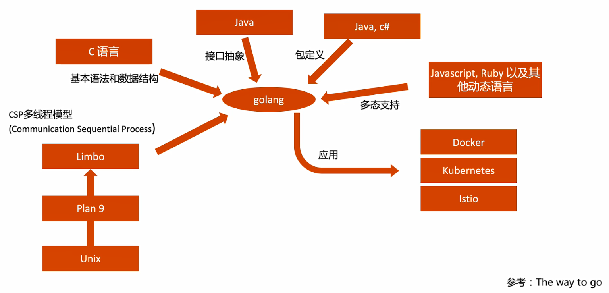
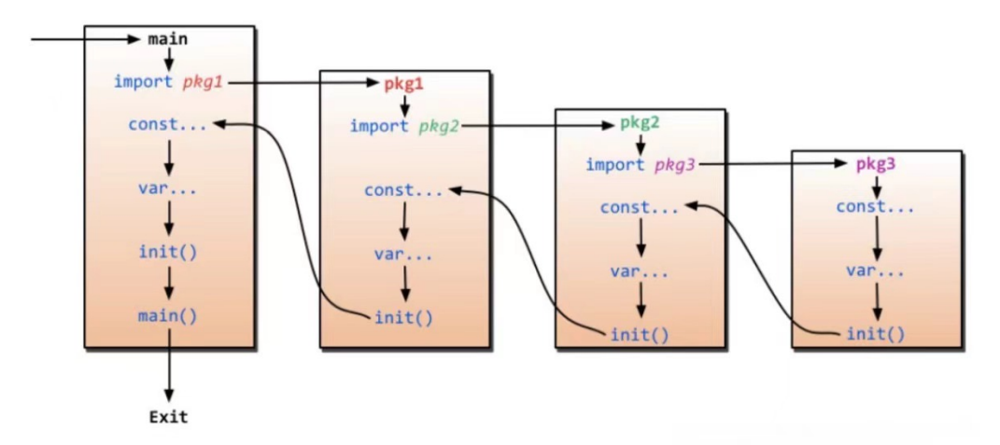

[toc]

# Go介绍

## 统一思想 12 factors

* 基准代码

  * 一份基准代码，多份部署：以代码仓库中代码为基准，进行不同环境的部署

* 依赖

  * 显式声明依赖关系：有声明依赖的文件，清晰地描述了依赖的模块和版本信息

* 配置

  * 在环境中存储配置：代码和配置分离，只有环境的信息时变更时，可以直接修改配置文件实现变更

* 后端服务

  * 把后端服务当做附加资源

* 构建、发布、运行

  * 严格分离构建和运行

* 进程

  * 以一个或多个无状态进程运行应用：尽量做到无状态，应用和数据分离

* 端口绑定

  * 通过端口绑定提供服务

* 并发

  * 通过进程模型进行扩展

* 易处理

  * 快速启动和优雅终止可最大化健壮性

* 开发环境与线上环境等价

  * 尽可能的保持开发，预发布，线上环境相同

* 日志

  * 把日志当做事件流

* 管理进程

  * 后台管理任务当作一次性进程运行


## Go语言的原则

* Less is exponentially more   --  Rob Pike, Go Designer
* Do Less, Enable More  -- Russ Cox, Go Tech lead

## Why Golang

* 其它语言弊端或痛点
  * 硬件发展速度远远超过软件
  * C语言等原生语言缺乏好的依赖管理
  * Java、C++等过于繁重
  * 系统语言对垃圾回收和并行计算等基础功能缺乏支持
  * 对多核计算机缺乏支持
* Go的优点：
  * 秒级完成大型程序的单节点编译
  * 依赖管理清晰
  * 不支持继承，程序员无需话费精力定义不同类型之间的关系
  * 支持垃圾回收，支持并发执行，支持多线程通讯
  * 对多核计算机支持友好


## Go不支持的特性

* 不支持函数重载和操作符重载
* 不支持隐式转换，避免在C/C++开发中的一些Bug和混乱
* 支持接口抽象，不支持继承
* 不支持动态加载代码
* 不支持动态链接库
* 通过recover和panic来替代异常机制
* 不支持断言
* 不支持静态变量


## Go语言特性衍生来源

* 基本语法来自C语言
* CSP多线程模型来自Limbo
* 接口抽象来自Java
* 包定义来自Java、C#
* 多态支持来自Javascript、Ruby
* 应用有Docker、Kubernetes、Istio




# 环境设置

## 下载Go

### Go安装文件及源代码

​	[https://golang.google.cn/dl/](https://golang.google.cn/dl/)

### 下载对应平台的二进制文件并安装

### 环境变量

* GOROOT
  * go的安装目录
    * linux 一般的安装目录为：/usr/local/go，在/etc/profile文件末尾追加`export GOROOT=/usr/local/go`，即go安装目录，然后`source /etc/profile`重新载入配置使之生效
* GOPATH，用于存放项目源代码及依赖包
  * src：存放源代码
    * 例如项目 github.com，则在src下建立该目录
  * pkg：存放依赖包
  * bin：存放可执行文件
* 其它常用变量
  * GOOS，GOARCH，GOPROXY
  * 国内用户建议设置 goproxy：`export GOPROXY=https://goproxy.cn`

## 安装设置IDE

* Visual Studio Code
  * [https://code.visualstudio.com/download](https://code.visualstudio.com/download)
  * 安装好之后需要下载Go语言插件
    * [https://marketplace.visualstudio.com/items?itemName=golang.go](https://marketplace.visualstudio.com/items?itemName=golang.go)
* 其它
  * Intellj goland，收费
  * vim，sublime等

## Go语言的基本命令

Hello World示例：

```go
package main
import (
	"fmt"
)

func main(){
    fmt.Println("Hello World!")
}

```

### go build

* 编译时会将所有依赖编译进同一个二进制文件
* -o：指定输出目录，例如：`go build -o bin/helloworld .`
* 支持的操作系统和CPU架构：$GOROOT/src/go/build/syslist.go
* `GOOS=linux GOARCH=amd64 go build`：指定适用的环境  --> 操作系统为linux，CPU架构为amd64

### go test

​	Go 语言原生自带测试

```go
package main

//导入testing和assert断言的依赖
import (
    "testing"
    "github.com/stretchr/testify/assert"
)

//定义一个加法测试函数
func add(a,b int) int{
    return a + b
}

//测试方法，入参是约定好的
func TestIncrease(t *testing.T){
    t.Log("Start testing")
    //定义result变量，接收add函数的返回结果
    result := add(1,2)
    //通过assert.Equal()方法断言执行结果为3
    assert.Equal(t,result,3)
}
```

​	在项目目录中运行测试 `go test ./ `

​	`go test`命令扫描所有`*_test.go`为结尾的文件，惯例是将测试代码和正式代码放在同目录，如main.go的测试代码一般写在main_test.go中 

### go vet

​	用于检测错误，包括语法错误、可能的bug、Boolean错误、Range循环、Unreachable等

## 代码版本控制

 * 下载并安装 Git Command Line
    * [https://git-scm.com/downloads](https://git-scm.com/downloads)
 * Github、GitLab
 * `git clone XXX`、`git add 代码路径`、`git commit -m '注释信息'`、`git push`、`git pull`

## Golang playground

​	官方或其它组织提供了在线运行、测试Golang代码的环境
 *  [官方 playground](https://play.golang.org/)
*  [https://goplay.tools/](https://goplay.tools/)
*  [菜鸟工具](https://c.runoob.com/compile/21/)


# 基础语法：控制结构及常用数据结构
## 控制结构
### if语句
* 基本形式
  * ```go
    if condition1{
    	//代码块
    }else if condition2{
    	//代码块
    }else{
    	//上面判断条件之外的情况
    }
    ```

* if 的简短语句

  * if语句可以在条件表达式前执行一个简单的语句

  * ```
    //声明一个变量v，赋值为x-100，如果v小于0，则执行代码块中代码，返回v
    if v := x - 100;v < 0{
    	return v
    }
    ```

    


### switch语句

```
switch var1 {
	case value1:	//空分支
	case val2:
		fallthrough //添加fallthrough后会匹配执行后面的case val3中的
	case val3:
		f()
	default: //默认分支
		...
}
```

### for语句

​	Go只有一种循环结构：for

* 关键字：
  * `continue`：结束本次循环，进入下一轮循环
  * `break`：结束所在的循环体

* 计入计数器的循环

  * ```go
    //for 初始化语句;条件语句;修饰语句{}
    //示例
    for i := 0; i<10; i++ {
    	sum += i
    }
    ```

* 初始化语句和后置语句是可选的

  * ```go
    //可以省略初始化或后置语句
    //示例，此场景与while等价（Go语言不支持while）
    for ;sum < 1000 ;{
    	sum += sum
    }
    ```

* 无限循环

  * 不设定条件可以无限循环，但最好在内部设定退出条件

  * ```
    for {
    	if condition1 {
    		break
    	}
    }
    ```


### for-range

​	for-range 用来遍历数组、切片、字符串、Map等

```
for index, char := range myString {

}

for key, value := range MyMap {

}

for index, value := range MyArray{

}
//如果for range遍历指针数组，则value取出的指针地址为原指针地址的拷贝
```


## 数据结构

### 变量与常量

* 常量：不期望后期在程序运行过程中被修改

  * `const identifier type`
  * 示例：`const a = 1`

* 变量：程序在后续运行过程中可以被修改

  * 声明：`var identifier type`

    * `var name string`

  * 初始化：

    * 变量声明可以包含初始值，每个变量对应一个

      * 示例：`var i,j int = 1,2`

    * 如果初始化值已存在，则可以省略类型；变量会从初始值中获得类型

      * ```
        var a int = 1
        var b = a
        ```

  * 短变量声明：

    * 在函数中，简洁赋值语句 `:=` 可以在类型明确的地方代替 `var` 声明 
    * 在函数外的每个语句都必须以关键字开始 （var，func 等等），因此 `:=` 结构不能在函数外使用
    * 示例：`c, python, java := true, false, "no!"`

### 类型转换与推导

* 类型转换

  * 表达式T(v)将值v转换为类型T

  * 示例

    * ```
      var i int = 42
      var f float64 = float64(i)
      var u unit = unit(f)
      
      或者
      i := 42
      f := float64(i)
      f := unit(f)
      ```

* 类型推导

  * 在声明一个变量而不制定其类型时（即使用不带类型的 := 语法或 var = 表达式语法），变量的类型由右值推导得出

    * ```
      var i int
      j := i //j也是一个int
      ```

      


### 数组

* 相同类型且长度固定连续内存片段，数组是定长的，不定长的数据元素组要使用切片(slice)
* 以编号访问每个元素
* 定义方法：`var identifier [len]type`
* 示例：`myArray := [3]int{1,2,3}`


### 切片(slice)

* 切片是对数组一个连续片段的引用

* 数组定义中不指定长度即为切片

  * `var identifier []type`

* 切片在未初始化之前默认为nil，长度为0

* 示例：

  * ```go
    func main(){
        myArray := [5]int{1,2,3,4,5}	//初始化一个数组myArray
        mySlice := myArray[1:3]	//取myArray中的第1~2号元素（元素是从0开始的），赋值给mySlice切片对象
        fullSlice := myArray[:]	//取myArray中所有元素，赋值给fullSlice切片对象
        remove3rdItem := deleteItem(fullSlice,2)	//删除第3个元素，赋给remove3rdItem对象
    }
    
    //切片中没有删除方法，需要利用append自己写一个达到目的
    //形参为切片对象和要删除的元素索引，返回值为一个切片类型
    func deleteItem(slice []int, index int) []int {
        //利用append方法，将index索引之前和之后的切片元素合并，生成新的切片对象返回
        return append(slice[:index],slice[index+1:])
    }
    ```


### Make和New

* New返回指针地址

* Make返回第一个元素，可预设内存空间，避免未来的内存拷贝

* Make仅仅用于slice、map、channel的内存分配

* 示例

  * ```go
    //new返回的是一个指针，指向一个被初始化为0的地址
    mySlice1 := new([]int)
    
    /*
    T代表类型
    初始化slice：
    make(T,n)	type 为T，length为n，capacity为n
    make(T,n,m) type 为T，length为n，capacity为m
    
    初始化map：
    make(T)		type 为T
    make(T,n)	type 为T，初始化空间为n
    
    初始化channel：
    make(T)		无缓冲区的T类型channel
    make(T,n)	类型为T，缓冲区大小为n的channel
    */
    mySlice2 := make([]int, 0)
    mySlice3 := make([]int, 10)
    mySlice4 := make([]int, 10,20)
    ```


### 切片常见问题

* 切片是连续内存并且可以动态扩展

  * ```go
    a := []int{}	//定义一个空切片赋值给a
    b := []int{1,2,3}	//定义一个切片{1,2,3}赋值给b
    c := a			//将a赋值给c，此时c和a的内存地址一致
    a = append(b,1)	//给b切片中添加一个新值，并赋值给a，此时a原先分配的内存空间可能不足，此情况下系统会在内存中开辟新的连续内存空间，将b的值{1,2,3}及后添加的 1 放到新开辟的内存空间，再将此空间赋值给a，此时a和c的内存空间地址已经不一样，需要注意 
    ```

  * 

* 修改切片的值

  * ```go
    mySlice := []int{10,20,30,40,50}	//初始化一个slice
    //下面的方法只能修改临时变量 value 的值
    for _, value := range mySlice{
        value *= 2
    }
    fmt.Printf("mySlice %+v\n",mySlice)
    
    //如果要修改切片本身的值，需要通过切片元素下标进行修改
    for index,_ := range mySlice{
        mySlice[index] *= 2
    }
    fmt.Printf("mySlice %+v\n",mySlice)
    ```

  * 


### Map

* 声明方法

  * ```
    var map1 map[keytype]valuetype	
    ```

* 访问Map元素

  * 按Key取值

    * ```
      value,exists := myMap["a"]	//value为"a"对应的值，exists为判断key是否存在的bool值
      if exists {
      	println(value)
      }
      ```

  * 遍历Map

    * ```
      for k,v := range myMap{
      	println(k,v)
      }
      ```

* 示例

  * ```go
    myMap := make(map[string]string,10)	//声明一个Map名称为myMap，key和value都为string，长度为10
    myMap["a"] = "b"	//赋值
    
    //函数作为变量赋值给一个Map
    myFuncMap := map[string]func() int{
    	"funcA":func() int{ return 1},
    }
    fmt.Println(myFuncMap)
    
    //将上面Map中的函数变量赋值给函数f
    f := myFuncMap["funcA"]
    fmt.Println(f())
    
    //在某些场景下可以将一些函数放入到map中，根据需要取出来使用
    ```


### 结构体和指针

* 通过`type ... struct`关键字自定义结构体

* Go语言支持指针，但不支持指针运算

  * 指针变量的值为内存地址
  * 未赋值的指针为nil

* 示例：

  ```go
  //定义一个结构体MyType，包含string类型的Name、int类型的Age
  type MyType struct{
  	Name string
  	Age int
  }
  
  //打印方法，接收MyType类型参数
  func printMyType(t *MyType){
      println(t.Name,t.Age)
  }
  
  func main(){
      t := MyType{Name:"test",Age:18}
      printMyType(&t)
  }
  ```


#### 结构体标签

* 结构体中的字段除了有名字和类型外，还可以有一个可选的标签（tag）

* 使用场景：Kubernetes APIServer 对所有资源的定义都用 Json tag 和 protoBuff tag 

  * ```go
    NodeName string 
    `json:"nodeName,omitempty"
    protobuf:"bytes,10,opt,name=nodeName"`
    ```

  * ```
    type MyType struct {
    	Name string `json:"name"`
    }
    
    func main(){
    	//初始化一个MyType类型变量mt
    	mt := MyType{Name:"test"}
    	//通过反射获取自定义结构体中的捆绑的tag标签
    	myType := reflect.TypeOf(mt)
    	name := myType.Field(0)
    	//tag是通过
    	tag := name.Tag.Get("json")
    	println(tag)
    }
    ```


#### 类型重命名

* ```
  //创建一个ServiceType类型的结构体，实质为string类型
  type ServiceType string
  
  //kubernetes中用类型重命名的方式，实现枚举类型，描述一些Service服务信息，初始化时声明包括几种Service类型
  const(
  	ServiceTypeClusterIP ServiceType = "ClusterIP"
  	ServiceTypeNodePort ServiceType = "NodePort"
  	ServiceTypeLoadBalancer ServiceType = "LoadBalancer"
  	ServiceTypeExternalName ServiceType = "ExternalName"
  )
  
  ```


# 函数

## Main函数

* 每个Go语言程序都应该有一个 main package
* Main package 里的main函数是Go语言程序入口
* main()函数的传参通过 `os.Args` 实现
* 示例：

```go
package main


import (
	"flag"
	"fmt"
	"os"
)

func main(){
	//flag.String 获取传入的参数，匹配到参数名则将传入值赋给对应参数的变量，例如下面 name 为参数，world为默认值
	name := flag.String("name", "world", "specify the name you want to say hi")
	flag.Parse()	//解析入参变量
	//Go语言通过os.Args向main函数传入参数，os.Args是一个字符串数组，第一个元素是程序本身
	fmt.Println("os args is:",os.Args)
	fmt.Println("input parameter is:", *name)	//打印name参数对应的值，如果有传入则打印传入的值，没有则打印默认值
}

/*
运行程序：
./main --name jerry
程序会打印：
os args is: [./main --name jerry]
input parameter is: jerry
*/
```


## Init函数

* Init函数：会在包初始化时运行
* 谨慎使用init函数
  * 当多个依赖项目引用同一项目，且被引用项目的初始化在init中完成，并且不可重复运行时，会导致启动错误
* Go语言程序初始化执行顺序：
	1. 首先导入依赖包
	2. 依赖包中的常量初始化，变量初始化，init()函数（如果依赖包中也有依赖包，则先继续向上递归初始化依赖包中内容，再返回来初始化自身）
	3. 常量初始化
	4. 变量初始化
	5. init()函数执行
	6. main()函数执行




## 返回值

格式：`func funcName(Args ...) returnValueType ... { func_body }`

### 多值返回

* 函数可以返回任意数量的返回值

* ```go
  func funcName(Args ...) (returnValueType1,returnValueType2, ... returnValueTypeN) { 
      func_body
  }
  
  //示例：
  //定义两个返回值，分别为int和string，用于返回年龄和姓名
  func myFunc(age int) (int, string) {
    bornYear := 2022 - age
      name := "tom"
  	return bornYear, name
  }
  
  func main() {
  	bornYear, name := myFunc(20)
  	fmt.Printf("%s was born in %d \n", name, bornYear)
  }
  
  
  ```
  
  
  


### 命名返回值

* Go的返回值可以被命名，它们会被视作定义在函数顶部的变量

* 返回值的名称应当具有一定的意义，它可以作为文档使用

* 没有参数的 return 语句返回已命名的返回值，也就是直接返回

* ```go
  //示例：
  func myFunc(age int) (bornYear int, name string) {
      //命名后的返回值，在函数内部直接当做变量使用，不需要声明
  	bornYear = 2022 - age
  	name = "tom"
  	return bornYear, name
  }
  
  func main() {
  	bornYear, name := myFunc(20)
  	fmt.Printf("%s was born in %d \n", name, bornYear)
  }
  
  ```

  


### 调用者忽略部分返回值

使用下划线 `_` 占位要忽略的返回值

* 示例：忽略返回的错误信息 `result,_ = strconv.Atoi(origStr)`

* ```go
  //示例：
  func myFunc(age int) (bornYear int, name string) {
  	bornYear = 2022 - age
  	name = "tom"
  	return bornYear, name
  }
  
  func main() {
      //这里在获取返回值的时候可以忽略部分值，用下划线 _ 占位
  	bornYear, _ := myFunc(20)
  	fmt.Printf("jerry was born in %d \n", bornYear)
  }
  ```


## 传递参数

Go语言中的可变参数允许调用方法传递任意多个相同类型的参数

* 函数定义

  * `func append(slice []Type, elems ...Type) []Type`

* 调用方法

  * `myArray := []string{}`
  * `myArray = append(myArray,"a","b","c)`

* 示例

  * ```go
    
    func myFunc(... int){
        
    }
    ```

  * 


## 内置函数


| 函数名            | 作用                            |
| ----------------- | ------------------------------- |
| close             | 管道关闭                        |
| len,cap           | 返回数组、切片、Map的长度或容量 |
| new,make          | 内存分配                        |
| copy,append       | 操作切片                        |
| panic,recover     | 错误处理                        |
| print,println     | 打印                            |
| complex,real,imag | 操作复数                        |


## 回调函数(Callback)

* 函数作为参数传入其它函数，并在其他函数内部调用执行

  * strings.IndexFunc(line, unicode.IsSpace)

  * Kubernetes controller 的 leaderelection

  * 示例

    ```go
    func main(){
    	DoOperation(1,increase)
    	DoOperation(1,decrease)
    }
    
    func increase(a, b int){
        println( "increase result is:" , a+b)
    }
    
    func decrease(a,b int){
        println( "decrease result is:", a-b)
    }
    //接收参数中，可以将函数作为参数，下面接收一个包含2个int类型形参的函数
    func DoOperation(y int, f func(int, int)){
        //调用传入的函数执行，并将另一个参数y和1传给该函数
        f(y,1)
    }
    ```

    


## 闭包(匿名函数)

* 匿名函数

  * 不能独立存在
  * 可以赋值给其它变量
    * `x := func(){}`
  * 可以直接调用
    * `func(x,y int){println(x+y)}(1,2)`
  * 可作为函数返回值
    * `func Add() (func(b int) int)`

* 使用场景

  * ```go
    //在程序运行出现错误，恢复时用到
    defer func(){
        if r := recover(); r != nil {
            println( "recovered in FuncX")
        }
    }()
    ```

    

## 方法

* Go语言中方法和函数有所不同

* 方法：作用在接收者上的函数

  * `func (recv receiver_type) methodName(parameter_list) (return_value_list)`
  * 接收者是一个被实例化的对象

* 使用场景

  * 很多场景下，函数需要的上下文可以保存在receiver属性中，通过定义 receiver 的方法，该方法可 以直接访问 receiver 属性，减少参数传递需求

  * ```go
    //传入一个 Server 实例化的对象 s ，方法中可以直接调用 s 的行为和属性
    func (s *Server) StartTLS() {
    	if s.URL != “” {
    		panic(“Server already started”)
    	}
        
    	if s.client == nil {
    		s.client = &http.Client{
                Transport: &http.Transport{}
            }
        }
    }
    
    ```

    


## 传值还是传指针

* Go语言只有 传值

* 函数内修改参数的值不会影响函数外原始变量的值

* 可以传递指针参数将变量地址传递给调用函数，Go语言会复制该指针作为函数内的地址，但指向同一地址

* 示例

  * ```go
    //参数传值
    func myFunc(a int) {
    	a = 9
    }
    
    //上面方法中不会修改到原变量a的值
    func main() {
    	a := 1
    	myFunc(a)
    	println(a)
    }
    
    //参数传递指针，go会将内存地址复制一份，赋值给变量，因此会修改掉内存中的数据
    func myFunc(a *int) {
    	*a = 9
    }
    
    func main() {
    	a := 1
    	myFunc(&a)
    	println(a)
    }
    
    
    ```

* 传 struct 还是 pointer 要根据情况进行

  * 传 struct 函数运行完成后地址会回收，对GC友好
  * 传 pointer 只传递内存地址，很多情况下效率会高一些


# 接口


* 接口定义一组方法集合

  * ```go
    type IF interface {
    	Method1(param_list) return_type
    }
    ```

* 适用场景：Kubernetes 中有大量的接口抽象和多种实现

* Struct 无需显示声明实现 interface，只需直接实现方法

* Struct 除实现 interface 定义的接口外，还可以有额外的方法

* 一个类型可实现多个接口（Go 语言的多重继承）

* Go 语言中接口不接受属性定义

* 接口可以嵌套其它接口

* 注意事项

  * Interface是可能为 nil 的，所以针对interface 的使用一定要预先判空，否则会引起程序crash(nil panic)
  * Struct 初始化以为着空间分配，对 struct 的引用不会出现空指针

* 示例

  * ```go
    //定义一个接口IF
    type IF interface {
        //包含一个方法getName()，返回值类型为string
    	getName() string
    }
    
    //定义一个结构体Human
    type Human struct {
        //结构体包含姓、名
    	firstName, lastName string
    }
    
    //实现Human结构体的getName()方法，符合IF方法要求则表示实现了接口IF，可以作为IF类型处理
    func (h *Human) getName() string {
    	return h.firstName + "," + h.lastName
    }
    
    //定义一个结构体Car
    type Car struct {
        //结构体的属性
    	factory, model string
    }
    //实现Car的getName()方法
    func (h *Car) getName() string {
    	return h.factory + "," + h.model
    }
    
    func main() {
        //初始化一个IF接口类型的切片
    	interfaces := []IF{}
        //创建一个Human类型的对象 h，赋值属性
    	h := new(Human)
    	h.firstName = "san"
    	h.lastName = "zhang"
        //将对象h存放到IF类型的切片中
    	interfaces = append(interfaces, h)
    
        //创建Car类型的对象 c，与h操作类似
    	c := new(Car)
    	c.factory = "Tesla"
    	c.model = "Model S"
    	interfaces = append(interfaces, c)
    
        //遍历切片中的元素，都可以执行接口中定义的getName()方法
    	for _, f := range interfaces {
    		println(f.getName())
    	}
    }
    
    /*
        执行结果：
        san,zhang
        Tesla,Model S
    */
    ```


# 反射


# 面向对象

* 可见性控制
  * public - 常量、变量、类型、接口、结构、函数等的名称大写
  * private - 非大写就只能在包内使用
* 继承
  * 通过组合实现，内嵌一个或多个 struct
* 多态
  * 通过接口实现，通过接口定义方法集，编写多套实现


# 常用语法、多线程


