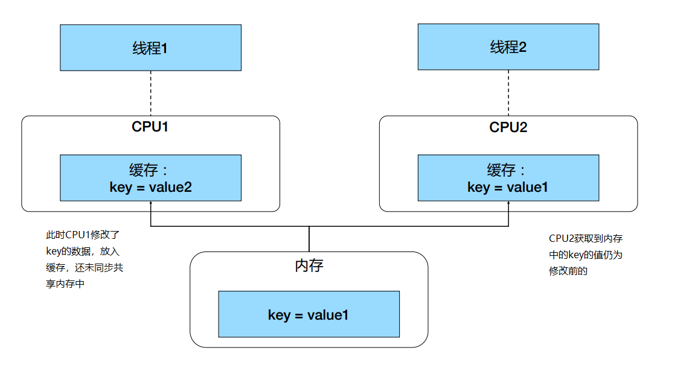

[toc]

# 线程加锁

## 线程安全

现在CPU大多是多核架构，多个线程同时运行可能会被调度到不同的CPU中，每个CPU都有自己的缓存。假设两个CPU第一次在共享内存取出同一段数据后，CPU1 修改数据时可能会先写入缓存而不会立即写入内存，CPU2中仍是未修改的数据，此时就会出现问题。




## 锁

在对数据资源进行操作前加锁，可以避免出现数据不一致的情况。

* Go 语言不仅仅提供基于 CSP 的通讯模型，也支持基于共享内存的多线程数据访问
* Sync 包提供了锁的基本原语
* sync.Mutex 互斥锁
  * Lock() 加锁，Unlock() 解锁
* sync.RWMutex 读写分离锁
  * 不限制并发读，只限制并发写和并发读写
* sync.WaitGroup
  * 等待一组 goroutine 返回
* sync.Once
  * 保证代码只执行一次
* sync.Cond
  * 让一组goroutine 在满足特定条件时被唤醒，Condition


### 示例

```go
package main

import (
	"fmt"
	"sync"
	"time"
)

func main() {
	//分别执行读锁、写锁、读写锁的模拟函数
	go rLock()
	go wLock()
	go lock()

	time.Sleep(5 * time.Second)
}

func rLock() {
	lock := sync.RWMutex{} //创建一个读写锁
	for i := 0; i < 3; i++ {
		lock.RLock()         //加读锁
		defer lock.RUnlock() //函数执行完成释放读锁
		fmt.Println("rLock: ", i)
	}
}

func wLock() {
	lock := sync.RWMutex{} //创建一个读写锁
	for i := 0; i < 3; i++ {
		lock.Lock()         //默认加锁为写锁
		defer lock.Unlock() //函数执行完释放写锁，执行时第二次循环会申请不到资源
		fmt.Println("wLock: ", i)
	}
}

func lock() {
	lock := sync.Mutex{} //创建一个互斥锁
	for i := 0; i < 3; i++ {
		lock.Lock()         //加锁
		defer lock.Unlock() //函数执行完成释放锁，同样第二次循环过来会申请不到
		fmt.Println("Lock: ", i)
	}
}


/*
执行结果：
Lock:  0
wLock:  0
rLock:  0
rLock:  1
rLock:  2
*/

```


#### Mutex示例

Kubernetes 中的 informer factory，informer主要用来监听 kubernetes 的对象

```go
// Start initializes all requested informers.
//该方法传递进来一个 sharedInformerFactory 类型的实体 f，接收通道 stopCh 接收struct
func (f *sharedInformerFactory) Start(stopCh <-chan struct{}) {
    f.lock.Lock()		//加锁
	defer f.lock.Unlock()	//方法执行完成后解锁
    //下面的informers为 Map类型，Map 不能同时修改，否则会panic掉，多线程操作Map时可以在程序里加锁再进行修改
	for informerType, informer := range f.informers {		//遍历 Map类型的 informers，获取到类型和数据
        if !f.startedInformers[informerType] {		//判断 f 的startedInformers[informerType]为 false
            go informer.Run(stopCh)		//执行
            f.startedInformers[informerType] = true		//修改值为true
        }
    }
}
```


#### WaitGroup示例

主线程中启动多个子线程，但希望在所有子线程代码执行完成以后再继续，就可以使用WaitGroup。

Kubernetes 中使用示例：

```go
// CreateBatch create a batch of pods. All pods are created before waiting.
//传入一些pod 对象
func (c *PodClient) CreateBatch(pods []*v1.Pod) []*v1.Pod {
    ps := make([]*v1.Pod, len(pods))
    var wg sync.WaitGroup		//定义一个waitgroup
    for i, pod := range pods {
        wg.Add(1)		//每次循环增加一个等待
        //创建Pod
        go func(i int, pod *v1.Pod) {		
            defer wg.Done()		//执行完成后，触发wg.Done()，释放一个数量
            defer GinkgoRecover()
            ps[i] = c.CreateSync(pod)
        }(i, pod)
    }
    wg.Wait()		//这里会等待上面循环中线程都执行完成后再继续
    return ps
}
```


几种等待子线程的方式：

```go
//依靠time.Sleep()等待子线程执行完成，等待时间很难评估
func waitBySleep(){
	//循环启动子线程，每次打印一个值
	for i := 0; i<100 ; i++{
		go fmt.Println(i)
	}
	//在主线程中使用sleep等待
	time.Sleep(time.Second)
}

//依靠channel通讯等待子线程
func waitByChannel(){
	c := make(chan bool,100)	//定义一个通道，类型为bool，数量为100
	for i := 0; i<100 ;i++{		//循环打印一个值，并写入channel中
		go func(i int){
			fmt.Println(i)
			c <- true
		}(i)
	}

	//主线程中循环取通道中数据
	for i := 0; i<100 ; i++ {
		<- c
	}
}


//通过WaitGroup方式等待子线程执行完毕
func waitByWG(){
	wg := sync.WaitGroup{}		//创建一个WaitGroup
	wg.Add(100)					//设定等待100个goroutine
	for i := 0; i<100 ;i++{
		go func(i int){
			fmt.Println(i)
			wg.Done()		//每次循环触发Done()，减少WaitGroup中数量
		}(i)
	}
	wg.Wait()		//主线程会等待WaitGroup中无数量时再继续执行
}
```


#### Cond示例

cond：`sync.NewCond(&sync.Mutex{})`  


生产者消费者示例：

```go
package main

import (
	"fmt"
	"sync"
	"time"
)

//定义一个结构体，包含string类型的切片和一个cond锁
type Queue struct {
	queue []string
	cond  *sync.Cond
}

func main() {
	//初始化一个Queue类型实体q
	q := Queue{
		queue: []string{},
		cond:  sync.NewCond(&sync.Mutex{}),
	}

	//起一个新的协程，循环生产数据
	go func() {
		for {
			q.Enqueue("a")
			time.Sleep(2 * time.Second)
		}
	}()

	//循环取出数据
	for {
		q.Dequeue()
		time.Sleep(time.Second)
	}
}

//Queue的生产方法，入参为string类型
func (q *Queue) Enqueue(item string) {
	q.cond.L.Lock()                                       //调用q的属性cond，进行加锁操作，L是一个Locker对象
	defer q.cond.L.Unlock()                               //方法执行完成后释放锁
	q.queue = append(q.queue, item)                       //在q的切片中追加数据
	fmt.Printf("putting %s to queue, notify all\n", item) //打印追加的值
	q.cond.Broadcast()                                    //cond.Broadcast() 广播通知等待的线程
}

//Queue的消费方法，返回string类型
func (q *Queue) Dequeue() string {
	//加锁
	q.cond.L.Lock()
	defer q.cond.L.Unlock()
	//队列为空则等待
	if len(q.queue) == 0 {
		fmt.Println("no data available, wait")
		q.cond.Wait() //等待消息通知
	}
	result := q.queue[0]  //取出第一个元素，赋值给result
	q.queue = q.queue[1:] //队列中删除第一个元素
	return result
}

```


Kubernetes中的队列，生产者消费者场景中有用到：

```go
// Add marks item as needing processing.
func (q *Type) Add(item interface{}) {
    q.cond.L.Lock()
    defer q.cond.L.Unlock()
    if q.shuttingDown {
    	return
    }
    if q.dirty.has(item) {
    	return
    }
    q.metrics.add(item)
    q.dirty.insert(item)
    if q.processing.has(item) {
    	return
    }
    q.queue = append(q.queue, item)
    q.cond.Signal()
}


// Get blocks until it can return an item to be processed. If shutdown = true,
// the caller should end their goroutine. You must call Done with item when you
// have finished processing it.
func (q *Type) Get() (item interface{}, shutdown bool) {
    q.cond.L.Lock()
    defer q.cond.L.Unlock()
    for len(q.queue) == 0 && !q.shuttingDown {
    	q.cond.Wait()
    }
    if len(q.queue) == 0 {
        // We must be shutting down.
        return nil, true
    }
    item, q.queue = q.queue[0], q.queue[1:]
    q.metrics.get(item)
    q.processing.insert(item)
    q.dirty.delete(item)
    return item, false
}

```


 


# 线程调度


## Go 语言的线程调度


## Linux 进程的内存使用


## 进程切换开销


## 线程切换开销


## 用户线程


## Goroutine


### GMP模型

Go 语言基于 GMP 模型实现用户态线程

* Goroutine：
* Machine：
* Process：


# 内存管理

## 谁来管理


## 堆内存管理


## TCMalloc


## Go 语言内存分配


# 包引用与依赖管理


# Makefile


# HTTP Server 编写


# 调试


# Kubernetes 常用代码解读


