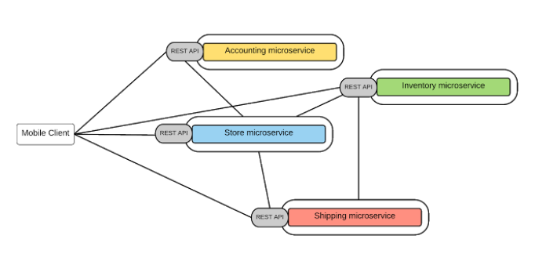
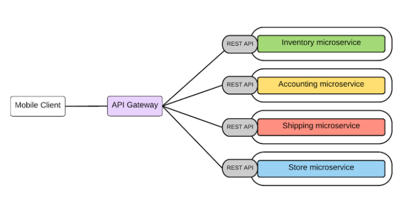

[toc]


# 分层架构到微服务

## 架构演进

应用架构不断演进，从单体架构  -->  分层架构（例如 MVC） -->    SOA架构（各个子系统间的调用，基于ESB服务总线通讯）-->  微服务


## 优劣势对比

|          | 分层架构                                                     | 微服务                                                       |
| -------- | ------------------------------------------------------------ | ------------------------------------------------------------ |
| 简单系统 | 易部署<br />易测试<br />易横向扩展                           | 微服务架构增加了系统的复杂性，把集中部署变成了分布式部署。需要实现基于消息或RPC的进程间通讯，需要处理部分失败等分布式系统的复杂问题<br />微服务采用分区数据库架构，一个事务需要更新不同微服务的数据库，分布式事务更复杂<br /><br />测试更复杂<br />部署监控更复杂 |
| 复杂系统 | 难以理解整体<br />不易快速维护<br />启动慢<br />变更引起的回归问题多<br />难以做持续集成和持续部署 | 将一个庞大系统分解成高内聚，松耦合的组件使得系统部署更快，更易理解和维护<br />不同服务由不同team维护，分工更细，更关注业务，微服务往往是异构系统，开发团队可自主选择技术栈<br />微服务架构使每个服务独立部署，易于CI/CD<br />每个微服务独立扩展 |


## 微服务改造

分离微服务的方法建议：

* 审视并发现可以分离的业务逻辑
* 寻找天生隔离的代码模块，可以借助于静态代码分析工具
* 不同并发规模，不同内存需求的模块都可以分离出不同的微服务，此方法可提高资源利用率，节省成本


一些常用的可微服务化组件：

* 用户和账户管理
* 授权和会话管理
* 系统配置
* 通知和通讯服务
* 照片，多媒体，元数据等


**分解原则：基于Size，scope and capabilities **


## 微服务间通讯

### 点对点

* 多用于系统内部多组件之间通讯
* 有大量的重复模块如认证授权
* 缺少统一规范，如监控，审计等功能
* 后期维护成本高，服务和服务的依赖关系错综复杂难以管理





### API网关

* 基于一个轻量级的message gateway
* 新API通过注册至Gateway实现
* 整合实现 Common function





# Docker


## 概念

* 基于Linux内核的Cgroup，Namespace，以及Union FS等技术，对进程进行封装隔离，属于操作系统层面的虚拟化技术，由于隔离的进程独立于宿主和其它的隔离的进程，因此也称其为容器。
* 最初实现是基于LXC，从0.7以后开始取出LXC，转而使用自行开发的 Libcontainer，从1.11开始，则进一步演进为使用 runC 和 Containerd。
* Docker 在容器的基础上，进行了进一步的封装，从文件系统、网络互联到进程隔离等等，极大的简化了容器的创建和维护，使得Docker技术比虚拟机技术更为轻便、快捷。


## 使用Docker的优点

* 更高效地利用系统资源
* 更快速的启动时间
* 一致的运行环境
* 持续交付和部署
* 更轻松地迁移
* 更轻松地维护和扩展
* ...


## 虚拟机和容器对比


### 运行态的对比

_Docker.png)


### 性能对比

| 特性       | 容器               | 虚拟机     |
| ---------- | ------------------ | ---------- |
| 启动       | 秒级               | 分钟级     |
| 硬盘使用   | 一般为MB           | 一般为GB   |
| 性能       | 接近原生           | 弱于       |
| 系统支持量 | 单机支持上千个容器 | 一般几十个 |


## 安装Docker

1. 修改yum、apt-get源文件
2. yum或apt安装
3. 下载镜像
```bash
#CentOS安装docker 
yum -y install epel-release
yum -y update
yum -y install docker-io

#ubuntu安装
sudo apt-get update
sudo apt-get install -y docker.io


#查看docker信息  
docker version
docker info 

#查看docker进程container  
docker ps
```


### 镜像加速

修改/etc/docker/daemon.json文件

```
{
  "registry-mirrors": ["https://registry.docker-cn.com"]
}
```


#### 国内加速站点

* docker-cn
* 阿里云
* 中国科技大学


### Docker相关组件
* Docker Daemon：docker守护进程，通过https接收消息
* host    宿主机  
* image  镜像  
* container  容器  
* registry	仓库  
    * Sponsor：第三方的，供客户和Docker社区使用
    * Mirror：第三方的，只让客户使用
    * Vendor：有发布Docker镜像的供应商提供的registry
    * Private：通过设有防火墙和额外的安全层的私有实体提供的registry
* client	客户端  


## 容器操作

### 常用命令

* docker search ：搜索镜像
* docker pull：拉取镜像
* docker container：管理容器
* docker create：创建容器
* docker start：启动容器
* docker run：创建并启动容器，如果本地没有镜像，会从docker registry下载
    * 等同于docker create + docker start
    * -it 交互，创建后保持会话
    * -d 后台运行
    * -p 端口映射
    * -v 磁盘挂载
* docker attach：
* docker ps：查看运行的容器
* docker logs：输出容器中日志
* docker restart：重启容器
* docker stop：停止容器
* docker kill：杀死容器
* docker rm：删除容器
* docker inspect：查看容器运行详细信息
* docker <continerid> exec -it 容器名 /bin/sh：为容器分配会话终端，并连接到标准输入
* docker cp file1 <continerid>:/file-to-path  :  拷贝文件至容器内
* docker run --rm：退出后自动删除容器


### 镜像生成

* Dockerfile
* 基于容器制作
* Docker Hub automated builds


**相关命令**

* docker commit：可以基于容器创建镜像  
    * `docker commit 容器名 新镜像名`
* docker tag：
* docker push
* docker save：打包镜像
* docker load：读取镜像包


## 容器主要特性

* 安全性：
* 隔离性：容器之间、容器与主机之间的隔离，主要通过Namespace实现
* 便携性：可以在任何地方重放
* 可配额：依赖于Cgroups，控制资源


### Namespace

#### Linux 中操作 Namespace

* clone
  * 在创建新建成的系统调用时，可以通过flags参数制定需要新建的Namespace类型：
    * `// CLONE_NEWCGROUP / CLONE_NEWIPC / CLONE_NEWNET / CLONE_NEWNS / CLONE_NEWPID / CLONE_NEWUSER / CLONE_NEWUTS `
    * `int clone(int (*fn)(void *), void *child_stack, int flags, void *arg)`
* setns
  * 该系统调用可以让调用进程加入某个已经存在的Namespace中：`int setns(int fd, int nstype)`
* unshare
  * 该系统调用可以将调用进程移动到新的Namespace下：`int unshare(int flags)`


#### 类型

* Pid：进程
  * 不同用户的进程就是通过 Pid namespace  隔离开的，且不同namespace中可以有相同 Pid
  * 有了 Pid namespace，每个namespace 中的Pid 能够相互隔离
* net：网络
  * 网络隔离是通过 net namespace 实现的，每个 net namespace 有独立的 network devices，IP addresses，IP routing tables，/proc/net 目录
  * Docker 默认采用 veth 的方式将 container 中的虚拟网卡同 host 上的一个 docker bridge：docker0 连接在一起
* ipc：消息队列、进程通信等
  * Container 中进程交互还是采用 linux常见的进程间交互方法（interprocess communication -IPC），包括常见的信号量、消息队列和共享内存
  * container 的进程间交互实际上还是 host 上具有相同 Pid namespace 中的进程间交互，因此需要在 IPC 资源申请时加入 namespace 信息 - 每个 IPC 资源有一个唯一的 32 位 ID
* mnt：挂载点
  * mnt namespace 允许不同 namespace 的进程看到的文件结构不同，这样每个namespace 中的进程所看到的文件目录就被隔离开了
* uts：主机名和域名
  * UTS（“UNIX Time-sharing System”）namespace 允许每个 container 拥有独立的 hostname 和 domain name，使其在网络上可以被视作一个独立的节点而非Host上的一个进程
* user：用户和用户组
  * 每个container 可以拥有不同的 user 和 group id，也就是说可以在 container 内部用 container 内部的用户执行程序而非 Host 上的用户


#### namespace 常用操作

* 查看当前系统的namespace：`lsns -t <type>`
* 查看某进程的namespace：`ls -la /proc/<pid>/ns/`
* 进入某 namespace 运行命令：`nsenter -t <pid> -n ip addr`


#### 示例

```
在新network namespace执行sleep指令：
unshare -fn sleep 60

另起终端查看进程信息
ps -ef|grep sleep
输出：
root     3749012 3716943  0 11:59 pts/1    00:00:00 unshare -fn sleep 60
root     3749013 3749012  0 11:59 pts/1    00:00:00 sleep 60

查看网络 Namespace
4026532787 net       2 3749012 root unassigned                                unshare -fn sleep 6

进入该进程所在Namespace 查看网络配置，与主机不一致
1: lo: <LOOPBACK> mtu 65536 qdisc noop state DOWN group default qlen 1000
    link/loopback 00:00:00:00:00:00 brd 00:00:00:00:00:00
2: tunl0@NONE: <NOARP> mtu 1480 qdisc noop state DOWN group default qlen 1000
    link/ipip 0.0.0.0 brd 0.0.0.0


```


### Cgroups

* Cgroups（Control Groups）是Linux 下用于对一个或一组进程进行资源控制和监控的机制
* 可以对诸如CPU使用时间、内存、磁盘I/O等进程所需的资源进行限制
* 不同资源的具体管理工作由相应的Cgroup 子系统（Subsystem）来实现
* 针对不同类型的资源限制，只要将限制策略在不同的子系统上进行关联即可
* Cgroups 在不同的系统资源管理子系统中以层级树（Hierarchy）的方式来组织管理：每个Cgroup 都可以包含其它的子 Cgroup，因此子 Cgroup 能使用的资源除了受本 Cgroup 配置的资源参数限制，还受到父 Cgroup 设置的资源限制


