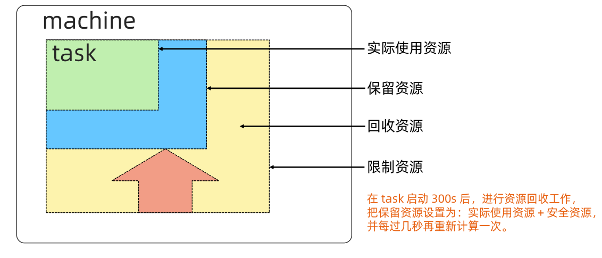
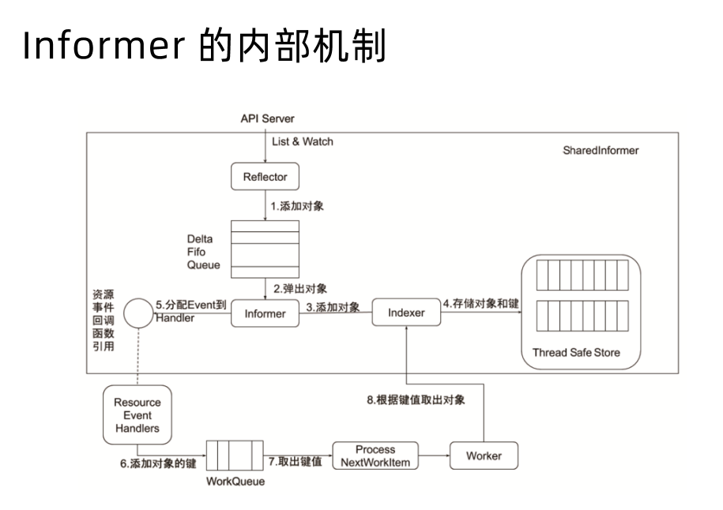

[toc]

# Kubernetes 架构基础

## Borg
Google 支撑在线业务、离线业务平台。  
* 在线业务：Gmail、Google Docs、Web Search等业务
* 离线业务：时效性要求较低

### 特性
* 物理资源利用率高
* 进程级别隔离
* 应用高可用
* 调度策略灵活
* 应用接入、使用方便，提供Job描述语言

### 优势
* 对外隐藏底层资源管理、调度、故障处理
* 实现应用高可靠和高可用
* 弹性，支持应用跑在成千上万台机器上


### 基本概念
* Workload
  * prod：在线任务
  * non-prod：离线任务，在业务波谷期运行，提升资源利用率
* Cell
  * 一个 Cell 上跑一个集群管理系统 Borg
  * 定义 Cell 让 Borg 对服务器资源同一抽象
* Job 和 Task
  * 用户以 Job 形式提交应用部署请求，一个 Job 包含一个或多个相同的 Task，每个 Task 运行相同的应用程序
  * 每个 Job 可以定义属性、原信息和优先级
* Naming
  * BNS：Borg Name Service，服务间发现通过BNS实现
  * 例如：50.jfoo.ubar.cc.borg.google.com  可以表示为一个名为 cc 的 Cell 中由用户 uBar 部署的一个名为 jFoo 的 Job 下的第50个 Task


### 架构
  


* Borgmaster 主进程：
  * 处理客户端 RPC 请求，比如创建、查询 Job
  * 维护系统组件和服务的状态，比如服务器、Task
  * 负责与 Borglet 通信

* Scheduler 进程：调度进程
  * 调度策略
    * Worst Fit：往最闲的机器中调度，负载均衡
    * Best Fit：往最小满足资源需求的主机上调度，尽量提高利用率
    * Hybrid：混合
  * 调度优化
    * Score caching：当服务器或者任务的状态未发生变更或者很少时，直接采用缓存数据，避免重复计算
    * Equivalence classes：调度同一 Job 下多个相同的 Task 只需计算一次
    * Relaxed randomization：随机性，每次随机选择一些机器，只要符合需求的服务器数量达到一定值，就可以停止计算，无需每次对 Cell 中所有服务器进行 Feasibility checking

* Borglet：运行在所有服务器上的Agent，负责接收 Borgmaster 进程的指令。


### 高可用
#### 应用高可用
* 资源紧张时，将 non-prod 的任务暂停，被抢占的 non-prod 任务放回 pending queue，等待重新调度
* 多副本应用跨故障域部署。比如跨机架、跨可用区、跨地域之类
* 避免大批量升级服务器或操作系统
* 支持幂等性，支持客户端重复操作，例如多次指令请求结果一致
* 服务器状态不可用时，控制重新调度任务的速率
* 记录详细内部信息，便于故障排查
* 保障应用高可用的关键性设计原则：无论何时何种原因，即使 borgmaster 或者 borglet 挂掉、失联，也不能杀掉正在运行的服务 task


#### 自身高可用
* Borgmaster 多副本设计
* 采用简单和底层（low-level）的工具部署 Borg 系统实例，避免引入过多外部依赖
* 每个 Cell 的 Borg 均独立部署，避免不同 Borg 系统相互影响


### 资源利用率
* 将 prod 和 non-prod 、batch 混合部署，空闲时间离线任务可以充分利用计算资源，繁忙时间，在线任务抢占节点资源
* google 98% 服务采用混部，90% 的服务器中跑了超过 25 个 Task 和 4500 个线程
* 中等规模的 Cell 中，在线任务和离线任务独立部署 比 混合部署 所需服务器资源多出 20%~30%
* 公司刚起步没有离线业务怎么办？ 后面会探讨？mark一下

### Brog 调度原理
一般业务应用在申请资源时候，通常通过压力测试评估业务所需资源，会根据实际情况多预留一部分资源。 为保证业务正常这种预留是应该的，但预留过多也会造成浪费。   

Brog 在 task 启动 300s 后会进行资源回收，根据实际资源使用情况重新计算。



### 隔离性
* 安全隔离性
  * 早期采用 Chroot jail，后期使用 Namespace
* 性能隔离
  * 采用 Cgroup 的容器技术实现
  * 在线任务 prod 是延时敏感（latency-sensitive）型，优先级高，non-prod、Batch 优先级低
  * 通过优先级抢占，保障在线业务 prod 型任务的性能
  * Borg 资源分为两类：
    * 可压缩（compressible），CPU，资源耗尽不会终止进程
    * 不可压缩（non-compressible），例如内存，资源耗尽会终止进程


## Kubernetes（K8s）简介
Kubernetes 就是谷歌基于 Borg 的开源版本，主要功能包括：  
* 基于容器的应用部署
* 负载均衡
* 跨机器和跨地区的集群调度
* 自动伸缩
* 无状态服务和有状态服务
* 插件机制保证扩展性

### 命令式（Imperative）和声明式（Declarative）
* 命令式如同电视遥控器，关注如何做，实现时写出具体解决问题或者完成任务的明确步骤。  

* 声明式如同空调遥控器，关注做什么，描述系统应该达到什么目标，具体实现交给系统

### Kubernetes 核心对象
* Node：计算节点
* Namespace：资源隔离单位
* Pod：最小调度单一，一个或多个容器组成
* Service：负载均衡和域名服务，类似 Borg 总的 Name Service


### 基础架构


* kubectl：命令行工具，通过命令与 api server 交互，下发指令、查询状态等，主要面向集群管理维护人员
* Master：集群管理节点，一般也要采用多节点实现高可用，主要由以下组件组成
  * etcd：数据存储，存放了整个集群节点状态、任务信息等
  * api server：对集群内外提供 REST API 服务，所有组件之间均通过API server通信，包括认证、鉴权、准入功能
  * Controllers：控制器，使集群运行状态满足用户声明，有多种控制器，Deployment、ReplicaSet、StatusfulSet
  * Scheduler：调度器，本质也是一个控制器，按照策略调度 Pod 或 Job 到满足要求的后端节点
* Node：资源节点，用于运行任务的服务器资源，可以是物理机或虚拟机
  * kubelet：资源节点上的代理，定期与 api server 交互反馈节点状态，获取与自身相关的任务
  * kube-proxy：网络组件，维护主机网络规则，对 pods 进行负载均衡

### 主要组件
#### etcd 
CoreOS 基于 Raft 开发的分布式 key-value 存储，可以用于服务发现、共享配置和一致性保障（数据库选主、分布式锁等）。
* 基本的 key-value 存储
* 监听机制
* key 的过期及续约机制
* 原子 CAS 和 CAD，用于分布式锁和 leader 选举
* 支持 watch 机制，可以做消息中间件

简单演示：
```bash
# kubernetes 集群安装好以后，master节点可以通过 exec 进入 etcd 相关 Pod 容器内
kubectl -n kube-system exec -it etcd-master01 sh
# etcdctl 为 etcd 的 ctl 命令行 client，带上证书文件，get 是获取，--keys-only 仅获取key，前缀是/
etcdctl --endpoints https://localhost:2379 --cert /etc/kubernetes/pki/etcd/server.crt --key /etc/kubernetes/pki/etcd/server.key --cacert /etc/kubernetes/pki/etcd/ca.crt  get --keys-only --prefix /
# 输出内容截取
...

/registry/services/specs/ingress/ingress-nginx-nginx-ingress

/registry/services/specs/istio-system/istio-egressgateway

/registry/services/specs/istio-system/istio-ingressgateway
...

# 可以通过 watch 观察，有变更会通知过来，watch default namespace 中services变更情况
etcdctl --endpoints https://localhost:2379 --cert /etc/kubernetes/pki/etcd/server.crt --key /etc/kubernetes/pki/etcd/server.key --cacert /etc/kubernetes/pki/etcd/ca.crt  watch --prefix /registry/services/specs/default/


# 另开一个终端删除再重新创建 service，这里会接收到信息，乱码内容由于使用的 gRPC 协议，以 protoBuffer 形式返回的
...

DELETE
/registry/services/specs/default/httpserver-svc

PUT
/registry/services/specs/default/httpserver-svc
k8s

v1Service 
ÿ
httpserver-svcdefault"*$1650b381-449d-48b4-b53d-86b95fb32e4d2ÿ¦b 
0kubectl.kubernetes.io/last-applied-configurationျ"apiVersion":"v1","kind":"Service","metadata":{"annotations":{},"name":"httpserver-svc","namespace":"default"},"spec":{"ports":[{"port":80,"protocol":"TCP","targetPort":80}],"selector":{"app":"httpserver"},"type":"NodePort"}}
z 
kubectl-client-side-applyUpdatevÿ¦FieldsV1:˂
Ȃ{"f:metadata":{"f:annotations":{".":{},"f:kubectl.kubernetes.io/last-applied-configuration":{}}},"f:spec":{"f:externalTrafficPolicy":{},"f:internalTrafficPolicy":{},"f:ports":{".":{},"k:{\"port\":80,\"protocol\":\"TCP\"}":{".":{},"f:port":{},"f:protocol":{},"f:targetPort":{}}},"f:selector":{},"f:sessionAffinity":{},"f:type":{}}}B 
 
TCPPP( 
app 
10.99.100.117NodePort:NoneBRZCluster`h 
10.99.100.117IPv4²Cluster             SingleStack 
"
...

```


#### API Server
* 主要提供集群管理的 REST API 接口，包括：
  * 认证 Authentication
  * 授权 Authorization
  * 准入 Admission（Mutating & Valiating）
* 提供其它模块之间的数据交互和通信的枢纽，其它模块通过 API Server 查询或修改数据，只有通过 API Server 才能直接操作 etcd
* API Server 提供 etcd 数据缓存以减少集群对 etcd 的访问


* APIHandler：接收API 请求
* AuthN：AuthService，认证
* Rate Limit：限流
* Auditing：审计，做日志记录
* AuthZ：K8s RBAC，鉴权
* Aggregator：可以将外部集成的扩展对象转给外部 Aggregated APIServer处理
* Mutating Webhook：根据策略修改用户请求信息
* Schema Validation：
* Validating Webhook：验证 mutating 后的信息


#### Controller Manager
* 集群大脑，确保整个集群针式状态（Actual State）符合用户期望（Desired State）的状态
* 多个控制器的组合，每个 Controller 都是 control loop，侦听自己管控的对象，对象发生变更时完成配置
* Controller 通常会有自动重试机制，确保最终一致性（Eventual Consistency）

##### 工作流程

* Lister 主要提供查询， client 缓存
* Informer 接收增删改请求后，生成 Event 事件，EventHandler 会监听对应的 Function，将对应的 Key 拿出来放入队列中，由 worker 去取出 Key 做对应的配置修改


##### Informer 内部机制

* sharedInformer 通过 List & Watch 监听到自身相关的资源对象，将 APIServer 返回的 JSON 或 protoBuffer 通过反射转换为对应的对象，添加进 Delta Fifo Queue 队列中，Informer 将对象存储到 Thread Safe Store，Informer 还会将 Event 发送到 Handler ，由 Handler 处理接下来的动作。


##### 控制器协同工作原理


* 用户定义 Deployment 以后发送给 API Server，Deployment Controller 会监听到发送给API Server 的 Deployment 资源请求，根据用户定义的内容，创建ReplicaSet 对象，同样 ReplicaSet Controller 会监听到发送给 API Server 的 ReplicaSet 资源请求，去创建 Pod 对象，调度器监听到有发送给 API Server 的 Pod 创建请求，根据策略和 Node 节点资源情况，绑定到适合的 Node 中，Node 节点中的 kubelet 监听到APIServer中有绑定至本节点的 Pod，根据 Pod 定义的内容调取本节点 CRI、CNI、CSI 等接口创建容器及相关资源。


过程示例：
```bash
# 以创建一个deployment为例，-v 9会显示详细信息
kubectl apply -f httpserver-deployment.yaml -v 9
# 以下为输出内容截选
# kubectl 默认通过用户目录下 .kube/config 获取 APIServer 地址
I0421 17:28:05.006228 2230128 loader.go:372] Config loaded from file:  /root/.kube/config
# 将 deployment 信息发送给 APIServer 
I0421 17:28:05.030670 2230128 round_trippers.go:466] curl -v -XGET  -H "Accept: application/com.github.proto-openapi.spec.v2@v1.0+prux/amd64) kubernetes/816c97a" 'https://10.0.12.2:6443/openapi/v2?timeout=32s'
I0421 17:28:05.045301 2230128 round_trippers.go:510] HTTP Trace: Dial to tcp:10.0.12.2:6443 succeed
I0421 17:28:05.050860 2230128 round_trippers.go:570] HTTP Statistics: DNSLookup 0 ms Dial 0 ms TLSHandshake 4 ms ServerProcessing 0 
I0421 17:28:05.050886 2230128 round_trippers.go:577] Response Headers:
I0421 17:28:05.050902 2230128 round_trippers.go:580]     Cache-Control: no-cache, private
I0421 17:28:05.050915 2230128 round_trippers.go:580]     Date: Thu, 21 Apr 2022 09:28:05 GMT
I0421 17:28:05.050927 2230128 round_trippers.go:580]     Etag: "6E0762F3FF397B93EBB1676CB6E060526DCB7FEEDF304627E727E27A7F2AE279A17494EBA4E6DC070505"
I0421 17:28:05.050941 2230128 round_trippers.go:580]     X-Varied-Accept: application/com.github.proto-openapi.spec.v2@v1.0+protobuf
I0421 17:28:05.050954 2230128 round_trippers.go:580]     Accept-Ranges: bytes
I0421 17:28:05.050966 2230128 round_trippers.go:580]     Audit-Id: d241beb1-61c8-4622-bb08-693ff5793ed7
I0421 17:28:05.050980 2230128 round_trippers.go:580]     Content-Type: application/octet-stream
I0421 17:28:05.050993 2230128 round_trippers.go:580]     Last-Modified: Wed, 23 Mar 2022 06:34:41 GMT
I0421 17:28:05.051006 2230128 round_trippers.go:580]     Vary: Accept-Encoding
I0421 17:28:05.051020 2230128 round_trippers.go:580]     Vary: Accept
I0421 17:28:05.051033 2230128 round_trippers.go:580]     X-From-Cache: 1
I0421 17:28:05.171138 2230128 request.go:1179] Response Body:
00000000  0a 03 32 2e 30 12 15 0a  0a 4b 75 62 65 72 6e 65  |..2.0....Kuberne|
00000010  74 65 73 12 07 76 31 2e  32 33 2e 30 42 d0 bf b6  |tes..v1.23.0B...|

```


#### Scheduler
特殊的 Controller，工作原理与其他控制器一样。  
Scheduler 的特殊职责在于监控当前集群所有未调度的 Pod，获取当前集群中所有节点的健康状况和资源使用情况，为待调度 Pod 选择最佳的计算节点，完成调度。  
调度阶段分为：
* Predict：过滤不能满足业务需求的节点，如资源不足，端口冲突的
* Priority：按照既定要素将满足调度需求的节点评分，选择最佳节点
* Bind：将计算节点和 Pod 绑定，完成调度

Scheduler 有很多相关插件


#### Kubelet
Kubernetes 的初始化系统（init system）
* 从不同源获取 Pod 清单，并按照需求启停 Pod 的核心组件
  * Pod 清单可以从本地文件目录、给定的 HTTPServer 或 Kube-APIServer 等源头获取
  * Kubelet 将容器运行时、网络、存储抽象成为了 CRI、CNI、CSI
* 汇报当前节点的资源信息和健康状态
* 负责 Pod 的健康检查和状态汇报


#### Kube-Proxy
* 监控集群中用户发布的服务，配置负载均衡
* 每个节点的 Kube-Proxy 都会配置相同的负载均衡策略
* 负载均衡配置基于不同插件实现
  * userspace
  * 操作系统网络协议栈不同的 Hooks 点和插件


#### Add-ons
* kube-dns：集群 DNS 服务
* Ingress Controller：服务提供外网入口
* MetricsServer：资源监控
* Dashboard：Web GUI
* Fluentd-Elasticsearch：日志采集


# 深入理解
## Kubectl
* K8s的命令行工具，使用户可以通过命令与 K8s 交互，默认配置文件为 ~/.kube/config
* kubectl 将用户请求转化为 rest 调用，以 rest client 形式与 apiserver 通讯
* apiserver 地址、用户信息、证书信息都存放在 kubeconfig
* 常用参数
  * exec：向指定容器发送命令
  * log：查看日志
    * 可以通过 `--all-containers` 查看 Pod 对应所有容器的日志
  * describe：描述某容器
  * -o wide：
  * -w ：watch


## 云计算传统分类
* IAAS
* PAAS
* SAAS

## Kubernetes 生态
* 应用开发、分级部署
* 代理、CICD、日志监控
* 数据平面、控制平面
* 集群管理
* 基础架构管理


## 设计理念
* 高可用：应用和 K8s自身
* 安全：基于TLS提供服务、SA和user、Namespace、Secret、Taints、psp、networkpolicy
* 可扩展性：应用及自身扩展能力
* 可移植性：支持多种基础架构、操作系统

## 分层架构
* 核心层：
* 应用层：
* 管理层：
* 接口层：kubectl 、SDK、集群联邦
* 生态系统：


## API 设计原则
* 所有 API 都是声明式的
* API 对象是彼此互补而且可组合
* 高层 API 以操作意图为基础设计
* 底层 API 根据高层 API 的控制需要设计
* 尽量避免简单封装，不要有在外部 API 无法显式知道的内部隐藏的机制
* API 操作复杂度与多谢数量成正比
* API 对象不能依赖网络连接状态
* 尽量避免让操作机制依赖于全局状态


## 架构设计原则
* 只有 APIServer 可以直接访问 etcd 存储，其它服务必须通过 Kubernetes API 来访问集群状态
* 单节点故障不应该影响集群的状态
* 在没有新请求情况下，所有组件应该在故障恢复后继续执行上次最后收到的请求
* 所有组件都应该在内存中保持所需要的状态，APIServer 将状态写入 etcd 存储，而其它组件则通过 APIServer 更新并监听所有的变化
* 优先使用事件监听而不是轮询


## 引导（Bootstrapping）原则
* Self-hosting
* 减少依赖
* 分层管理依赖
* 循环依赖问题的原则
  * 接受其它方式数据输入
  * 状态可恢复
  * 自动重启异常服务


## 作业：kubeadm 安装 Kubernetes 集群

## 核心技术概念和 API 对象
API 对象是 Kubernetes 集群中的管理操作单元。  
Kubernetes 集群系统每支持一项新功能，引入一项新技术，一定会新引入对应的 API 对象，支持该功能的管理操作。  
每个 API 对象都有四大类属性：
* TypeMeta：GKV
* MetaData：基本信息
* Spec：详细描述
* Status：对象状态

### TypeMeta
1. Group：Kubernetes 有很多的对象，将这些对象归类，依据功能范围分入不同的分组，例如将支撑最基本功能的对象归入 core 组，将应用部署相关的对象归入 apps 组，使得可维护性和可理解性更高
2. Kind：对象的基本类型，例如 Node、Pod、Service
3. Version：K8s 每年会出几个版本进行演进，随着对象的成熟，版本会逐渐变化


### MetaData
最重要的属性：Namespace、Name，前者定义了对象归属，后者定义了名字，这两个属性唯一定义了某个对象实例。

1. Label：给对象打标签，可以有任意个，键值对形式；K8s API 支持以 Label 作为过滤查询条件
2. Annotation：属性扩展，更多面向于管理员和开发，例如 Spec 中属性不够用，可以在 Annotaion 中自定义一些属性
3. Finalizer：本质是一个资源锁，Kubernetes 在接收某对象的删除请求时，会检查 Finalizer 是否为空，如果不为空则只对其做逻辑删除，即只会更新对象的 metadata.deletionTimestamp 字段
4. ResourceVersion：可以被看为乐观锁，每个对象任意时刻都有 ResourceVersion，当 ResourceVersion 信息也被一并获取

#### Label
* 标识 Kubernetes 对象的标签，Key/Value 类型附加到对象
* key 最长 63 个字节，value 可以为空，最长不超过 253 个字节的字符串
* Label 不唯一，实际上很多对象使用相同的 Label 
* 定义好 Label 以后，其它对象可以使用 Label Selector 选择一组相同 Label 的对象
* Label Selector 支持几种方式
  * 等式，例如 app=nginx、env!=production
  * 集合，例如 env in (production,qa)
  * 多个 Label(它们之间AND关系)，如 app=nginx,env=test


示例：
```bash
# 筛选具有app=prometheus标签的pod
kubectl get po -l app=prometheus
```

#### Annotations
* key/value 形式
* Labels 用于标志和选择对象，Annotations 则是用来记录一些附加信息，辅助应用部署、安全策略、调度策略等
* 例如 deployment 使用 annotations 记录 rolling update 的状态


### Spec 和 Status 
* Spec 和 Status 是对象的核心
* Spec 是用户期望的状态，由创建对象的用户端定义
* Status 是对象的实际状态，由对应的控制器收集实际状态并更新
* 与 TypeMeta 和 Metadata 等通用属性不同，Spec 和 Status 是每个对象独有的

### 常用 Kubernetes 对象和分组


# 核心对象

## Node
* Node是Pod 真正运行的主机，可以是物理机，也可以是虚拟机
* 为了管理Pod，每个 Node 节点上至少要运行 container runtime（比如 Docker 或者Rkt ）、Kubelet 和 kube-proxy服务。


下面查看一个 node 节点的配置信息了解 node 的属性
```bash
# 获取 node 节点的 yaml 形式信息
kubectl get node -oyaml node01
```
输出信息：
```yaml
# 最上面是 TypeMeta 信息，即 GKV，core Group可以省略
apiVersion: v1
kind: Node
# Metadata信息，包括 annotations 、Labels、name 、resourceVersion等
metadata:
  annotations:
    flannel.alpha.coreos.com/backend-data: '{"VNI":1,"VtepMAC":"e6:98:4e:22:1a:ec"}'
    flannel.alpha.coreos.com/backend-type: vxlan
    flannel.alpha.coreos.com/kube-subnet-manager: "true"
    flannel.alpha.coreos.com/public-ip: 10.0.12.8
    kubeadm.alpha.kubernetes.io/cri-socket: /run/containerd/containerd.sock
    node.alpha.kubernetes.io/ttl: "0"
    volumes.kubernetes.io/controller-managed-attach-detach: "true"
  creationTimestamp: "2022-03-03T04:12:17Z"
  labels:
    beta.kubernetes.io/arch: amd64
    beta.kubernetes.io/os: linux
    kubernetes.io/arch: amd64
    kubernetes.io/hostname: node01
    kubernetes.io/os: linux
  name: node01
  resourceVersion: "7610543"
  uid: 435c2872-9dd5-4871-8095-a1ec6d3b9563
# spec 期望状态，这里只是配置了 CIDR 信息
spec:
  podCIDR: 10.244.1.0/24
  podCIDRs:
  - 10.244.1.0/24
# status ，实际状态
status:
  addresses:
  - address: 10.0.12.8
    type: InternalIP
  - address: node01
    type: Hostname
  # 资源限制
  allocatable:
    cpu: "4"
    ephemeral-storage: "76043298691"
    hugepages-1Gi: "0"
    hugepages-2Mi: "0"
    memory: 3927156Ki
    pods: "110"
  # 节点上资源信息
  capacity:
    cpu: "4"
    ephemeral-storage: 82512260Ki
    hugepages-1Gi: "0"
    hugepages-2Mi: "0"
    memory: 4029556Ki
    pods: "110"
  # node 的健康状态
  conditions:
  - lastHeartbeatTime: "2022-03-12T15:13:55Z"
    lastTransitionTime: "2022-03-12T15:13:55Z"
    message: Flannel is running on this node
    reason: FlannelIsUp
    status: "False"
    type: NetworkUnavailable
  - lastHeartbeatTime: "2022-04-22T03:12:40Z"
    lastTransitionTime: "2022-03-12T15:12:59Z"
    message: kubelet has sufficient memory available
    reason: KubeletHasSufficientMemory
    status: "False"
    type: MemoryPressure
  - lastHeartbeatTime: "2022-04-22T03:12:40Z"
    lastTransitionTime: "2022-03-12T15:12:59Z"
    message: kubelet has no disk pressure
    reason: KubeletHasNoDiskPressure
    status: "False"
    type: DiskPressure
  - lastHeartbeatTime: "2022-04-22T03:12:40Z"
    lastTransitionTime: "2022-03-12T15:12:59Z"
    message: kubelet has sufficient PID available
    reason: KubeletHasSufficientPID
    status: "False"
    type: PIDPressure
  - lastHeartbeatTime: "2022-04-22T03:12:40Z"
    lastTransitionTime: "2022-03-12T15:13:09Z"
    message: kubelet is posting ready status. AppArmor enabled
    reason: KubeletReady
    status: "True"
    type: Ready
  daemonEndpoints:
    kubeletEndpoint:
      Port: 10250
  # 节点中的容器镜像信息
  images:
  - names:
    - docker.io/xumingyu/httpserver@sha256:c10eae368ca5f2196d574b1067efcd2e56fde84d988ef83445a44ed32ed3ba41
    - docker.io/xumingyu/httpserver:v0.1
    sizeBytes: 116651968
  - names:
    - registry.aliyuncs.com/google_containers/etcd@sha256:64b9ea357325d5db9f8a723dcf503b5a449177b17ac87d69481e126bb724c263
    - registry.aliyuncs.com/google_containers/etcd:3.5.1-0
    sizeBytes: 98888614
  # ... 省略一些镜像信息
  # 下面是其它的一些信息
  nodeInfo:
    architecture: amd64
    bootID: 9457b6dc-5f8f-4bbb-9dca-a0aca323f30a
    containerRuntimeVersion: containerd://1.5.5
    kernelVersion: 5.4.0-90-generic
    kubeProxyVersion: v1.23.3
    kubeletVersion: v1.23.3
    machineID: 9b2327043edd4def94e0433a5d535875
    operatingSystem: linux
    osImage: Ubuntu 20.04 LTS
    systemUUID: 9b232704-3edd-4def-94e0-433a5d535875
```


## Namespace

* Namespace 是对一组资源和对象的抽象集合，比如可以用来讲系统内部的对象划分为不同的项目组或用户组。
* 常见的 pods，services，replication controllers 和 deployments 等都是属于某一个Namespace 的（默认是default），而 Node，persistentVolumes 等则不属于任何 Namespace。


查看 default namespace信息：`root@master01:~# k get ns default -oyaml`  
输出：
```yaml
apiVersion: v1
kind: Namespace
# metadata 中是没有namespace 信息的，namespace 属于整个集群
metadata:
  creationTimestamp: "2022-03-03T04:11:38Z"
  labels:
    kubernetes.io/metadata.name: default
  name: default
  resourceVersion: "206"
  uid: 5777924e-ac1e-49c7-bc66-37ce55eae635
# 最早期的 finalizer 就是 namespace 使用，出现在 spec 中，后面版本才移到 metadata 中，但 namespace 仍保留在 spec 中，作用是一样的
spec:
  finalizers:
  - kubernetes
status:
  phase: Active
```


## Pod
* Pod 是一组紧密关联的容器集合，它们共享 PID、IPC、Network和UTS namespace，是kubernetes调度的基本单位。
* Pod 的设计理念是支持多个容器在一个Pod  中共享网络和文件系统，可以通过进程间通信和文件共享这种简单高效的方式组合完成服务
* 同一个 Pod 中的不同容器可共享资源
  * 共享网络 Namespace
  * 可通过挂在存储卷共享存储
  * 共享 Security Context

简单 yaml 示例，定义了一个包含 nginx 容器的 Pod
```yaml
apiVersion: v1
kind: Pod
metadata:
  name: mynginx
spec:
  containers:
  - images: nginx:1.15
    name: nginx
```


创建 Pod ：
```bash
kubectl run --image=nginx nginx
# 获取刚创建的 Pod 信息
k get pods nginx -owide
NAME    READY   STATUS    RESTARTS   AGE   IP            NODE     NOMINATED NODE   READINESS GATES
nginx   1/1     Running   0          46s   10.244.2.33   node02   <none>           <none>
# 访问 Pod IP 地址，请求会跳转到容器nginx中再返回
root@master01:~# curl 10.244.2.33
<!DOCTYPE html>
<html>
<head>
<title>Welcome to nginx!</title>
... 省略

```

### 如何通过 Pod 对象定义支撑应用运行
* 环境变量
  * 直接设置值
  * 读取 Pod Spec 的某些属性
  * 从 ConfigMap 读取某个值
  * 从 Secret 读取某个值

示例：
```yaml
apiVersion: v1
kind: Pod
metadata:
  name: mynginx
spec:
  containers:
  - images: nginx:1.15
    name: nginx
    env:  # env 下面可以定义环境变量，传递给 Pod 中的容器
    # 直接设置值
    - name: HELLO
      value: world
    # 读取 Pod metadata 中的 name 值
    - name: POD_NAME
      valueFrom:
        fieldRef:
          apiVersion: v1
          fieldPath: metadata.name
    #通过 ConfigMap 读取
    - name: VARIABLE1
      valueFrom:
        configMapKeyRef:
          name: my-env
          key: VARIABLE1
    # 通过 Secret 读取
    - name: SECRET_USERNAME
      valueFrom:
        secretKeyRef:
          name: mysecret
          key: username

```

### 存储卷
* 通过存储卷可以将外挂存储挂载到 Pod 内部使用。
* 存储卷定义包括两个部分：Volume 和 VolumenMounts。
  * Volume：定义 Pod 可以使用的存储卷来源
  * VolumeMounts：定义存储卷如何 Mount 到容器内部

```yaml
apiVersion: v1
kind: Pod
metadata:
  name: mynginx
spec:
  containers:
  - images: nginx:1.15
    name: nginx
    # 挂载存储卷到 Pod 中
    volumeMounts:
    - name: data    # volume 的名称
      mountPath: /data    # 挂载到 Pod 中的路径
  # 定义了 volume 来源
  volumes:
  - name: data
    emptyDir: {}
```


### Pod 网路
Pod 的多个容器共享网络 Namespace  
* 同一个 Pod 中的不同容器可以彼此通过 Loopback 地址访问：
  * 在第一个容器中起了一个服务 http://127.0.0.1
  * 在第二个容器内，是可以通过 httpGet http:/172.0.0.1 访问到改地址的
* 这种方法常用于不同容器的相互协作


### 资源限制
Kubernetes 通过 Cgroups 提供容器资源管理的功能，可以限制每个容器的 CPU 和内存使用  
`kubectl set resources deployment my-nginx -c=nginx --limits=cpu=500m,memory=128Mi`


### 健康检查
Kubernetes 作为面向应用的集群管理工具，需要确保容器在部署后确实处在正常的运行状态。  
1. 探针类型
   * LivenessProbe
     * 探测应用是否处于健康状态，如果不健康则删除并重新创建容器
   * ReadinessProbe
     * 探测应用是否就绪并处于正常服务状态，如果不正常则不会接收来自 Service 的流量
   * startupProbe
     * 探测应用是否启动完成，如果在 failureThreshold*periodSeconds 周期内未就绪，则应用进程会被重启
2. 探活方式
   * Exec：通过在容器中执行命令获取状态
   * TCP socket
   * HTTP：HTTP 返回状态码判断


演示通过 exec 方式探活：
```yaml
apiVersion: apps/v1
kind: Deployment
metadata:
  labels:
    run: centos
  name: centos
spec:
  replicas: 1
  selector:
    matchLabels:
      run: centos
  template:
    metadata:
      labels:
        run: centos
    spec:
      containers:
      - command:  # 此命令是为了让容器保持在前台运行，不会退出
        - tail
        - -f
        - /dev/null
        image: centos
        name: centos
        readinessProbe: # 探活方式为exec，探测/tmp/目录下是否有 healthy 文件
          exec:
            command:
            - cat
            - /tmp/healthy
          initialDelaySeconds: 5
          periodSeconds: 5
```
```bash
# 使用上面的 yaml 文件创建 deployment 后，可以看到默认 READY 数量为0
k get deploy
NAME                           READY   UP-TO-DATE   AVAILABLE   AGE
centos                         0/1     1            0           8m44s

# 进入到对应的容器中，创建 /tmp/healthy 文件
k exec -it centos-846684dfdb-8gswh
touch /tmp/healthy


# 再次查看 deployment 的 READY 状态变为1
k get deploy
NAME                           READY   UP-TO-DATE   AVAILABLE   AGE
centos                         1/1     1            1           9m11s

# 这是 exec 方式探活，通过 yaml 中定义的 cat /tmp/healthy 返回的命令执行状态码，判断是否成功

```


## ConfigMap
* ConfigMap 用来将非机密性的数据保存到键值对中
* 使用时，Pods 可以将其作为环境变量、命令行参数或者存储卷中的配置文件
* ConfigMap 将环境配置信息和容器镜像解耦，便于应用配置的修改


### 创建时指定键值对
```bash
# 可以通过 create 时，指定 --from-literal= 后面指定 key、value 的值
root@master01:~# kubectl create configmap special-config --from-literal=special.how=very --from-literal=special.type=charm
configmap/special-config created

# 创建完成后在 configmap 中的 data 部分就可以看到刚才添加的键值对
root@master01:~# kubectl get configmap special-config -oyaml
apiVersion: v1
data:
  special.how: very
  special.type: charm
kind: ConfigMap
metadata:
  creationTimestamp: "2022-04-22T09:58:21Z"
  name: special-config
  namespace: default
  resourceVersion: "7657824"
  uid: 15a39c4d-d018-4dc3-bd81-925691a4cca3

```

### 通过文件加载
```bash
# env.conf 文件的内容
name=tom
abc
#def
lives=1
active=true

# 创建时指定从文件中加载，--from-file= ，会将文件名作为 key，文件内容作为 value
root@master01:~# kubectl create configmap env-config --from-file=env.conf
configmap/env-config created
# 查看 cm 中的内容
root@master01:~# kubectl get cm env-config -oyaml
apiVersion: v1
data:
  env.conf: |
    name=tom
    abc
    #def
    lives=1
    active=true
kind: ConfigMap
metadata:
  creationTimestamp: "2022-04-22T10:04:34Z"
  name: env-config
  namespace: default
  resourceVersion: "7658552"
  uid: 1334cc27-e66d-4bef-ba80-33640e462367

```

```bash
# 使用 --from-env-file= 会将文件中的内容以 key、value的形式存储到 cm 中，以#开头的会忽略
root@master01:~# kubectl create configmap env-config1 --from-env-file=env.conf
configmap/env-config1 created

# 查看 cm 可以看到文件的内容被按照键值对存放到 data 中
root@master01:~# kubectl get cm env-config1 -oyaml
apiVersion: v1
data:
  abc: ""
  active: "true"
  lives: "1"
  name: tom
kind: ConfigMap
metadata:
  creationTimestamp: "2022-04-22T10:08:07Z"
  name: env-config1
  namespace: default
  resourceVersion: "7658969"
  uid: 92ed0545-6c95-4bb7-880f-7413ccea8be1
```


### Pod 使用 ConfigMap


pod.yaml
```yaml
apiVersion: v1
kind: Pod
metadata:
  name: configmap-volume-pod
spec:
  containers:
    - name: test-container
      image: docker.io/library/busybox
      command: [ "/bin/sh", "-c", "ls /etc/config/" ]
      volumeMounts:
      - name: config-volume
        mountPath: /etc/config
  volumes:
    - name: config-volume
      configMap:
        # Provide the name of the ConfigMap containing the files you want
        # to add to the container
        name: special-config
  restartPolicy: Never
```

```bash
kubectl create -f pod.yaml
kubectl get po configmap-volume-pod
# 查看 pod 的运行日志，可以看到挂载进去的文件
kubectl logs -f configmap-volume-pod
special.how
special.type

```


## Secret
* Secret 是用来保存和传递密码、密钥、认证凭证等敏感信息的对象
* 使用 Secret 的好处是可以避免把敏感信息明文写在配置文件里
* Kubernetes 集群中配置和使用服务不可避免的要用到敏感信息实现登录、认证等功能，例如访问 AWS 存储的用户名密码
* 为了避免将敏感信息明文写在配置文件种，可以将这些信息存入 Secret 对象中，配置文件通过 Secret 对象引用这些敏感信息
* 好处：意图明确，避免重复，减少暴露机会


## 用户（User Account）& 服务账户（Service Account）
* 用户账户为人提供账户标识，服务账户为计算机进程和 Kubernetes 集群中运行的 Pod 提供账户标识
* 用户账户和服务账户的一个区别是作用范围：
  * UA 对应的是人的身份，与 Namespace 无关，所以 UA 是跨 Namespace 的
  * SA 对应的是一个运行中的程序身份，与特定的 Namespace 相关

```bash
# k8s 为每个 namespace 创建了 Service Account
root@master01:~/envoy# kubectl get sa
NAME                            SECRETS   AGE
default                         1         51d
jenkins                         1         47d

# 获取 default ns 信息，其中有 secrets
root@master01:~/envoy# kubectl get sa default -oyaml
apiVersion: v1
kind: ServiceAccount
metadata:
  creationTimestamp: "2022-03-03T04:11:53Z"
  name: default
  namespace: default
  resourceVersion: "422"
  uid: 4cac76c0-2d12-4ada-8be6-addf3c2f1d2a
secrets:
- name: default-token-9fmzk
root@master01:~/envoy# 


# 查看 secrets，包含了 ca、token 等信息
root@master01:~/envoy# kubectl get secret default-token-9fmzk -oyaml
apiVersion: v1
data:
  ca.crt: LS0tLS1CRUdJT...........omit
  namespace: ZGVmYXVsdA==
  token: ZXlKaGJHY2................omit
kind: Secret
metadata:
  annotations:
    kubernetes.io/service-account.name: default
    kubernetes.io/service-account.uid: 4cac76c0-2d12-4ada-8be6-addf3c2f1d2a
  creationTimestamp: "2022-03-03T04:11:53Z"
  name: default-token-9fmzk
  namespace: default
  resourceVersion: "421"
  uid: af27c9c0-dcaa-400a-b636-b127b6270e7b
type: kubernetes.io/service-account-token


# 查看一个 Pod
root@master01:~/envoy# k get pods testpod -oyaml
apiVersion: v1
kind: Pod
metadata:
  # ......... omit ........
  # k8s 会将 SA 对应的 证书等挂载进 Pod 中，Pod 与 API Server 通信时会携带这些信息，API Server 从而知道 Pod 身份、权限等信息
    volumeMounts:
    - mountPath: /var/run/secrets/kubernetes.io/serviceaccount
      name: kube-api-access-crn4q
      readOnly: true
 # ......... omit ........
  serviceAccount: default
  serviceAccountName: default
  terminationGracePeriodSeconds: 30
  tolerations:
  - effect: NoExecute
    key: node.kubernetes.io/not-ready
# ......... omit ........
  volumes:
  - name: kube-api-access-crn4q
    projected:
      defaultMode: 420
      sources:
      - serviceAccountToken:
          expirationSeconds: 3607
          path: token
      - configMap:
          items:
          - key: ca.crt
            path: ca.crt
          name: kube-root-ca.crt
      - downwardAPI:
          items:
          - fieldRef:
              apiVersion: v1
              fieldPath: metadata.namespace
            path: namespace

```


## Service
Service 是应用服务的抽象，通过 labels 为应用提供负载均衡和服务发现。  
匹配 labels 的 Pod IP 和端口列表组成 endpoints，由 Kube-proxy 负责将服务 IP 负载均衡到这些 endpoints 上。  
每个 Service 都会自动分配一个 Cluster IP（仅在集群内部可访问的虚拟地址）和 DNS 名，其它容器可以通过改地址或 DNS 来访问服务，而不需要了解后端容器的运行。  


示例：
```yaml
apiVersion: v1
kind: Service
metadata:
  name: svc-envoy
spec:
  type: NodePort
  ports:
    - port: 80
      targetPort: 10000
      protocol: TCP
      name: web
    - port: 81
      targetPort: 9901
      protocol: TCP
      name: webadmin
  selector: # Service 主要通过 selector 关联后端 Pod
    run: envoy
```


## Replica Set
* Pod 只是单个应用实例的抽象，要构建高可用应用，通常需要构建多个同样的副本，提供同一个服务
* Kubernetes 为此抽象除了副本集 ReplicaSet ，允许用用定义 Pod 的副本数，每一个 Pod 都会被当做一个无状态的成员进行管理，K8s 保证总是有用户期望数量的 Pod 正常运行
* 当某个副本宕机以后，控制器将会创建一个新的副本
* 当业务负载发送变更需要调整扩缩容时，可以方便的调整副本数量


## 部署（Deployment）
* 部署（Deployment）表示用户对 Kubernetes 集群的一次更新操作
* 部署是一个比 RS 应用模式更广的 API 对象，可以是创建一个新的服务，更新一个新的服务，也可以是滚动升级一个服务
* 滚动升级一个服务，实际是创建一个新的 RS，然后逐渐将新 RS 中的副本数增加到理想状态，将旧 RS 中的副本数减少到 0  的复合操作
* 这样的复合操作 RS 不太好描述，因此使用更通用的 Deployment 描述 
* 以 Kubernetes 的发展方向，未来对所有长期服务的业务管理，都会通过 Deployment 来管理

示例：
```yaml
apiVersion: apps/v1
kind: Deployment
metadata:
  labels:
    run: envoy
  name: envoy
spec:
  replicas: 1
  selector:
    matchLabels:
      run: envoy
  template:
    metadata:
      labels:
        run: envoy
    spec:
      containers:
      - image: envoyproxy/envoy-dev
        name: envoy
        volumeMounts:
        - name: envoy-config
          mountPath: "/etc/envoy"
          readOnly: true
      volumes:
      - name: envoy-config
        configMap:
          name: envoy-config
```


## 有状态服务集（Stateful Set）
* 对鱼 StatefuSet 中的 Pod，每个 Pod 挂载自己独立的存储，如果一个 Pod 出现故障，从其他节点启动一个同样名字的 Pod ，要挂载上原来 Pod 的存储继续以它的状态提供服务
* 适合于 StatefulSet 的业务包括数据库服务 MySQL 和 PostgreSQL，集群化管理服务 Zookeeper、etcd 等有状态服务
* 使用 StatefulSet，Pod 仍然可以通过漂移到不同节点提供高可用，而存储也可以通过外挂的存储来提供高可靠性，StatefulSet 做的只是将确定的存储关联起来保证状态的连续性


## Statefulset 与 Deployment 的差异
* 身份标识
  * StatefulSet  Controller 为每个 Pod 编号，序号从 0 开始
* 数据存储
  * Sts 允许用户定义 volumeClaimTemplates，Pod 被创建的同时，Kubernetes 会以 volumeClaimTemplates 中定义的模板创建存储卷，并挂载给 Pod 
* StatefulSet 的升级策略不同
  * onDelete
  * 滚动升级
  * 分片升级


## 任务（Job）
* Job 是 Kubernetes 用来控制批处理型任务的 API 对象
* Job 管理的 Pod 根据用户的设置把任务成功完成后就自动退出
* 成功完成的标志根据不同的 spec.completions 策略而不同：
  * 单 Pod 型任务有一个 Pod 成功就标志完成
  * 定数成功型任务保证有 N 个任务全部完成
  * 工作队列型任务根据应用确认的全局成功而标志成功


## 后台支撑服务集（DaemonSet）
* 长期伺服型和批处理型服务的核心在业务应用，可能有些节点运行多个同类业务的 Pod，有些节点上又没有这类 Pod 运行
* 而后台支撑型服务的核心关注点在 Kubernetes 集群中的节点（物理机或虚拟机），要保证每个节点上都有一个此类 Pod 运行
* 节点可能是所有集群节点也可能是通过 nodeSelector 选定的一些特定节点
* 典型的后台支撑服务包括存储、日志和监控等在每个节点上支撑 Kubernetes 集群运行的服务


## 存储 PV 和 PVC
* PersistentVolume（PV）是集群中的一块存储卷，可以由管理员手动设置，或当用户创建 PersistentVolumeClaim（PVC）时根据 StorageClass 动态设置
* PV 和 PVC 与 Pod 生命周期无关。也就是说，当 Pod 中的容器重新启动、 Pod 重新调度或者删除时，PV 和 PVC 不会受到影响，Pod 存储于 PV 里的数据得以保留
* 对于不同的使用场景，用户通常需要不同属性（例如性能、访问模式等）的 PV

* StorageClass


## CRD - CustomResourceDefinition
* CRD 就想数据库的开放式表结构，允许用户自定义 Schema
* 用户可以基于 CRD 定义一切需要的模型，满足不同业务的需求
* 社区鼓励基于 CRD 的业务抽象，众多主流的扩展应用都是基于 CRD 构建的，比如 Istio、Knative
* 甚至基于 CRD 退出了 Operator Mode 和 Operator SDK，可以以极低的开发成本定义新对象，并构建新对象的控制器 


