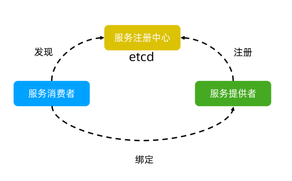
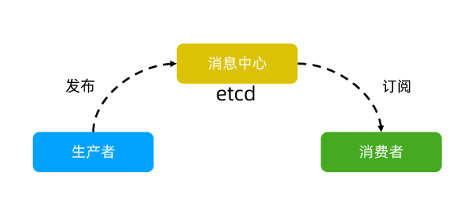
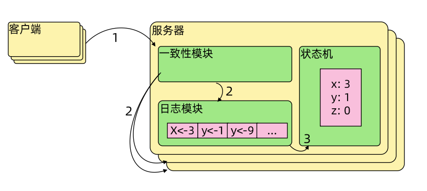
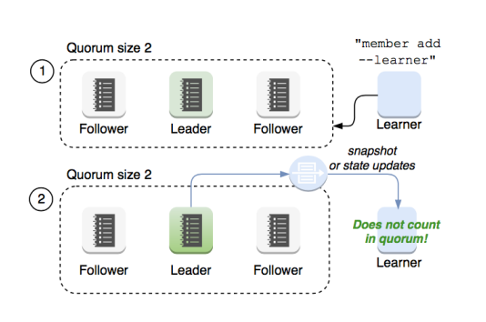

[toc]


# etcd 简介

etcd -- etc distribution ，linux 中的 etc 目录主要用于配置文件管理，etcd 受/etc 启发，构件分布式的配置管理的产品。etcd 是CoreOS 基于 Raft 开发的分布式 key-value 存储，可用于服务发现、共享配置以及一致性保障（如数据库选主、分布式锁等）。      

在分布式系统中，如何管理节点间的状态一直是一个难题，etcd 像是专门为集群环境的服务发现和注册而设计，它提供了数据 TTL 失效、数据改变监视、多值、目录监听、分布式锁原子操作等功能，可以方便的跟踪并管理集群节点的状态。  

* 键值对存储：将数据存储在分层组织的目录中，如同在标准文件系统中
* 监测变更：监测特定的键或目录以进行更改，并对值的更改做出反应
* 简单：curl 可访问的用户的 API（HTTP+JSON）
* 安全：可选的SSL客户端证书认证
* 快速：单实例每秒1000次写操作，2000+次读操作
* 可靠：使用 Raft 算法保证一致性


## 主要功能及使用场景

### 主要功能

* 基本的 key-value 存储
* 监听机制
* key 的过期及续约机制，用于监控和服务发现
* 原子 Compare And Swap 和 Compare And Delete，用于分布式锁和 leader 选举


### 使用场景

* 可以用键值对存储，应用程序可以读取和写入 etcd 中的数据
* etcd 比较多的应用场景是用于服务注册和发现
* 基于监听机制的分布式异步系统


#### 键值对存储

etcd 是一个**键值存储**的组件，其他的应用都是基于其键值存储的功能展开。

* 采用**KV型**数据存储，一般情况下比关系型数据库快
* 支持动态存储（内存）以及静态存储（磁盘）
* **分布式存储**，可集成为多节点集群
* 存储方式，采用类似目录结构（B+tree)
  * 只有叶子节点才能真正存储数据，相当于文件
  * 叶子节点的父节点一定是目录，目录不能存储数据


#### 服务注册与发现

* 强一致性、高可用的服务存储目
  * 基于 Raft 算法的etcd天生就是这样一个强一致性、高可用的服务存储目录
* 一种注册服务和服务健康状况的机制
  * 用户可以在 etcd 中注册服务，并且对注册服务配置 key TTL，定时保持服务的心跳已达到监控健康状态的效果





#### 消息发布与定阅

* 在分布式系统中，最适用的一种组件间通信方式就是消息发布与订阅
* 即构建一个配置共享中心，数据提供者在这个配置中心发布消息，而消息使用者则订阅他们关心的主题，一旦主题有消息发布，就会实时通知订阅者
* 通过这种方式可以做到分布式系统配置的集中式管理与动态更新
* 应用中用到的一些配置信息放到 etcd 上进行集中管理
* 应用在启动的时候主动从etcd 获取一次配置信息，同时，在 etcd 节点上注册一个 Watcher 并等待，以后每次配置有更新的时候，etcd 都会实时通知订阅者，以此达到获取最新配置信息的目的




## etcd 安装

参考链接：[Releases · etcd-io/etcd · GitHub](https://github.com/etcd-io/etcd/releases)

```bash
ETCD_VER=v3.5.1

# choose either URL
GOOGLE_URL=https://storage.googleapis.com/etcd
GITHUB_URL=https://github.com/etcd-io/etcd/releases/download
DOWNLOAD_URL=${GOOGLE_URL}

rm -f /tmp/etcd-${ETCD_VER}-linux-amd64.tar.gz
rm -rf /tmp/etcd-download-test && mkdir -p /tmp/etcd-download-test

curl -L ${DOWNLOAD_URL}/${ETCD_VER}/etcd-${ETCD_VER}-linux-amd64.tar.gz -o /tmp/etcd-${ETCD_VER}-linux-amd64.tar.gz
tar xzvf /tmp/etcd-${ETCD_VER}-linux-amd64.tar.gz -C /tmp/etcd-download-test --strip-components=1
rm -f /tmp/etcd-${ETCD_VER}-linux-amd64.tar.gz

/tmp/etcd-download-test/etcd --version
/tmp/etcd-download-test/etcdctl version
/tmp/etcd-download-test/etcdutl version
```


孟老师的链接：[101/1.etcd-member-list.MD at master · cncamp/101 · GitHub](https://github.com/cncamp/101/blob/master/module5/1.etcd-member-list.MD)

```bash
ETCD_VER=v3.4.17
DOWNLOAD_URL=https://github.com/etcd-io/etcd/releases/download
rm -f /tmp/etcd-${ETCD_VER}-linux-amd64.tar.gz
rm -rf /tmp/etcd-download-test && mkdir -p /tmp/etcd-download-test
curl -L ${DOWNLOAD_URL}/${ETCD_VER}/etcd-${ETCD_VER}-linux-amd64.tar.gz -o /tmp/etcd-${ETCD_VER}-linux-amd64.tar.gz
tar xzvf /tmp/etcd-${ETCD_VER}-linux-amd64.tar.gz -C /tmp/etcd-download-test --strip-components=1
rm -f /tmp/etcd-${ETCD_VER}-linux-amd64.tar.gz
rm -rf /tmp/etcd-download-test
```


### 第三方库和客户端工具

目前有很多支持 etcd 的库和客户端工具

* 命令行客户端工具 etcdctl
* Go 客户端 go-etcd
* Java 客户端 jetcd
* Python 客户端 python-etcd


### 练习

```bash
启动etcd：
/tmp/etcd-download-test/etcd
...

查看etcd运行情况：
./etcdctl member list --write-out=table
+------------------+---------+---------+-----------------------+-----------------------+------------+
|        ID        | STATUS  |  NAME   |      PEER ADDRS       |     CLIENT ADDRS      | IS LEARNER |
+------------------+---------+---------+-----------------------+-----------------------+------------+
| 8e9e05c52164694d | started | default | http://localhost:2380 | http://localhost:2379 |      false |
+------------------+---------+---------+-----------------------+-----------------------+------------+


存入数据：
[root@node1 etcd-download-test]# ./etcdctl put /key1 val1
OK

查询数据：
[root@node1 etcd-download-test]# ./etcdctl get /key1
/key1
val1

再插入一条数据：
[root@node1 etcd-download-test]# ./etcdctl put /key2 val2
OK

按前缀匹配查询：
[root@node1 etcd-download-test]# ./etcdctl get --prefix /
/key1
val1
/key2
val2

通过watch可以长链接持续监听，通过另一客户端写入数据，此时watch的客户端会收到消息：
[root@node1 etcd-download-test]# ./etcdctl watch --prefix /
PUT
/key3
val3


```


## TTL

TTL（Time To Live）指的是给一个key 设置一个有效期，到期后这个key 就会被自动删除掉，这在很多分布式锁的实现上都会用到，可以保证锁的实时有效性。


## CAS

Atomic Compare-and-Swap（CAS）指的是在对 key 进行赋值的时候，客户端需要提供一些条件，当这些条件满足后，才能赋值成功。       

这些条件包括：

* prevExist：key 当前赋值前是否存在
* prevValue：key 当前赋值的值
* prevIndex：key 当前赋值前的 Index

这样的话，key 的设置是有前提的，需要知道这个 key 当前的具体情况才可以对其设置


# Raft协议

## 概览

Raft 协议基于 quorum 机制，即大多数同意原则，任何的变更都需超过半数的成员确认。



系统中每个节点有三个组件：

* 状态机
* Log
* 一致性模块


## Raft 协议讲解动画

[Raft (thesecretlivesofdata.com)](http://thesecretlivesofdata.com/raft/)


Raft 协议中，一个节点可以有3个状态：

* leader
* followers
* candidate


## Learner

Raft 4.2.1 引入的新角色  

* 当出现一个 etcd 集群需要增加节点时，新节点与 Leader 的数据差异较大，需要较多数据同步才能跟上 Leader 的最新的数据
* 此时 Leader 的网络带宽很可能被用尽
* 进而导致 Follower 重新发起投票
* 进而可能引发 etcd 集群不可用
* **Learner 角色只接收数据而不参与投票，因此增加 Learner 节点时，集群的 quorum 不变。**




# etcd 实现 Raft 协议

## etcd 基于Raft 的一致性

### 选举方法

* 初始启动时，节点处于Follower状态并被设定一个 election timeout，如果在这一时间周期内没有收到来自
* Leader 节点依靠定时向 Follower 发送 heartbeat 来保持其地位
* 任何时候如果其他 Follower 在 election timeout 期间都没有收到来自 Leader 的 heartbeat，同样会将自己的状态切换为 candidate 并发起选举。每成功选举一次，新 Leader 的任期（Term）都会比之前 Leader 的任期大1。


## 日志复制


## 安全性


# 高可用 etcd 集群


# 常见问题及解决办法


