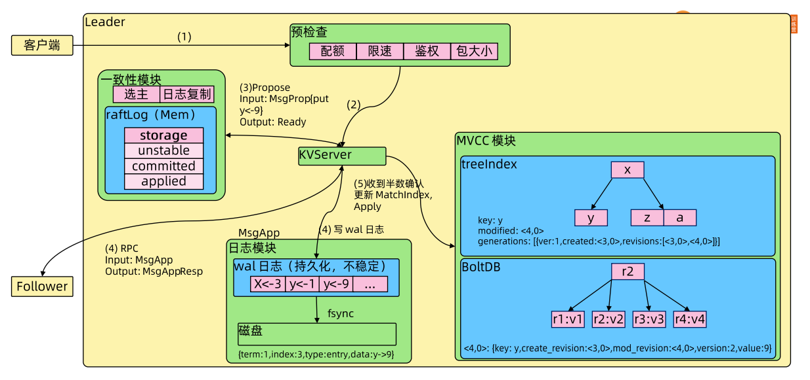

[toc]


# etcd 简介

etcd -- etc distribution ，linux 中的 etc 目录主要用于配置文件管理，etcd 受/etc 启发，构件分布式的配置管理的产品。etcd 是CoreOS 基于 Raft 开发的分布式 key-value 存储，可用于服务发现、共享配置以及一致性保障（如数据库选主、分布式锁等）。      

在分布式系统中，如何管理节点间的状态一直是一个难题，etcd 像是专门为集群环境的服务发现和注册而设计，它提供了数据 TTL 失效、数据改变监视、多值、目录监听、分布式锁原子操作等功能，可以方便的跟踪并管理集群节点的状态。  

* 键值对存储：将数据存储在分层组织的目录中，如同在标准文件系统中
* 监测变更：监测特定的键或目录以进行更改，并对值的更改做出反应
* 简单：curl 可访问的用户的 API（HTTP+JSON）
* 安全：可选的SSL客户端证书认证
* 快速：单实例每秒1000次写操作，2000+次读操作
* 可靠：使用 Raft 算法保证一致性


## 主要功能及使用场景

### 主要功能

* 基本的 key-value 存储
* 监听机制
* key 的过期及续约机制，用于监控和服务发现
* 原子 Compare And Swap 和 Compare And Delete，用于分布式锁和 leader 选举


### 使用场景

* 可以用键值对存储，应用程序可以读取和写入 etcd 中的数据
* etcd 比较多的应用场景是用于服务注册和发现
* 基于监听机制的分布式异步系统


#### 键值对存储

etcd 是一个**键值存储**的组件，其他的应用都是基于其键值存储的功能展开。

* 采用**KV型**数据存储，一般情况下比关系型数据库快
* 支持动态存储（内存）以及静态存储（磁盘）
* **分布式存储**，可集成为多节点集群
* 存储方式，采用类似目录结构（B+tree)
  * 只有叶子节点才能真正存储数据，相当于文件
  * 叶子节点的父节点一定是目录，目录不能存储数据


#### 服务注册与发现

* 强一致性、高可用的服务存储目
  * 基于 Raft 算法的etcd天生就是这样一个强一致性、高可用的服务存储目录
* 一种注册服务和服务健康状况的机制
  * 用户可以在 etcd 中注册服务，并且对注册服务配置 key TTL，定时保持服务的心跳已达到监控健康状态的效果


服务注册者将自己注册至服务注册中心，并定期续约。  
注册中心定期清除掉未续约的提供者。  
服务消费者查询到的服务提供者都是有效的。


#### 消息发布与订阅

* 在分布式系统中，最适用的一种组件间通信方式就是消息发布与订阅
* 即构建一个配置共享中心，数据提供者在这个配置中心发布消息，而消息使用者则订阅他们关心的主题，一旦主题有消息发布，就会实时通知订阅者
* 通过这种方式可以做到分布式系统配置的集中式管理与动态更新
* 应用中用到的一些配置信息放到 etcd 上进行集中管理
* 应用在启动的时候主动从etcd 获取一次配置信息，同时，在 etcd 节点上注册一个 Watcher 并等待，以后每次配置有更新的时候，etcd 都会实时通知订阅者，以此达到获取最新配置信息的目的


  
消费者通过 watch 的方式，保持长连接会话，与消费者相关的主题有新的消息时，etcd 会将消息推送给消费者


## etcd 安装

参考链接：[Releases · etcd-io/etcd · GitHub](https://github.com/etcd-io/etcd/releases)

```bash
ETCD_VER=v3.5.1

# choose either URL
GOOGLE_URL=https://storage.googleapis.com/etcd
GITHUB_URL=https://github.com/etcd-io/etcd/releases/download
DOWNLOAD_URL=${GOOGLE_URL}

rm -f /tmp/etcd-${ETCD_VER}-linux-amd64.tar.gz
rm -rf /tmp/etcd-download-test && mkdir -p /tmp/etcd-download-test

curl -L ${DOWNLOAD_URL}/${ETCD_VER}/etcd-${ETCD_VER}-linux-amd64.tar.gz -o /tmp/etcd-${ETCD_VER}-linux-amd64.tar.gz
tar xzvf /tmp/etcd-${ETCD_VER}-linux-amd64.tar.gz -C /tmp/etcd-download-test --strip-components=1
rm -f /tmp/etcd-${ETCD_VER}-linux-amd64.tar.gz

/tmp/etcd-download-test/etcd --version
/tmp/etcd-download-test/etcdctl version
/tmp/etcd-download-test/etcdutl version
```


孟老师的链接：[101/1.etcd-member-list.MD at master · cncamp/101 · GitHub](https://github.com/cncamp/101/blob/master/module5/1.etcd-member-list.MD)

```bash
ETCD_VER=v3.4.17
DOWNLOAD_URL=https://github.com/etcd-io/etcd/releases/download
rm -f /tmp/etcd-${ETCD_VER}-linux-amd64.tar.gz
rm -rf /tmp/etcd-download-test && mkdir -p /tmp/etcd-download-test
curl -L ${DOWNLOAD_URL}/${ETCD_VER}/etcd-${ETCD_VER}-linux-amd64.tar.gz -o /tmp/etcd-${ETCD_VER}-linux-amd64.tar.gz
tar xzvf /tmp/etcd-${ETCD_VER}-linux-amd64.tar.gz -C /tmp/etcd-download-test --strip-components=1
rm -f /tmp/etcd-${ETCD_VER}-linux-amd64.tar.gz
rm -rf /tmp/etcd-download-test
```


### 第三方库和客户端工具

目前有很多支持 etcd 的库和客户端工具

* 命令行客户端工具 etcdctl
* Go 客户端 go-etcd
* Java 客户端 jetcd
* Python 客户端 python-etcd


## 练习

```bash
# 启动etcd：
/tmp/etcd-download-test/etcd
...
# 如果要修改端口，可以在后面指定参数 `--listen-client-urls '地址'`、`--listen-peer-urls 'peer 的url地址'`、`--initial-cluster '地址'`等 

#查看etcd运行情况：
./etcdctl member list --write-out=table
+------------------+---------+---------+-----------------------+-----------------------+------------+
|        ID        | STATUS  |  NAME   |      PEER ADDRS       |     CLIENT ADDRS      | IS LEARNER |
+------------------+---------+---------+-----------------------+-----------------------+------------+
| 8e9e05c52164694d | started | default | http://localhost:2380 | http://localhost:2379 |      false |
+------------------+---------+---------+-----------------------+-----------------------+------------+


# 存入数据：
[root@node1 etcd-download-test]# ./etcdctl put /key1 val1
OK

# 查询数据：
[root@node1 etcd-download-test]# ./etcdctl get /key1
/key1
val1

# 再插入一条数据：
[root@node1 etcd-download-test]# ./etcdctl put /key2 val2
OK

# 按前缀匹配查询：
[root@node1 etcd-download-test]# ./etcdctl get --prefix /
/key1
val1
/key2
val2

# 通过watch可以长链接持续监听，通过另一客户端写入数据，此时watch的客户端会收到消息：
[root@node1 etcd-download-test]# ./etcdctl watch --prefix /
PUT
/key3
val3

```


## TTL
TTL（Time To Live）指的是给一个key 设置一个有效期，到期后这个key 就会被自动删除掉，这在很多分布式锁的实现上都会用到，可以保证锁的实时有效性。


## CAS
Atomic Compare-and-Swap（CAS）指的是在对 key 进行赋值的时候，客户端需要提供一些条件，当这些条件满足后，才能赋值成功。       

这些条件包括：

* prevExist：key 当前赋值前是否存在
* prevValue：key 当前赋值的值
* prevIndex：key 当前赋值前的 Index

这样的话，key 的设置是有前提的，需要知道这个 key 当前的具体情况才可以对其设置  


# Raft协议

## 概览
Paxos 协议的简化演进版。  

Raft 协议基于 quorum 机制，即大多数同意原则，任何的变更都需超过半数的成员确认。


系统中每个节点有三个组件：

* 状态机
* Log
* 一致性模块

服务端接收到客户端请求后，由一致性模块将变更请求发送给 peer，再将变更请求写入到日志模块，peer 接收到请求后会写入日志模块，并将处理结果发送给发起方，当大多数 peer 都确认后，数据会写入状态机，客户端的查询都是状态机中的数据。  


## Raft 协议讲解动画

[Raft (thesecretlivesofdata.com)](http://thesecretlivesofdata.com/raft/)


Raft 协议中，一个节点可以有3个状态：
* leader：接收写入请求
* follower：同步 leader 的写入操作
* candidate：候选

### leader election
初始状态所有节点都为 follower，选举出 leader，leader 定期向其它 follower 发送心跳，当未收到 leader 时，follower 就可以变成 candidate，向集群中其它节点发送 leader election，请求自己变成 leader，半数以上节点同意后，新的 leader 产生

* election timeout：选举超时时间，leader 要定时发送心跳，在 timeout 时间内没有接收到心跳，会有新的节点发起 leader election 
* term：任期，当集群中 leader 挂掉后，需要选出 leader，term 任期会增加，以区分不同任期下 leader


### Log Replication
客户端写入请求发送到 leader，leader 通过多次心跳将写入请求的数据发送给其它 follower，反复确认，直到所有节点状态机写入了数据


### 集群节点应当是奇数
防止偶数情况下，多个节点票数一致，重复投票问题

### 分区恢复
当由于网络故障等原因集群出现分区时，各个分区会重新选主，网络恢复后，新的任期 leader 数据会覆盖旧 leader 中不一致的数据 

## Learner
Raft 4.2.1 引入的新角色  

* 当出现一个 etcd 集群需要增加节点时，新节点与 Leader 的数据差异较大，需要较多数据同步才能跟上 Leader 的最新的数据
* 此时 Leader 的网络带宽很可能被用尽
* 进而导致 Follower 重新发起投票
* 进而可能引发 etcd 集群不可用
* **Learner 角色只接收数据而不参与投票，因此增加 Learner 节点时，集群的 quorum 不变。**


# etcd 实现 Raft 协议

## etcd 基于Raft 的一致性

## 选举方法

* 初始启动时，节点处于Follower状态并被设定一个 election timeout，如果在这一时间周期内没有收到来自 Leader 的 heartbeat，节点将发起选举，将自己切换为 candidate 之后，向集群中其它 Follower 节点发送请求，询问其是否选举自己成为 Leader
* 当收到来自集群中过半数节点接受投票后，节点即成为 Leader，开始接收保存 client 的数据并向其它的 Follower 节点同步日志。如果没有达成一致，则 candidate 随机选择一个等待间隔（150ms ~ 300ms）再次发起投票，得到集群中半数以上 Follower 接受的 candidate 将成为 Leader。
* Leader 节点依靠定时向 Follower 发送 heartbeat 来保持其地位
* 任何时候如果其他 Follower 在 election timeout 期间都没有收到来自 Leader 的 heartbeat，同样会将自己的状态切换为 candidate 并发起选举。每成功选举一次，新 Leader 的任期（Term）都会比之前 Leader 的任期大1。


## 日志复制
当 Leader 接收到客户端的日志（事务请求）后先把该日志追加到本地的 Log 中，然后通过 heartbeat 把该 Entry 同步给其他 Follower，Follower 接收到日志后记录日志然后向 Leader 发送 ACK，当 Leader 收到大多数（n/2+1) Follower 的 ACK 信息后将该日志设置为已提交并追加到本地磁盘中，通知客户端并在下个 heartbeat 中 Leader 将通知所有的 Follower 将该日志存储在自己的本地磁盘中。

* 写入请求由 Leader 处理，即使集群中的 Follower 接收到写请求，也会转送给 Leader 操作


## 安全性
### Safety
保证每个节点都执行相同序列的安全机制。  
如当某个 Follower 在当前 Leader commit Log 时变得不可用了，稍后可能该 Follower 又会被选举为 Leader，则是新 Leader 可能会用新的 Log 覆盖先前已 committed 的 Log，这就会导致节点执行不同序列，Safety 就是用于保证选举出来的 Leader 一定包含先前 committed Log 的机制。  

### 选举安全性（Election Safety）
每个任期（Term）只能选举出一个 Leader  

### Leader 完整性（Leader Completeness）
指 Leader 日志的完整性，当 Log 在任期 Term1 被 Commit 后，那么以后任期 Term2、Term3... 等的 Leader 必须包含该 Log；Raft 在选举阶段就使用 Term 的判断用于保证完整性：当请求投票的该 Candidate 的 Term 较大或 Term 相同 Index 更大则投票，否则拒绝该请求


## 失效处理
* Leader 失效：没有收到 heartbeat 的节点会重新选举，当 Leader 恢复后由于步进数较小会自动成为 Follower （日志也会被新 Leader 的日志覆盖）
* Follower 节点不可用：恢复后重新在 Leader 节点复制
* 多个 candidate：冲突后 candidate 将随机选择一个等待时间（150ms ~ 300ms）再次投票，得到集群半数以上 Follower 接受的 candidate 成为 Leader


## wal 日志（write ahead log）

* etcd 源码下有个 tools/etcd-dump-logs ，可以将 wal 日志 dump 成文本查看，协助分析 Raft 协议
* Raft 协议本身不关心应用数据，也就是 data 中的部分，一致性都通过同步 wal 日志来实现，每个节点将从主节点收到的 data apply 到本地的存储，Raft 只关心日志的同步状态，如果本地存储实现的有 bug，比如没有正确地将 data apply 到本地，也可能会导致数据不一致。

## 存储机制
etcd v3 store 分为两部分
* 一部分是内存中的索引，**kvindex**，基于 Google 开源的一个 Golang 的 Btree 实现
* 另外一部分是后端存储。按照它的设计，backend 可以对接多种存储，当前使用的是 **boltdb**

boltdb 是一个单机的支持事务的 KV存储，etcd 的事务是基于 boltdb 的事务实现的，etcd 在 boltdb 中存储的 key 是 revision，value 是 etcd 自己的 key-value 组合，也就是说 etcd 会在 boltdb 中把每个版本都保存下，从而实现了多版本机制  

### revision

revision 主要有两部分组成

* 第一部分 main rev，每次事务进行加一
* 第二部分 sub rev，同一个事务中的每次操作加一

etcd 提供了命令和设置选项来控制 compact ，同时支持 pub 操作的参数来精确控制某个 key 的历史版本数。  
内存 kvindex 保存的就是 key 和 revision 之间的映射关系，用来加速查询

### etcd 数据写入流程




1. 客户端写入数据会发送到 leader 节点，如果发送到 Follower，Follower 中的一致性模块会判断自己是否为 leader，不是则转给 leader
   * leader 首先会做预检查，配额，是否还有空间写入；是否需要限速；鉴权，是否有权限写入；包大小，是否超过1.5M等
2. 通过预检查以后会进入 KVServer
3. KVServer 发现是写请求，会通过 Propose 方法发送消息到一致性模块，一致性模块会在内存中构建 raftLog（Mem），raftLog 是一种数据结构，先将数据写入到 unstable 中记录，再写入 wal 日志
4. 写 wal 日志，由日志模块 MsgApp 处理，先写入到 buffer 中，再周期性 fsync 到磁盘中
   * 同时会有 goroutine 将消息复制到 Follower ，Follower 写入会做同样操作，完成后会通知 Leader
5. Leader 收到半数 Follower 以上成员确认，会更新 MatchIndex，再将 raftLog 中的 unstable 中的值放入 committed 中，之后再通过 Apply 方法请求状态机（基于 MVCC(MultiVersion Concurrence control) 模块）记录这次请求，
   * treeIndex ：key中存放 key 信息，还有 modified 存放当前版本信息，另外有 generations 存放所有版本信息、revisions 等
   * BoltDB：存放的 key 是 revision 号，value 中存放的是历史信息


## etcd 的数据一致性


etcd 中维护了 Term 和 Index 信息
* Term 存放任期信息
* Index 
* Committed log ：超过半数确认的日志

重新选举 Leader 时，未确认过的 index 会被放弃，matchindex 小于 committed log 时，不能参加 leader election ，这样保证集群数据一致性


## Watch 机制
etcd V3 的 Watch 机制支持 Watch 某个固定的 key，也支持 Watch 一个范围（可以用于模拟目录的结构的 Watch），所以 watchGroup 包含两种 watcher
* key watchers，数据结构是每个 key 对应一组 watcher
* range watchers，数据结构是一个 IntervalTree，方便通过区间查找到对应的 watcher

同时 每个 WatchableStore 包含两种 watcherGroup，一种是 synced，一种是 unsynced，前者表示该 group 的 watcher 数据都已经同步完毕，在等待新的变更，后者表示该 group 的 watcher 数据同步落后于当前最新变更，还在追赶。  

当 etcd 收到客户端的 watch 请求，如果请求携带了 revision 参数，则比较请求的 revision 和 store 当前的 revision，如果大于当前 revision，则放入 synced 组中，否则放入 unsynced 组。  

同时，etcd 会启动一个后台的 goroutine 持续同步 unsynced 的 watcher，然后将其迁移到 synced 组。  

在这种机制下，etcd V3 支持从任意版本开始 watch，没有 V2 的 1000条历史 event 表限制的问题（当然这是指没有 compact 的情况下）。


## 练习：启动实例，写入查询数据

```bash
# 启动一个etcd
./etcd
# 启动一个 etcdctl 通过 watch 监听某个 key
./etcdctl watch /key1 --endpoints=localhost:2379
# 另外启动一个 etcdctl 写入数据到上面监听的 key 中
 ./etcdctl put /key1 value1
OK
# 通过 watch 监听的 etcdctl 界面可以看到变化
PUT
/key1
value1

# 也可以通过 -wjson 使得输出格式为 json，包含了 revision 等信息，但 key value 会被加密
./etcdctl get /key1 --endpoints=localhost:2379 -wjson
{"header":{"cluster_id":14841639068965178418,"member_id":10276657743932975437,"revision":4,"raft_term":2},"kvs":[{"key":"L2tleTE=","create_revision":2,"mod_revision":4,"version":3,"value":"dmFsdWUx"}],"count":1}

# 如果知道 revision 也可以通过 --rev= 指定 revision 号去查询
./etcdctl get /key1 --endpoints=localhost:2379 --rev=3
/key1
value2

# 或者 watch 时指定从某个 revision 开始，默认从当前最新的 revision 开始
root@node01:/tmp/etcd-download-test# ./etcdctl watch /key1 --endpoints=localhost:2379 --rev=1
PUT
/key1
val1
PUT
/key1
value2
PUT
/key1
value1


```


# 高可用 etcd 集群

## etcd 参数

### 成员参数
```bash
# name for this member
--name 'default'
# Path to the data directory, default is current path
--data-dir '${name}.etcd'
# URLs to listen on for peer traffic
--listen-peer-urls 'http://localhost:2380'
# URLs to listen on for client traffic
--listen-client-urls 'http://localhost:2379'
```


### 集群参数
```bash
# 集群对 peer 之间的宣告地址，一般优先级高于 client 的 advertise
--initial-advertise-peer-urls 'http://localhost:2380'
# 初始化集群，默认配置信息
--initial-cluster 'default=http://localhost:2380'
# new or existing, initial cluster,创建一个新的集群或加入已有集群
--initial-cluster-state 'new'
# initial cluster token，初始化 token 信息
--initial-cluster-token 'etcd-cluster'
# 集群对 client 宣告地址
--advertise-client-urls 'http://localhost:2379'
```

### 安全相关参数
```bash
# client TLS cert file
--cert-file ''
# client TLS key file
--key-file ''
# client TLS certificate revocation list file，废弃的证书路径
--client-crl-file ''
# client TLS CA cert file
--trusted-ca-file ''
# peer TLS cert file
--peer-cert-file ''
# peer TLS key file
--peer-key-file ''
# peer TLS trusted CA file
--peer-trusted-ca-file ''

```


## 灾备
案例：etcd 以 Pod 形式启动，因为某些原因 Pod 都被驱逐掉，且 data 数据没有挂载到 Pod 外部，例如 calico 可以有自己的 etcd 存放集群所有节点 ip 信息，一旦删除，集群 ip 会混乱冲突。因此要及时备份 etcd 中的数据。

### Snapshot
创建
```bash
etcdctl --endpoints https://127.0.0.1:2379 --cert /tmp/etcd-certs/certs/127.0.0.1.pem --key  /tmp/etcd-certs/certs/127.0.0.1-key.pem --cacert  /tmp/etcd-certs/certs/ca.pem snapshot save snapshot.db
```
恢复数据
```bash
etcdctl snapshot restore snapshot.db --name infra2 --data-dir=/tmp/etcd/infra2 --initial-clusterinfra0=https://127.0.0.1:2380,infra1=http://127.0.0.1:3380,infra2=http://127.0.0.1:4380 --initial-cluster-token etcd-cluster-1 --initial-advertise-peer-urls http://127.0.0.1:5380
```

### 练习：单节点集群搭建，模拟灾备恢复

演示3个节点的集群数据备份、破坏、恢复

```bash
# 安装 golang-cfssl
apt install golang-cfssl
# 创建目录，用于etcd-io
mkdir /root/go/src/github.com/etcd-io
cd /root/go/src/github.com/etcd-io
# 拉取 etcd-io 代码
git clone https://github.com/etcd-io/etcd.git
cd etcd/hack/tls-setup
# 编辑配置文件，保留 127.0.0.1  localhost
vi config/req-csr.json
# 输出三个示例的 IP，生成证书，创建证书目录，将证书文件移动到该目录
export infra0=127.0.0.1
export infra1=127.0.0.1
export infra2=127.0.0.1
make
mkdir /tmp/etcd-certs
mv certs /tmp/etcd-certs
```


启动三个节点：

```bash
# 在单台机器上使用不同端口，模拟3个实例，data、
nohup etcd --name infra0 \
--data-dir=/tmp/etcd/infra0 \
--listen-peer-urls https://127.0.0.1:3380 \
--initial-advertise-peer-urls https://127.0.0.1:3380 \
--listen-client-urls https://127.0.0.1:3379 \
--advertise-client-urls https://127.0.0.1:3379 \
--initial-cluster-token etcd-cluster-1 \
--initial-cluster infra0=https://127.0.0.1:3380,infra1=https://127.0.0.1:4380,infra2=https://127.0.0.1:5380 \
--initial-cluster-state new \
--client-cert-auth --trusted-ca-file=/tmp/etcd-certs/certs/ca.pem \
--cert-file=/tmp/etcd-certs/certs/127.0.0.1.pem \
--key-file=/tmp/etcd-certs/certs/127.0.0.1-key.pem \
--peer-client-cert-auth --peer-trusted-ca-file=/tmp/etcd-certs/certs/ca.pem \
--peer-cert-file=/tmp/etcd-certs/certs/127.0.0.1.pem \
--peer-key-file=/tmp/etcd-certs/certs/127.0.0.1-key.pem 2>&1 > /var/log/infra0.log &

nohup etcd --name infra1 \
--data-dir=/tmp/etcd/infra1 \
--listen-peer-urls https://127.0.0.1:4380 \
--initial-advertise-peer-urls https://127.0.0.1:4380 \
--listen-client-urls https://127.0.0.1:4379 \
--advertise-client-urls https://127.0.0.1:4379 \
--initial-cluster-token etcd-cluster-1 \
--initial-cluster infra0=https://127.0.0.1:3380,infra1=https://127.0.0.1:4380,infra2=https://127.0.0.1:5380 \
--initial-cluster-state new \
--client-cert-auth --trusted-ca-file=/tmp/etcd-certs/certs/ca.pem \
--cert-file=/tmp/etcd-certs/certs/127.0.0.1.pem \
--key-file=/tmp/etcd-certs/certs/127.0.0.1-key.pem \
--peer-client-cert-auth --peer-trusted-ca-file=/tmp/etcd-certs/certs/ca.pem \
--peer-cert-file=/tmp/etcd-certs/certs/127.0.0.1.pem \
--peer-key-file=/tmp/etcd-certs/certs/127.0.0.1-key.pem 2>&1 > /var/log/infra1.log &

nohup etcd --name infra2 \
--data-dir=/tmp/etcd/infra2 \
--listen-peer-urls https://127.0.0.1:5380 \
--initial-advertise-peer-urls https://127.0.0.1:5380 \
--listen-client-urls https://127.0.0.1:5379 \
--advertise-client-urls https://127.0.0.1:5379 \
--initial-cluster-token etcd-cluster-1 \
--initial-cluster infra0=https://127.0.0.1:3380,infra1=https://127.0.0.1:4380,infra2=https://127.0.0.1:5380 \
--initial-cluster-state new \
--client-cert-auth --trusted-ca-file=/tmp/etcd-certs/certs/ca.pem \
--cert-file=/tmp/etcd-certs/certs/127.0.0.1.pem \
--key-file=/tmp/etcd-certs/certs/127.0.0.1-key.pem \
--peer-client-cert-auth --peer-trusted-ca-file=/tmp/etcd-certs/certs/ca.pem \
--peer-cert-file=/tmp/etcd-certs/certs/127.0.0.1.pem \
--peer-key-file=/tmp/etcd-certs/certs/127.0.0.1-key.pem 2>&1 > /var/log/infra2.log &
```

查看状态，写入数据，备份数据到文件：

```bash
# 通过 ctl 查看集群列表中成员，可以看到上面启动的实例状态，都监听在启动参数指定的对应端口
etcdctl --endpoints https://127.0.0.1:3379 --cert /tmp/etcd-certs/certs/127.0.0.1.pem --key /tmp/etcd-certs/certs/127.0.0.1-key.pem --cacert /tmp/etcd-certs/certs/ca.pem member list
1701f7e3861531d4, started, infra0, https://127.0.0.1:3380, https://127.0.0.1:3379, false
6a58b5afdcebd95d, started, infra1, https://127.0.0.1:4380, https://127.0.0.1:4379, false
84a1a2f39cda4029, started, infra2, https://127.0.0.1:5380, https://127.0.0.1:5379, false

# 向集群中写入几条数据
etcdctl  --endpoints https://127.0.0.1:3379 --cert /tmp/etcd-certs/certs/127.0.0.1.pem --key /tmp/etcd-certs/certs/127.0.0.1-key.pem --cacert /tmp/etcd-certs/certs/ca.pem put a b
etcdctl  --endpoints https://127.0.0.1:3379 --cert /tmp/etcd-certs/certs/127.0.0.1.pem --key /tmp/etcd-certs/certs/127.0.0.1-key.pem --cacert /tmp/etcd-certs/certs/ca.pem put c d
etcdctl  --endpoints https://127.0.0.1:3379 --cert /tmp/etcd-certs/certs/127.0.0.1.pem --key /tmp/etcd-certs/certs/127.0.0.1-key.pem --cacert /tmp/etcd-certs/certs/ca.pem put e 123

# 备份数据到文件中
etcdctl --endpoints https://127.0.0.1:3379 \
--cert /tmp/etcd-certs/certs/127.0.0.1.pem \
--key /tmp/etcd-certs/certs/127.0.0.1-key.pem \
--cacert /tmp/etcd-certs/certs/ca.pem snapshot save snapshot.db

```

模拟故障：

```bash
# 删除上面3个实例的数据目录
rm -rf /tmp/etcd
# kill 3个实例的进程，如果不 kill，等到 etcd 要将数据落盘时，也会报错自动退出
kill -15 $ETCD1_PID $ETCD2_PID $ETCD3_PID
# 查看日志文件，可以看到告警信息
tail /var/log/infra1.log
{"level":"warn","ts":"2022-04-29T09:28:33.137+0800","caller":"rafthttp/probing_status.go:68","msg":"prober detected unhealthy status","round-tripper-name":"ROUND_TRIPPER_RAFT_MESSAGE","remote-peer-id":"84a1a2f39cda4029","rtt":"0s","error":"dial tcp 127.0.0.1:5380: connect: connection refused"}
{"level":"warn","ts":"2022-04-29T09:28:33.137+0800","caller":"rafthttp/probing_status.go:68","msg":"prober detected unhealthy status","round-tripper-name":"ROUND_TRIPPER_SNAPSHOT","remote-peer-id":"84a1a2f39cda4029","rtt":"0s","error":"dial tcp 127.0.0.1:5380: connect: connection refused"}
{"level":"info","ts":"2022-04-29T09:28:33.510+0800","caller":"membership/cluster.go:576","msg":"updated cluster version","cluster-id":"c36a1e619c38211b","local-member-id":"6a58b5afdcebd95d","from":"3.0","to":"3.5"}
{"level":"fatal","ts":"2022-04-29T09:41:13.155+0800","caller":"etcdserver/server.go:872","msg":"failed to purge snap file","error":"open /tmp/etcd/infra1/member/snap: no such file or directory","stacktrace":"go.etcd.io/etcd/server/v3/etcdserver.(*EtcdServer).purgeFile\n\t/tmp/etcd-release-3.5.1/etcd/release/etcd/server/etcdserver/server.go:872\ngo.etcd.io/etcd/server/v3/etcdserver.(*EtcdServer).GoAttach.func1\n\t/tmp/etcd-release-3.5.1/etcd/release/etcd/server/etcdserver/server.go:2659"}

```


恢复数据：

```bash
# 设置环境变量，使用 v3 版本 API
export ETCDCTL_API=3
# 通过备份的文件 restore 到之前设置的实例目录中
etcdctl snapshot restore snapshot.db \
  --name infra0 \
  --data-dir=/tmp/etcd/infra0 \
  --initial-cluster infra0=https://127.0.0.1:3380,infra1=https://127.0.0.1:4380,infra2=https://127.0.0.1:5380 \
  --initial-cluster-token etcd-cluster-1 \
  --initial-advertise-peer-urls https://127.0.0.1:3380

etcdctl snapshot restore snapshot.db \
    --name infra1 \
    --data-dir=/tmp/etcd/infra1 \
    --initial-cluster infra0=https://127.0.0.1:3380,infra1=https://127.0.0.1:4380,infra2=https://127.0.0.1:5380 \
    --initial-cluster-token etcd-cluster-1 \
    --initial-advertise-peer-urls https://127.0.0.1:4380

etcdctl snapshot restore snapshot.db \
  --name infra2 \
  --data-dir=/tmp/etcd/infra2 \
  --initial-cluster infra0=https://127.0.0.1:3380,infra1=https://127.0.0.1:4380,infra2=https://127.0.0.1:5380 \
  --initial-cluster-token etcd-cluster-1 \
  --initial-advertise-peer-urls https://127.0.0.1:5380

```


重启脚本：

```bash
# 相比上面初始化的部分，少了一下 init 参数
nohup etcd --name infra0 \
--data-dir=/tmp/etcd/infra0 \
--listen-peer-urls https://127.0.0.1:3380 \
--listen-client-urls https://127.0.0.1:3379 \
--advertise-client-urls https://127.0.0.1:3379 \
--client-cert-auth --trusted-ca-file=/tmp/etcd-certs/certs/ca.pem \
--cert-file=/tmp/etcd-certs/certs/127.0.0.1.pem \
--key-file=/tmp/etcd-certs/certs/127.0.0.1-key.pem \
--peer-client-cert-auth --peer-trusted-ca-file=/tmp/etcd-certs/certs/ca.pem \
--peer-cert-file=/tmp/etcd-certs/certs/127.0.0.1.pem \
--peer-key-file=/tmp/etcd-certs/certs/127.0.0.1-key.pem 2>&1 > /var/log/infra0.log &

nohup etcd --name infra1 \
--data-dir=/tmp/etcd/infra1 \
--listen-peer-urls https://127.0.0.1:4380 \
--listen-client-urls https://127.0.0.1:4379 \
--advertise-client-urls https://127.0.0.1:4379 \
--client-cert-auth --trusted-ca-file=/tmp/etcd-certs/certs/ca.pem \
--cert-file=/tmp/etcd-certs/certs/127.0.0.1.pem \
--key-file=/tmp/etcd-certs/certs/127.0.0.1-key.pem \
--peer-client-cert-auth --peer-trusted-ca-file=/tmp/etcd-certs/certs/ca.pem \
--peer-cert-file=/tmp/etcd-certs/certs/127.0.0.1.pem \
--peer-key-file=/tmp/etcd-certs/certs/127.0.0.1-key.pem 2>&1 > /var/log/infra1.log &

nohup etcd --name infra2 \
--data-dir=/tmp/etcd/infra2 \
--listen-peer-urls https://127.0.0.1:5380 \
--listen-client-urls https://127.0.0.1:5379 \
--advertise-client-urls https://127.0.0.1:5379 \
--client-cert-auth --trusted-ca-file=/tmp/etcd-certs/certs/ca.pem \
--cert-file=/tmp/etcd-certs/certs/127.0.0.1.pem \
--key-file=/tmp/etcd-certs/certs/127.0.0.1-key.pem \
--peer-client-cert-auth --peer-trusted-ca-file=/tmp/etcd-certs/certs/ca.pem \
--peer-cert-file=/tmp/etcd-certs/certs/127.0.0.1.pem \
--peer-key-file=/tmp/etcd-certs/certs/127.0.0.1-key.pem 2>&1 > /var/log/infra2.log &

```

测试访问之前数据

```bash
# 再次查看之前插入的数据，已经恢复
./etcdctl --endpoints=https://localhost:3379 --cert=/tmp/etcd-certs/certs/127.0.0.1.pem --key=/tmp/etcd-certs/certs/127.0.0.1-key.pem --cacert=/tmp/etcd-certs/certs/ca.pem get a
a
b
```


## 容量管理

* 单个对象不建议超过 1.5M
* 默认容量 2G
* 不建议超过 8G

限制集群大小可以通过：`--quota-backend-bytes` 参数  

### 练习：限制容量，告警解除

```bash
# 启动一个 etcd 实例，限制容量大小为 16M
./etcd --quota-backend-bytes=$((16*1024*1024))
# 通过脚本循环写入数据，写入到 16M 以后会报错
while [ 1 ]; do dd if=/dev/urandom bs=1024 count=1024 | ETCDCTL_API=3 ./etcdctl put key || break; done
1024+0 records in
1024+0 records out
1048576 bytes (1.0 MB, 1.0 MiB) copied, 0.0285739 s, 36.7 MB/s
OK
.... omit ...
1024+0 records in
1024+0 records out
1048576 bytes (1.0 MB, 1.0 MiB) copied, 0.0360212 s, 29.1 MB/s
{"level":"warn","ts":"2022-04-28T18:18:25.446+0800","logger":"etcd-client","caller":"v3/retry_interceptor.go:62","msg":"retrying of unary invoker failed","target":"etcd-endpoints://0xc0000dea80/127.0.0.1:2379","attempt":0,"error":"rpc error: code = ResourceExhausted desc = etcdserver: mvcc: database space exceeded"}
Error: etcdserver: mvcc: database space exceeded

# 此时再写入数据也会报错
 ./etcdctl put a b
{"level":"warn","ts":"2022-04-28T18:26:48.970+0800","logger":"etcd-client","caller":"v3/retry_interceptor.go:62","msg":"retrying of unary invoker failed","target":"etcd-endpoints://0xc0003d0380/127.0.0.1:2379","attempt":0,"error":"rpc error: code = ResourceExhausted desc = etcdserver: mvcc: database space exceeded"}
Error: etcdserver: mvcc: database space exceeded


# 查看 endpoint 状态，有 alarm 告警 NOSPACE
./etcdctl --write-out=table endpoint status
+----------------+------------------+---------+---------+-----------+------------+-----------+------------+--------------------+--------------------------------+
|    ENDPOINT    |        ID        | VERSION | DB SIZE | IS LEADER | IS LEARNER | RAFT TERM | RAFT INDEX | RAFT APPLIED INDEX |             ERRORS             |
+----------------+------------------+---------+---------+-----------+------------+-----------+------------+--------------------+--------------------------------+
| 127.0.0.1:2379 | 8e9e05c52164694d |   3.5.1 |   17 MB |      true |      false |         3 |         20 |                 20 |  memberID:10276657743932975437 |
|                |                  |         |         |           |            |           |            |                    |                 alarm:NOSPACE  |
+----------------+------------------+---------+---------+-----------+------------+-----------+------------+--------------------+--------------------------------+
# 也可以通过 alarm list，查看告警信息
./etcdctl alarm list
memberID:10276657743932975437 alarm:NOSPACE 

# 整理碎片，释放空间
./etcdctl defrag
Finished defragmenting etcd member[127.0.0.1:2379]
# 接触告警，否则即使释放出空间，存在告警仍不能写入新的数据
root@node01:/tmp/etcd-download-test# ./etcdctl alarm disarm
memberID:10276657743932975437 alarm:NOSPACE 

# 再次写入数据成功
./etcdctl put a b
OK

```


### 碎片整理
```bash
# keep one hour of history
etcd --auto-compaction-retention=1
# compact up to revision  3
etcdctl compact 3
# defrag
etcdctl defrag
```


## 高可用 etcd 解决方案

### etcd-operator

CoresOS 开源的，基于 Kubernetes CRD 完成的 etcd 集群配置，最早的 Operator，CRD + Controller。目前已经归档不再维护，但是比较经典

* [github 项目链接](https://github.com/coreos/etcd-operator)


* 用户可以定义 etcdCluster，设置版本、Pod数量

* backup 可以定义备份频率、保留数量等
* restore 可以定义恢复数据，从远端拉取备份数据进行恢复


### Bitnami

vmware 主导的项目，基于 Helm chart

* [bitnami 链接](https://bitnami.com/stack/etcd/helm)
* [github](https://github.com/bitnami/charts/blob/master/bitnami/etcd)

#### 基于 Bitnami 安装高可用集群

```sh
# Install helm
https://github.com/helm/helm/releases
https://helm.sh/docs/intro/quickstart/
```

```bash
# Download bitnami etcd
helm repo add bitnami https://charts.bitnami.com/bitnami
helm pull bitnami/etcd
tar -xvf etcd-6.8.4.tgz
vi etcd/values.yaml
```

set persistence to false:

```yaml
persistence:
  ## @param persistence.enabled If true, use a Persistent Volume Claim. If false, use emptyDir.
  ##
  enabled: false
```

```bash
### Install etcd by helm chart
helm install my-release ./etcd

# 安装完成后，根据提示启动 etcd-client Pod

### Start etcd client
kubectl run my-release-etcd-client --restart='Never' --image docker.io/bitnami/etcd:3.5.0-debian-10-r94 --env ROOT_PASSWORD=$(kubectl get secret --namespace default my-release-etcd -o jsonpath="{.data.etcd-root-password}" | base64 --decode) --env ETCDCTL_ENDPOINTS="my-release-etcd.default.svc.cluster.local:2379" --namespace default --command -- sleep infinity


# 进入 Pod 中测试插入删除数据
kubectl exec --namespace default -it my-release-etcd-client -- bash
etcdctl --user root:$ROOT_PASSWORD put /message Hello
etcdctl --user root:$ROOT_PASSWORD get /message

```


### Kubernetes 如何使用 etcd

etcd 是 Kubernetes 的后端存储  

对于每一个 Kubernetes Object，都有对应的 storage.go 负责对象的存储操作，例如 ns、pod  

* pkg/registry/core/pod/storage/storage.go

API Server 启动脚本中指定 etcd servers 集群（kubeadmin 方式启动的集群配置文件在 /etc/kubernetes/manifests/ 下）

```yaml
spec:
  containers:
  - command:
    - kube-apiserver
    - --advertise-address=10.0.12.2
    - --allow-privileged=true
    - --authorization-mode=Node,RBAC
    - --client-ca-file=/etc/kubernetes/pki/ca.crt
    - --enable-admission-plugins=NodeRestriction
    - --enable-bootstrap-token-auth=true
    # 这里是关于 etcd 的配置信息
    # api server 对于 etcd 来说是一个客户端，所以要指定ca、key等文件和 etcd 的地址
    - --etcd-cafile=/etc/kubernetes/pki/etcd/ca.crt
    - --etcd-certfile=/etc/kubernetes/pki/apiserver-etcd-client.crt
    - --etcd-keyfile=/etc/kubernetes/pki/apiserver-etcd-client.key
    - --etcd-servers=https://127.0.0.1:2379
	..... omit .....
```

早期 API Server 只是对 etcd 做简单的 ping check，现在改为了 etcd api call 来检查 etcd 状态。etcd 如果出现故障，api server 应该同步停止运行，否则会出现一些异常，早期版本的 kubernetes 中就存在此问题。   


#### kubernetes 对象在 etcd 中的存储路径

```bash
# 使用 kubectl -v 9 查看 default namespace 的详细信息，输出内容中可以看到向 api server 发送了一个 curl GET 的命令
kubectl get ns default -v 9
..... omit ....
curl -v -XGET  -H "Accept: application/json;as=Table;v=v1;g=meta.k8s.io,application/json;as=Table;v=v1beta1;g=meta.k8s.io,application/json" -H "User-Agent: kubectl/v1.23.3 (linux/amd64) kubernetes/816c97a" 'https://10.0.12.2:6443/api/v1/namespaces/default'
.... omit ....
# 在上面的路径是 https://10.0.12.2:6443/api/v1/namespaces/default
# 进入 etcd Pod 中
kubectl -n kube-system exec -it etcd-master01 -- sh
# 配置环境变量
ETCDCTL_API=3
# 带上证书等信息，get 查询 key 列表，--prefix 是只返回key信息，否则会返回 value 内容
etcdctl --endpoints https://127.0.0.1:2379 --cacert /etc/kubernetes/pki/etcd/ca.crt --cert /etc/kubernetes/pki/etcd/server.crt --key /etc/kubernetes/pki/etcd/server.key get --prefix --keys-only /
....
/registry/namespaces/default
/registry/namespaces/ingress
/registry/namespaces/istio-system
/registry/namespaces/kube-node-lease
/registry/namespaces/kube-public
/registry/namespaces/kube-system
....

# 可以看到上面在 etcd 中存储的 namespace 信息，路径与 api server 中的后半部分相同，其实通过 API Server 获取对象信息，与 etcd 中查询的结果一致，API Server 中做了转换将 registry 后面的部分拼装到 api 中
# 设置一个 alias，方便操作
alias ectl='etcdctl --endpoints https://127.0.0.1:2379 --cacert /etc/kubernetes/pki/etcd/ca.crt --cert /etc/kubernetes/pki/etcd/server.crt --key /etc/kubernetes/pki/etcd/server.key'
# 指定前缀查询 namespace 内容，返回的信息与调用 api server 的信息一直，部分乱码是由于 protobuffer 格式转换导致
 ectl get --prefix /registry/namespaces/default
/registry/namespaces/default
k8s

v1	Namespace 

default"*$5777924e-ac1e-49c7-bc66-37ce55eae6352󀏆Z&
ubernetes.io/metadata.namedefaultz}
kube-apiserverUpdatev󀏆FieldsV1:I
G{"f:metadata":{"f:labels":{".":{},"f:kubernetes.io/metadata.name":{}}}}B 


kubernetes 
Active"
#

```


etcd 在 kubernetes 集群中处于管理节点的位置，是很重要的组件


### 堆叠式 etcd 集群

将相同节点上的控制平面和 etcd 成员耦合在一起。  

优点

* 建立起来容易
* 对副本管理也更容易
* 与控制平面成员互补，etcd 对磁盘要求较高，其它组件则没有较多需求

缺点

* 存在耦合失败风险，如果一个节点发生故障，则 etcd 成员和控制平面实例都会丢失，并且集群冗余也会收到损害
* 应添加更多控制平面节点减轻风险

因此最少需要三个堆叠的 Master 节点


 这种方式通常由 kubelet 来拉起，例如 kubeadm 启动的，会将配置文件放在 /etc/kubernetes/manifests/etcd.yaml


### 外部 etcd 集群

将控制平面和 etcd 成员解耦部署  

优点

* 如果丢失一个 Master 节点，对 etcd 成员影响较小
* 不会像堆叠拓扑一样对集群冗余产生太大影响

缺点

* 所需的主机数量是堆叠式拓扑的两倍
* 分别部署控制节点和 etcd 集群


如果 master 主机节点资源有限，建议将 etcd 单独部署在控制平面集群外部


## 实践

### peer 数量

* 奇数节点，1、3、5？
  * 单节点性能最高，但数据可靠性不高
  * 多节点会有一定延迟，消耗更多资源，但冗余度高
* 所有些操作都要经过 leader
* 动态扩容较麻烦


### 保证 api server 和 etcd 之间高效性通讯

* apiserver 和 etcd 部署在统一节点

* apiserver 和 etcd 之间的通讯基于 gRPC

  * 针对每一个 object，apiserver 和 etcd 之间的 Connection -> stream 共享

  * HTTP/2 的特性

    * Stream quota

    * 带来的问题：大规模集群，会造成链路阻塞

    * 10000 个 Pod，一次 list 操作需要返回的数据可能超过 100M

      * ```bash
        # 这里以本地37个 Pod 的集群为例，配置内容较少，配置文件大小加起来就有 189K，乘以100倍，就有18.9M
        root@master01:~# kubectl get pods --all-namespaces|wc -l
        37
        root@master01:~# kubectl get pods --all-namespaces -oyaml > pods
        root@master01:~# ll -h pods
        -rw-r--r-- 1 root root 189K Apr 29 14:50 pods
        ```


#### 生产环境经验分享

apiserver 和 etcd 之间的通讯基于 gRPC，gRPC支持连接复用，Node、Pod、Namespace、Deployment、Service等等对象都通过同一个连接去 etcd 中查询，gRPC 基于 HTTP 2通信， 有 Stream quota，限制每个 TCP 连接中 HTTP连接数量。  

当时有一个集群，跑了几千个节点，每个节点运行一个 DaemonSet，运行的 Pod 中有一次新增了一个 list 操作，查询本地节点的 Pod，且没有加 ResourceVersion，虽然加了 Selector 过滤，但是过滤需要由 API Server 根据查询后的数据进行过滤，因此 API Server 会向 etcd 请求全量数据，在5000规模的集群上，每个节点每分钟向 API Server 要一次 Pod list 清单，每次请求 API Server 则向 etcd 中要一次全量 Pod 信息。  

导致 API Server 高频次向 etcd 请求 Pod list，且并发共用一个 TCP Connection ，而这些 TCP Connection 又被 Stream quota 限制，进而堵死链路。此时 Node 需要向 API Server 汇报自身状态，由于链路阻塞无法汇报，导致节点健康状态变为 UnKnown ，控制面组件中的 Controller Manager 会认为这些节点出现问题，调用驱逐器，从而驱逐这些 Node 节点，运行在这些 Node 上的 Pod 开始大规模搬迁，进而造成严重故障。  


### 本地 vs 远程

Remote Storage 

* 可用性高，但网络抖动容易出问题
* IO效率较低
* 远程 member 速度跟不上本地，数据请求规模一旦高峰，很容易出问题

本地最佳实践

* Local SSD，定期用 remote 备份数据
* 利用 local volume 分配空间


### 空间规划

* 与集群规模相关，8G 上限
* 集群中每个节点开启了 compact 、defrag 以后，每个节点的空间可能会不一样


### 安全性

* peer 和 peer 之间的通讯加密
  * 需求判断
    * TLS 的额外开销
    * 运营复杂度增加
* 数据加密
  * 需求判断
  * Kubernetes 提供了怎对 secret 的加密


### 事件分离

* 对于大规模集群，大量的事件会对 etcd 造成压力
* API server 启动脚本中指定 etcd servers 集群
  * `kube-apiserver --etcd_servers=https://localhost:4001 --etcd-cafile=/etc/ssl/kubernetes/ca.crt --storage-backend=etcd3 --etcd-servers-overrides=/events#https://localhost:4002`


### 减少网络延迟

* 数据中心内的 RTT(round-trip time，往返时延) 大概是数毫秒，国内典型 RTT 约 50ms，两大洲之间 RTT 可能慢到 400ms。因此建议 etcd 集群尽量同地域部署。
* 当客户端到 Leader 的并发连接数量过多，可能会导致其他 Follower 节点发往 Leader 的请求因为网络拥塞而被延迟处理。在 Follower 节点上，可能会看到错误信息：
  * dropped MsgProp to xxxxxxx since streamMsg's sending buffer is full
* 可以在节点上通过流量控制工具（Traffic Control）提高 etcd 成员之间发送数据的优先级来避免


### 减少磁盘 I/O 延迟

对于磁盘延迟，典型旋转磁盘写延迟约 10ms，对于 SSD（Solid State Drives，固态硬盘），通常延迟低于 1ms，HDD（Hard Disk Driver，硬盘驱动器）或者网盘在大量数据读写操作情况下延时会不稳定。因此建议用 SSD。    

建议将 etcd 的数据存放在单独的磁盘内，也可以将不同欸行的对象存储在不同的若干个 etcd 集群中，比如将频分变更的 event 对象从主 etcd 集群中分离，以保证主集群的高性能。在 API Server 处这是可以通过参数配置的。  

如果不可避免，要与其他业务共享存储磁盘，需要通过 ionice 命令对 etcd 服务设置更高的磁盘 I/O 优先级，尽可能避免其它进程的影响。

* `ionice -c2 -n0 -p 'pgrep etcd'`


### 保持合理的日志文件大小

etcd 日志随着创建、修改，都会追加到日志文件，因此日志文件会随着事件线性增长。  

为了降低日志文件大小，etcd 会周期性创建快照保存系统当前状态，并移除旧日志文件。当修改次数累积到一定数量（默认 10000，通过参数 “--snapshot-count” 指定），etcd 也会创建快照文件。  

如果 etcd 的内存使用和磁盘使用过高，可以分析是否数据写入频度过大导致快照频度过高，如果是这种情况可以通过调低快照触发阈值，降低使用。


#### 自动压缩历史版本

* `--auto-compaction`

#### 定期消除碎片

* defrag


### 优化运行参数

网络和磁盘延迟固定的情况下，可以通过优化 etcd 运行参数提升集群效率。  

* 调整心跳周期（Heatbeat Interval）和选举超时时间（Election Timeout），降低 Leader 选举的可能性。
  * 心跳周期是控制 Leader 向 Follower 发送心跳通知的频度，除了表明 Leader 活跃以外，还有待写入的数据信息，默认周期是 100ms。  
  * 选举超时事件定义了 Follower 多久没收到 Leader 心跳，就重新发起选举，默认是 1000ms。根据经验，通常建议选举超时时间是心跳时间的 10倍。
* 如果是部署在不同数据中心或延迟较高的集群环境，就需要对心跳周期和选举超时时间做调整
  * 建议时间是接近 peer 之间平均 RTT 的最大值， 一般是 0.55 - 1.5 倍
  * 如果过低，会发送较多不必要心跳，增加负担
  * 如果过高，则会导致频繁超时
  * 选举超时时间最少设置为 etcd 成员之间 RTT 时间的 10倍，以免网络波动
* 心跳间隔和选举超时时间，同一个 etcd 集群中所有节点必须一致，不一致会导致成员之间协商结果不可预知，从而不稳定。


### etcd 备份存储

etcd 默认工作目录下有 wal 和 snap 两个子目录。  

wal 存放预写式日志，记录数据变化过程，所有写入修改提交之前，都会写入 wal 中。  

snap 存放快照数据，防止 wal 文件过多，etcd周期创建快照。生成快照后，wal 中的数据就可以被删除。  

如果数据被破坏或者错误修改，需要回滚到之前某个状态，两个方法

* 快照中恢复主体数据，未被快照的数据会丢失
* 执行所有 wal 中记录修改操作，从原始数据恢复到数据破坏前状态，但是时间较长

 

官方推荐方式是定期创建快照。  

根据集群对 etcd 备份粒度要求，适当调节备份周期。  

为避免频繁快照影响性能，或者备份周期太长，丢失大量数据，可以采用增量增量备份方式。  


图中是 etcd Operator 备份方案，每隔 30分钟做一次快照，基于此快照结束的 revision 开始监听 etcd 事件，每 10s 将 events 写回磁盘


# 常见问题及解决办法


## 分页查询

每次查询通过分页，携带 CONTINUE_TOKEN 查询


## ResourceVersion

* 单个对象的 resourceVersion
  * 对象的最后修改 resourceVersion
* List 对象的 resourceVersion
  * 生成 list response 时的 resourceVersion
* List 行为
  * List 对象时，不加 resourceVersion，会击穿 API Server 缓存，直接发送到 etcd
  * APIServer 通过 Label 过滤对象查询时，过滤动作是在 APIServer，APIServer 会向 etcd 发起全量查询


## 生产遇到的问题

* 频繁 leader election
* etcd 分裂
* etcd 不响应
* apiserver 之间链路阻塞
* 磁盘暴涨


### 少数 etcd 成员 Down

早期 API Server 只是对 etcd 做简单的 ping check，etcd 成员 Down 掉以后，端口仍在监听，导致apiserver和负载均衡没有发现异常，仍将 node 节点的信息发送至 etcd，Node节点健康状况无法上报，Controller Manager 会认为节点出现问题，从而迁移走上面的 Pod。


### Master 节点出现网络分区

类似上面的案例，网络分区后，少数分区中的 etcd 无法写入数据，导致 node 节点无法上报状态。后续版本社区做了优化，api server 会对 etcd 做健康检查，发现 etcd 故障后，自己自杀掉进程，使得 Node 节点去连接集群中其它正常的 apiserver 和 etcd


