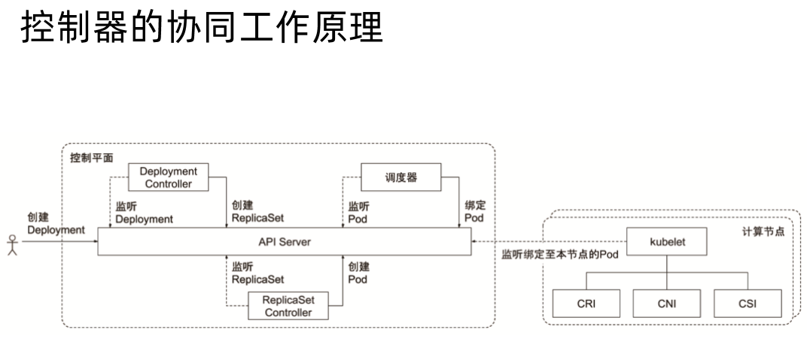

[toc]


# kube-scheduler

kube-scheduler 负责分配调度Pod 到集群内的节点上，它监听 kube-apiserver，查询还未分配的 Node 的 Pod，然后根据调度策略为这些 Pod 分配节点（更新 Pod 的 NodeName 字段）。  

调度器需要充分考虑诸多的因素：

* 公平调度
* 资源高效利用
* QoS
* affinity 和 anti-affinity
* 数据本地化（data locality）
* 内部负载干扰（inter-workload interfacerence ）
* deadlines


## 调度器策略

kube-scheduler 调度分为两个阶段，predicate 和 priority：

* predicate：过滤不符合条件的节点
* priority：优先级排序，选择优先级最高的节点


### Predicate 预选策略

根据预选策略，遍历所有目标 Node，筛选出符合要求的候选节点。    

* PodFitsHostPorts：检查 Pod 容器所需的端口，是否有 Host Ports 冲突，如果被占用，则禁止 Pod 调度到该节点
* PodFitsPorts：同 PodFitsHostPorts
* PodFitsHost：检查 Pod 指定的 NodeName 是否匹配当前节点
* PodFitsResources：检查 Node 的资源是否充足，包括允许的 Pod 数量、CPU、内存、GPU个数以及其它的OpaqueIntResources
* HostName：检查 pod.Spec.NodeName 是否与候选节点一致
* MatchNodeSelector：检查候选节点的 pod.Spec.NodeSelector 是否匹配
* NoVolumeZoneConflict：对于给定的某块区域，检查此区域的节点上部署Pod 是否存在 volume 冲突
* NoDiskConflict：根据节点请求的卷和已经挂载的卷，评估Pod是否适合该节点。
- MaxCSIVolumeCount：决定应该附加多少CSI卷，以及该卷是否超过配置的限制。
- CheckNodeMemoryPressure：如果节点报告内存压力，并且没有配置异常，那么将不会往那里调度Pod。
- CheckNodePIDPressure：如果节点报告进程id稀缺，并且没有配置异常，那么将不会往那里调度Pod。
- **CheckNodeDiskPressure：如果节点报告存储压力(文件系统已满或接近满)，并且没有配置异常，那么将不会往那里调度Pod。**
- CheckNodeCondition：节点可以报告它们有一个完全完整的文件系统，然而网络不可用，或者kubelet没有准备好运行Pods。如果为节点设置了这样的条件，并且没有配置异常，那么将不会往那里调度Pod。
- **PodToleratesNodeTaints：检查Pod的容忍度是否能容忍节点的污点。**
- CheckVolumeBinding：评估Pod是否适合它所请求的容量。这适用于约束和非约束PVC。


* 每种策略都是插件形式，Scheduler 会遍历这些插件，逐个执行策略筛选节点。  

* 当系统提供的策略不满足业务需要时，可以自己实现扩展策略。  
* 预选策略会过滤一些节点，过滤完成后剩余合适的节点会进入 Priorities 阶段。  


### Priorities 优选策略

确定最优节点，在预选策略的基础上，采用优选策略计算出每个候选节点的积分，积分最高的会被调度 Pod。  

* SelectorSpreadPriority：优先减少节点上属于同一个 Service 或 Replication Controller 的 Pod 数量。对于属于同一服务、有状态集或副本集（Service，StatefulSet or ReplicaSet）的Pods，会将Pods尽量分散到不同主机上。
* InterPodAffinityPriority：优先将 Pod 调度到相同的拓扑上（如同一个节点、Rack、Zone等）；策略有podAffinity和podAntiAffinity两种配置方式。简单来说，就说根据Node上运行的Pod的Label来进行调度匹配的规则，匹配的表达式有：In, NotIn, Exists, DoesNotExist，通过该策略，可以更灵活地对Pod进行调度。
* LeastRequestedPriority：优先调度到请求资源少的节点上
* BalancedResourceAllocation：优先平衡各节点的资源使用
* NodePreferAvoidPodsPriority：根据节点注释 scheduler.alpha.kubernetes.io/preferAvoidPods 字段判断优先级，权重为10000， 避免其他优先级策略的影响，可以使用它来示意两个不同的Pod不应在同一Node上运行。
* **NodeAffinityPriority：根据preferredduringschedulingignoredingexecution中所示的节点关联调度偏好来对节点排序，优先调度到匹配 NodeAffinity 的节点上**
* **TaintTolerationPriority：优先调度到匹配 TaintToleration 的节点上，根据节点上无法忍受的污点数量，为所有节点准备优先级列表。此策略将考虑该列表调整节点的排名。**
* ServiceSpreadingPriority：尽量将同一个 service 的 Pod 分布到不同节点上，已经被 SelectorSpreadPriority 替代（默认未使用）
* EqualPriority：将所有节点的优先级设置为1（默认未使用）
* ImageLocalityPriority：尽量将使用大镜像的容器调度到已经下拉了该镜像的节点上（默认未使用）
* **MostRequestedPriority：尽量调度到已经使用过的 Node 上，特别适用于 cluster-autoscaler（默认未使用）**
* RequestedToCapacityRatioPriority：使用默认的资源评分函数模型创建基于ResourceAllocationPriority的requestedToCapacity。

- EvenPodsSpreadPriority：实现择优 pod 的拓扑扩展约束


## 调度器实践

### 资源需求

* requests：设定的资源最低需求
* limits：资源使用上限，调用 Cgroups 实现资源限制


#### CPU

* 1000m 代表一个CPU
* requests
* limits


#### 内存

* requests
* limits


配置示例：  

启动一个 httpserver，需求资源为 0.1 个 CPU，100M内存，limits 资源为 0.3 个 CPU ，500M 内存。  

```yaml
apiVersion: apps/v1
kind: Deployment
metadata:
  name: httpserver
spec:
  replicas: 1
  selector: # 选择器
    matchLabels: # 匹配标签
      app: httpserver
  template:
    metadata: # 资源的元数据/属性 
      labels: # 设定资源的标签
        app: httpserver
    spec: # 资源规范字段
      containers:
      - name: httpserver # 容器的名字   
        image: xumingyu/httpserver-metrics:v0.2 # 容器使用的镜像地址   
        imagePullPolicy: IfNotPresent # 每次Pod启动拉取镜像策略，三个选择 Always、Never、IfNotPresent
                                      # Always，每次都检查；Never，每次都不检查（不管本地是否有）；IfNotPresent，如果本地有就不检查，如果没有就拉取 
        ports:
          - name: http # 名称
            containerPort: 80 # 容器开发对外的端口 
            protocol: TCP # 协议
        resources: # 资源管理
          limits: # 最大使用
            cpu: 300m # CPU，1核心 = 1000m
            memory: 500Mi # 内存，1G = 1024Mi
          requests:  # 容器运行时，最低资源需求，也就是说最少需要多少资源容器才能正常运行
            cpu: 100m
            memory: 100Mi

```

如果修改 requests 中的 CPU 资源为 10000m，limits 为 30000m，即10个CPU，实验机器中CPU资源不足，Pod 会出现告警

```bash
.... omit ....
Warning  FailedScheduling  91s   default-scheduler  0/3 nodes are available: 1 node(s) had taint {node-role.kubernetes.io/master: }, that the pod didn't tolerate, 2 Insufficient cpu.
```


#### 磁盘

* ephemeral storage，容器临时存储，包含日志和可写层数据，可以通过定义 Pod Spec 中的 `limits.ephemeral-storage` 和 `requests.ephemeral-storage` 来申请。  
* Pod 调度完成后，计算节点对于临时存储的限制不是基于 cgroup 的，而是由 kubelet 定时获取容器的日志和容器可写层的磁盘使用情况，如果超过限制，则会对 Pod 进行驱逐。  


#### Init Container 

* 当 kube-scheduler 调度带有多个 init 容器的 Pod 时，只计算 cpu.request 最多的 init 容器，而不是计算所有的 init 的容器总和
* 多个 init 容器是按顺序执行，执行完成后立即退出，所以申请最多资源的 init 容器所需资源即可满足所有 init 容器需求
* kube-scheduler 在计算该节点被占用的资源时，init 容器的资源依然会被纳入计算。因为 init 容器在特定的情况下可能会被再次执行，比如由于更换镜像而引起 Sandbox 重建时。


### LimitRange

可以设置 LimitRange 指定默认 request 和 limit 资源，使得没有指定资源限制的容器采用其设定的值，多个容器的 Pod 会按照 `容器数量*LimitRange` 的值计算总的资源需求。

示例：

创建一个 LimitRange，限制内存 limits 最多512M，request 为 256M

```yaml
apiVersion: v1
kind: LimitRange
metadata:
  name: mem-limit-range
spec:
  limits:
    - default:
        memory: 512Mi
      defaultRequest:
        memory: 256Mi
      type: Container
```

创建一个deployment，不指定 Pod 的资源限制

```yaml
apiVersion: apps/v1
kind: Deployment
metadata:
  name: httpserver
  namespace: default
spec:
  replicas: 1
  selector: # 选择器
    matchLabels: # 匹配标签
      app: httpserver
  template:
    metadata: # 资源的元数据/属性 
      labels: # 设定资源的标签
        app: httpserver
    spec: # 资源规范字段
      containers:
      - name: httpserver # 容器的名字   
        image: xumingyu/httpserver-metrics:v0.2 # 容器使用的镜像地址   
        imagePullPolicy: IfNotPresent
        ports:
          - name: http # 名称
            containerPort: 80 # 容器开发对外的端口 
            protocol: TCP # 协议                                          
```

查看刚刚创建的 pod，在 resources 部分会按照 LimitRange 中设置的值赋给 Pod

```bash
# kubectl get pods -oyaml
.... omit ....
resources:
    limits:
    memory: 512Mi
    requests:
    memory: 256Mi
.... omit ....
```


### 把Pod调度到指定Node上

* 可以通过 nodeSelector、nodeAffinity、podAffinity、Taints、tolerations 等来将 Pod 调度到需要的 Node 上。  

* 也可以通过设置 nodeName 参数，将 Pod 调度到指定 Node 节点上。  


#### nodeSelector

使用上面的 deployment，在 template.spec 中增加 nodeSelector，指定要求 disktype 为 ssd 的标签

```yaml
apiVersion: apps/v1
kind: Deployment
metadata:
  name: httpserver
  namespace: default
spec:
  replicas: 1
  selector: # 选择器
    matchLabels: # 匹配标签
      app: httpserver
  template:
    metadata: # 资源的元数据/属性 
      labels: # 设定资源的标签
        app: httpserver
    spec: # 资源规范字段
      containers:
      - name: httpserver # 容器的名字   
        image: xumingyu/httpserver-metrics:v0.2 # 容器使用的镜像地址   
        imagePullPolicy: IfNotPresent
        ports:
          - name: http # 名称
            containerPort: 80 # 容器开发对外的端口 
            protocol: TCP # 协议     
      # 增加标签选择器
      nodeSelector:
      	disktype: ssd
```

创建后，Pod 一直处于 Pending 状态，describe 可以看到日志告警，因为没有符合标签的 node

```bash
# k describe pod httpserver-6f9db777c8-pfrg7
.... omit ....
Warning  FailedScheduling  12s   default-scheduler  0/3 nodes are available: 1 node(s) had taint {node-role.kubernetes.io/master: }, that the pod didn't tolerate, 2 node(s) didn't match Pod's node affinity/selector.

```

给 node 打标签，再次查看 Pod 就会 Running，并且分配到打了符合该标签的 node 上

```bash
root@master01:~# k label node  node01 disktype=ssd
node/node01 labeled
root@master01:~# k get pod -owide
NAME                          READY   STATUS    RESTARTS   AGE    IP            NODE     NOMINATED NODE   READINESS GATES
httpserver-6f9db777c8-pfrg7   1/1     Running   0          3m5s   10.244.1.10   node01   <none>           <none>
```


#### NodeAffinity

目前支持两种

* `requiredDuringSchedulingIgnoredDuringExecution`：硬亲和性，必须满足条件
* `preferredDuringSchedulingIgnoredDuringExecution`：软亲和性，优选条件

示例：

```yaml
apiVersion: apps/v1
kind: Deployment
metadata:
  name: nginx-deployment
spec:
  replicas: 1
  selector:
    matchLabels:
      app: nginx
  template:
    metadata:
      labels:
        app: nginx
    spec:
      affinity:
        nodeAffinity:
        # 要求必须带有 disktype: ssd 标签的 node 节点
          requiredDuringSchedulingIgnoredDuringExecution:
            nodeSelectorTerms:
              - matchExpressions:
                  - key: disktype
                    operator: In
                    values:
                      - ssd
        # 符合上面要求的情况下，优先调度到 region: Guangdong/shenzhen 的节点
          preferredDuringSchedulingIgnoredDuringExecution:
          - weight: 1
            preference:
              matchExpressions:
                - key: region
                  operator: In
                  values:
                    - Guangdong/shenzhen
      containers:
        - name: nginx
          image: nginx
```


#### PodAffinity 和 PodAntiAffinity

基于 Pod 的标签来选择 Node，仅调度到满足条件 Pod 所在的 Node 上，支持 Pod Affinity 和 PodAntiAffinity。

示例：

```yaml
apiVersion: apps/v1
kind: Deployment
metadata:
  name: nginx-anti
spec:
  replicas: 2
  selector:
    matchLabels:
      app: anti-nginx
  template:
    metadata:
      labels:
        app: anti-nginx
    spec:
      affinity:
      # 必须调度到有运行 Pod 打了标签为 a: b 的 node 上
        podAffinity:
          requiredDuringSchedulingIgnoredDuringExecution:
          - labelSelector:
              matchExpressions:
                - key: a
                  operator: In
                  values:
                    - b
            # topologyKey 可以指定范围，例如同一可用区或同一主机，hostname是同一主机
            topologyKey: kubernetes.io/hostname
       # 不能调度到有运行 Pod 打了标签为 app: anti-nginx 的 node 上
        podAntiAffinity:
          requiredDuringSchedulingIgnoredDuringExecution:
          - labelSelector:
              matchExpressions:
                - key: app
                  operator: In
                  values:
                    - anti-nginx
            topologyKey: kubernetes.io/hostname
      containers:
        - name: with-pod-affinity
          image: nginx
```


#### Taints 污点 和 Tolerations 容忍度

Taints 和 Tolerations 用于保证 Pod 不被调度到不合适的 Node 上，其中 Taint 应用于 Node 上，Toleration 应用于 Pod 上。     

Taint 的 effect 类型：

* NoSchedule：新的 Pod 不调度到该 Node 上，不影响正在运行的 Pod
* PreferNoSchedule：soft 版的 NoSchedule，尽量不调度到该 Node 上
* NoExecute：新的 Pod 不调度到该 Node 上，并且删除（evict）已经在运行的 Pod。 Pod 可以增加一个时间（tolerationSeconds）。  


然而，当 Pod  的 Tolerations 匹配 Node 的所有 Taints 的时候可以调度到该 Node 上；当 Pod 是已经运行的时候，也不会被删除（evicted）。另外对于 NoExecute，如果 Pod 增加了一个 tolerationSeconds，则会在该时间之后才删除 Pod。


**示例**：  

给集群中节点打 Taints

```bash
# 集群中两个节点 node01 node02 打上 key 为 for-special-user,value 为 cadmin，effect 类型为 NoSchedule
kubectl taint nodes node01 node02 for-special-user=cadmin:NoSchedule
node/node01 tainted
node/node02 tainted
```

部署一个 nginx 的 Deployment

```yaml
apiVersion: apps/v1
kind: Deployment
metadata:
  name: nginx-deployment
spec:
  replicas: 1
  selector:
    matchLabels:
      app: nginx
  template:
    metadata:
      labels:
        app: nginx
    spec:
      containers:
        - name: nginx
          image: nginx
```

创建 nginx 资源，获取 pod 状态，为 Pending 状态

```bash
root@master01:~# kubectl apply -f no-toleration-nginx.yaml 
deployment.apps/nginx-deployment created
root@master01:~# kubectl get pods
NAME                                READY   STATUS    RESTARTS   AGE
nginx-deployment-85b98978db-llj69   0/1     Pending   0          9s
root@master01:~# kubectl describe pod nginx-deployment-85b98978db-llj69 
Name:           nginx-deployment-85b98978db-llj69
Namespace:      default
Priority:       0
Node:           <none>
Labels:         app=nginx
                pod-template-hash=85b98978db
Annotations:    kubernetes.io/limit-ranger: LimitRanger plugin set: memory request for container nginx; memory limit for container nginx
Status:         Pending
IP:             
IPs:            <none>
Controlled By:  ReplicaSet/nginx-deployment-85b98978db
.... omit ...
QoS Class:                   Burstable
Node-Selectors:              <none>
Tolerations:                 node.kubernetes.io/not-ready:NoExecute op=Exists for 300s
                             node.kubernetes.io/unreachable:NoExecute op=Exists for 300s
Events:
  Type     Reason            Age   From               Message
  ----     ------            ----  ----               -------
  Warning  FailedScheduling  23s   default-scheduler  0/3 nodes are available: 1 node(s) had taint {node-role.kubernetes.io/master: }, that the pod didn't tolerate, 2 node(s) had taint {for-special-user: cadmin}, that the pod didn't tolerate.
root@master01:~# 
```


部署一个带 Toleration 的 Deployment，key、value、effect 要符合 node 上的 taint 设置

```yaml
apiVersion: apps/v1
kind: Deployment
metadata:
  name: nginx-deployment
spec:
  replicas: 1
  selector:
    matchLabels:
      app: nginx
  template:
    metadata:
      labels:
        app: nginx
    spec:
      containers:
        - name: nginx
          image: nginx
      tolerations:
        - key: "for-special-user"
          operator: "Equal"
          value: "cadmin"
          effect: "NoSchedule"
```

部署后查看 Pod 状态，可以被调度到打了 Taint 的 Node 上

```bash
root@master01:~# kubectl apply -f toleration-nginx.yaml 
deployment.apps/nginx-deployment configured
root@master01:~# k get pods 
NAME                                READY   STATUS    RESTARTS   AGE
nginx-deployment-56f4bddcbd-wb6w9   1/1     Running   0          3m36s
```


##### 案例：多租户 Kubernetes 集群-计算资源隔离

在 Kubernetes 集群中，多租户集群是多用户共享计算节点资源，用户无需关心计算节点细节。  

但有些用户自带计算资源，例如 GPU、SSD，不想被其他用户占用，要求对这些资源进行隔离。  

实现方案：

* 将隔离的计算节点打 Taints
* 用户创建 Pod 时，定义 tolerations 来指定要调度到 node taints 上

方案漏洞：

* 其他用户如果可以 get nodes 信息或者 pods，可以看到 taints 信息，就可以通过同样的 tolerations 占用资源

解决办法：

* 限制用户 get node detail
* 不让用户 get 到其他用户的 pod detail
* 企业内部通过规范管理，通过统计数据查看用户占用 Node 情况


**经验**

* 用户会忘记打 tolerance，导致 Pod 无法调度到 node，pending
* 其它用户会 get node detail，偷用资源
* 搭建 dashboard 统计资源使用情况


### 优先级调度

从 v1.8 开始，kube-scheduler 支持定义 Pod 的优先级，保证高优先级的 Pod 优先调度。 

开启方法：

* apiserver 配置 `--feature-gates=PodPriority=true` 和 `--runtime-config=scheduling.k8s.io/v1alpha1=true`
* kube-scheduler 配置 `--feature-gates=PodPriority=true` 

##### PriorityClass

指定 Pod 优先级之前需要先定义一个 PriorityClass（非namespace 资源）。  

示例：

```yaml
apiVersion: v1
kind: PriorityClass
metadata:
  name: high-priority
value: 100000
globalDefault: false
description: "desc for this PriorityClass xxxxxxxx"
```


##### Pod 设置 priority

在 spec 中指定 priorityClassName 名称，对应上面设置的 priorityClassName  

```yaml
apiVersion: v1
kind: Pod
metadata:
  name: nginx
  labels:
  	env: test
spec:
  containers:
  - name: nginx
    image: nginx
    imagePullPolicy: IfNotPresent
  priorityClassName: high-priority
```


## 多调度器

默认的调度器不满足要求，可以部署自定义的调度器。并且在集群中可以同时运行多个调度器实例，通过 `pod.Spec.schedulerName` 来选择使用哪一个调度器（默认使用内置调度器）。  

社区有些开源的调度器

* TKE：腾讯开源的调度器
* Volcano：华为开源


### 生产经验

* 小集群：100个node，并发创建 8000 个 Pod 的最大调度耗时大概是 2 分钟左右，发生过 node 删除后，scheduler cache 还有信息的情况，导致 Pod 调度失败。
* 放大效应：当 node 出现问题所以 load 较小时，通常用户的 Pod 都会优先调度到该 node 上，导致用户所有创建的新 Pod 都失败的情况。
* 应用炸弹：存在危险的用户 Pod （比如 fork bomb），在调度到某个 node 上以后，会因为打开文件句柄过多导致 node down 机，Pod 会被 evict 到其它节点，再对其他节点造成伤害，依次循环导致整个 cluster 都不可用。 


调度器功能较为单一，因此维护起来没有太多麻烦。  


# Controller Manager

## 控制器的工作流程


Controller 通常有两种接口

* Informer：类似于 watch，一种消息通知接口，接收 Event，会有对应的 EventHandler 处理收到的 Event，调用对应的 Function。这些 Function 通常会将 Event 相关的对象 Key 放入到 workqueue 队列中，由 worker 线程从队列中取出处理。
* Lister：类似于 get，调用方法返回结果

### Informer 的内部机制


* sharedInformer 通过 List & Watch 监听到自身相关的资源对象，将 APIServer 返回的 JSON 或 protoBuffer 通过反射转换为对应的对象，添加进 Delta Fifo Queue 队列中，Informer 将对象存储到 Thread Safe Store，Informer 还会将 Event 发送到 Handler ，由 Handler 处理接下来的动作。


### 控制器协同工作原理



* 用户定义 Deployment 以后发送给 API Server，Deployment Controller 会监听到发送给API Server 的 Deployment 资源请求，根据用户定义的内容，创建ReplicaSet 对象，同样 ReplicaSet Controller 会监听到发送给 API Server 的 ReplicaSet 资源请求，去创建 Pod 对象，调度器监听到有发送给 API Server 的 Pod 创建请求，根据策略和 Node 节点资源情况，绑定到适合的 Node 中，Node 节点中的 kubelet 监听到APIServer中有绑定至本节点的 Pod，根据 Pod 定义的内容调取本节点 CRI、CNI、CSI 等接口创建容器及相关资源。


## 通用Controller

* Job Controller：处理job
* Pod AutoScaler：处理Pod 的自动缩容/扩容
* ReplicaSet：根据 Replicaset Spec 创建 Pod
* Service Controller：为 LoadBalancer type 的 service 创建 LB VIP
* ServiceAccount Controller：确保 SA 在当前 namespace 中存在
* StatefulSet Controller：处理有状态副本集 Statefulset 中的 Pod
* Volume Controller：依据 PV spec 创建 volum
* Resource quota Controller：
* Namespace Controller：确保删除 namespace 时，其中所有资源已经清空
* Replication Controller：
* Node Controller：
* Daemon Controller：依据 Spec 定义的内容为每个 Node 创建一个 Pod
* Deployment Controller：无状态副本集
* Endpoint Controller：
* Garbage Collector：处理级联删除，有一个 Graph Builder 组件负责通过 OwnerReference 信息构建对象之间的父子关系，以图的形式存放，比如删除 deployment 的同时删除 replicaset 以及 Pod
* CronJob Controller：


## Cloud Controller Manager

cloud provide

从 k8s 1.6 开始，从 kube-controller-manager 中分离出来。因为往往需要与企业 cloud 做深度集成，release cycle 与 kubernetes 相对独立。

Cloud Controller Manager 是从老版本的 API Server 分离出来的。 


### 生产经验

* 保护好 controller manager 的 kubeconfig
  * kubeconfig 拥有所有资源的所有操作权限，防止用户通过 kubectl exec kube-controller-manager cat 获取改文件
* 与Endpoint Controller 相关：Pod evict 后 IP 发生变化，但 endpoint 中的 address 更新失败（endpoint 客户端没有设置TCP超时时间，偶尔LB无响应，server 端断掉，而客户端还在监听），积年累月，worker 都会阻塞不工作


#### **确保 scheduler 和 controller 的高可用**

**LeaderElection**

* kubenetes 提供基于 configmap 和 endpoint 的 leader election 类库
* kubernetes 采用 leader election 模式启动 component 后，会创建对应 endpoint，并把当前的 leader 信息 annotate 到 endpoint 上。  


多实例的 Controller 启动时都会去 configmap或endpoint 中尝试获取一把锁，将自己的 hostname 更新进去，例如下面示例中 Endpoints 的 annotations 中有 一段 holderIdentity，获取到锁的就会成为 leader，并且按照指定间隔去续约，其它竞争者会成为 standby，如果 leader 出现问题无法续约，standby 成员会重新竞争 leader 。

示例：

```yaml
apiVersion: v1
kind: Endpoints
metadata:
  annotations:
    control-plane.alpha.kubernetes.io/leader: '{"holderIdentity":"master2_6eded3e8-2630-4f7a-b352-f054dcfe38d8","leaseDurationSeconds":15,"acquireTime":"2022-05-06T11:19:30Z","renewTime":"2022-05-06T11:21:25Z","leaderTransitions":6}'
  creationTimestamp: "2021-12-03T04:10:15Z"
  name: kube-controller-manager
  namespace: kube-system
  resourceVersion: "7367842"
  selfLink: /api/v1/namespaces/kube-system/endpoints/kube-controller-manager
  uid: c0623165-510e-4d67-9502-ec3140389ec7

```


```yaml
apiVersion: v1
kind: Endpoints
metadata:
  annotations:
    control-plane.alpha.kubernetes.io/leader: '{"holderIdentity":"master2_da06f8b4-907c-498a-a87a-6fd672796f3c","leaseDurationSeconds":15,"acquireTime":"2022-05-06T11:20:28Z","renewTime":"2022-05-06T11:21:54Z","leaderTransitions":9}'
  creationTimestamp: "2021-12-03T04:10:15Z"
  name: kube-scheduler
  namespace: kube-system
  resourceVersion: "7367921"
  selfLink: /api/v1/namespaces/kube-system/endpoints/kube-scheduler
  uid: d9fcf2c7-f8e5-4c80-95b6-01d6a00a3e05

```


# kubelet组件

## kubelet 架构


* kubelet API 层：提供 API 接口负责不同职责，业务指标上报、探活等
* 功能层：包括很多不同功能职责的组件
  * ProbeManager：负责探活
  * OOMWatcher：获取 Pod OOM异常，上报 kubelet
  * GPUManager：管理 GPU 资源
  * cAdvisor：一个开源的资源监控组件，kubelet 基于它实现 Node 的资源监控，新版本中重写了cAdvisor，由组件改为直接集成到 kubelet 中
  * DiskSpaceManager：管理节点磁盘状态
  * StatusManager：Pod 状态管理
  * EvictionManager：驱逐管理，根据一些策略驱逐低优先级或满足条件的 Pod
  * VolumeManager：卷管理
  * Image GC：镜像清理
  * Container GC：容器管理，清理
  * ImageManager：镜像管理
  * CertificateManager：证书管理
  * **syncLoop**：watch 节点上的对象，收到 event 后，交给 PodWorker
  * **PodWorker**：收到 event 后进行处理，调用 CRI 等
* CRI：容器运行时接口


## kubelet 管理 Pod 的核心流程


* syncLoop：监听 Pod 的状态变化 ，发现有变化以后将 event 存放到 UpdatePodOptions 中
* worker 线程：kubelet 中会有多个 worker ，监听 UpdatePodOptions 队列，拿到事件清单后，对比节点上 Pod 进行计算对比，然后根据计算结果进行对应的 create、delete、update 等操作。
* PLEG：主要负责 Pod 状态汇报，其中维护了一份 pod cache，定期从通过 relist 从 CRI 获取容器状态，再通过 pod lifecycle events 反馈给 API Server
  * 实践中问题：
    * CRI 接口无响应，PLEG 无法汇报节点中 Pod 状态，集群会认为节点出现问题
    * 节点中出现了大量 Exit 状态的容器，PLEG 遍历费时，达到一定量级，会超过汇报超时时间，集群认为节点出现问题


## kubelet 职责

每个节点上都运行一个 kubelet 服务进程，默认监听 10250 端口

* 接收并执行 master 发来的指令，主要通过 watch 监听 API Server 实现
* 管理 Pod 及 Pod 中的容器
* 每个kubelet 进程会在 API Server 上注册节点自身信息，定期向 master 节点汇报节点的资源使用情况，并通过 cAdvisor 监控节点和容器的资源


### 节点管理

节点管理主要是节点自注册和节点状态更新：

* kubelet 可以通过设置启动参数 --register-node 来确定是否向 API Server 注册自己
* 如果kubelet 没有选择自注册模式，则需要用户自己配置 Node 资源信息，同时需要告知 kubelet 集群上的 API Server 的位置
* kubelet 在启动时通过 API Server 注册节点信息，并定时向 API Server 发送节点新消息，API Server 在接收到新消息后，将信息写入 etcd


### Pod 管理

获取 Pod 清单：

* 文件：启动参数 --config 指定的配置目录下的文件（默认 /etc/Kubernetes/manifests/），该文件每20秒将重新检查一次（可配置）
* HTTP endpoint（URL）：启动参数 --manifest-url 设置。每 20秒检查一次这个端点（可配置）
* API Server：通过 API Server 监听 etcd 目录，同步 Pod 清单


### Pod启动流程


* 用户发起创建 Pod 请求到 APIServer
* APIServer 将请求写入到 etcd 中
* Scheduler 会 watch 到该变化，将 Pod 和合适的 Node 绑定，即将 NodeName 写入 Pod 对象中，该信息会写入 etcd
* kubelet 会 watch 与自身节点相关的 Pod 调度，调用 CRI 启动 Pod 相关容器，container runtime 会进行容器创建等操作，例如 Containerd，在此过程会启动多个容器，例如启动 pause （Sandbox 容器）进行网络配置，完成后再进行拉取镜像、初始化容器、启动容器等，完成后 kubelet 会汇报 Pod 状态，经过 APIServer 写入 etcd 中，kubelet 继续 watch 相关 Pod 状态变化。


kubelet 启动 Pod 实现细节：


* kubelet
  * 首先进行准入检查，检查资源等信息是否满足
  * 检查节点中网络插件是否正常，flannel、calico、cilium等
  * cgroup 信息配置，资源分配、限制等
  * 创建数据目录
  * 挂载存储，本地或网络磁盘等
  * syncPod
    * 计算 sandbox 和 container 变化
    * 如果 sandbox 发生变化，kill 掉相关 pod
    * 如果 Pod 已经不存在，容器仍存在，则 kill 掉相关容器
    * 准备初始化容器
    * 创建 sandbox
      * 生成 sandbox 配置
      * 创建 pod 日志目录
      * 调用 runtime 服务，转到 CRI 处理
* CRI
  * 运行 sandbox
  * 确认镜像是否存在
  * 调用 CNI 创建网络
  * 配置 Pod 网络
  * 创建容器
  * 创建 sandbox 容器管理目录
* CNI
  * 收到请求配置网络、添加网络等


# 容器运行时接口 CRI

## 定义

容器运行时（Container Runtime），运行于 K8s 集群的每个节点，负责容器的整个生命周期。随着容器发展，涌现出了越来越多的容器运行时。  

为了解决容器运行时和 Kubernetes 集成问题，在 K8s 1.5 版本中，社区推出了 CRI（Container Runtime Interface，容器运行时接口）以支持更多容器运行时。  


CRI 是 Kubernetes 定义的一组 gRPC 服务。kubelet 作为 client，基于 gRPC 框架，通过 Socket 和容器运行时通信。  

包括两类服务

* 镜像服务（Image Service）：提供下载、检查和删除镜像的远程程序调用
* 运行时服务（Runtime Service）：包含用于管理容器生命周期、与容器交互的调用（exec / attach / port-forward）的远程程序调用


## 运行时层级

OCI（Open Container Initiative，开放容器计划）定义了创建容器的格式和容器运行时的开源行业标准，包括镜像规范（Image Specification）和运行时规范（Runtime Specification）。  


* kubelet 通过 gRPC client 建立连接调用 CRI 中的 gRPC server
* Container Runtime 处于容器和 Kubernetes 的中间层
  * High-level Runtime（CRI Runtime）：
    * 镜像规范定义了 OCI 镜像的标准，High-level Runtime 会下载 OCI 镜像，解压成 OCI 运行时文件系统包（filesystem bundle）。
    * 接收 gRPC 调用，根据 OCI（Open Container Initiative）规范创建 OCI Json，再通过调用 OCI Runtime 启动容器进程
    * 实现有 dockershim、docker、containerd、cir-o 等
  * Low-level Runtime（OCI Runtime）：
    * 运行时规范描述了如何从 OCI 运行时文件系统包运行容器程序，定义它的配置、运行环境和生命周期 
    * 主要负责启动容器进程，按照 OCI 实现对容器的管理，为新容器设置 namespaces、cgroups、挂载根文件系统等
    * 实现有 runC、gVisor、kata-runtime 等


## Docker 和 Containerd

Docker 内部关于容器运行时功能的核心组件是 containerd，后面 containerd 可以与 kubelet 通过 CRI 对接，独立在 kubernetes 中运行。  

相对于 docker ，containerd 减少了 Docker 所需的处理模块 Dockerd、Docker-shim，并且对 Docker 支持的存储驱动进行了优化，因此在容器创建、启动、停止、删除、镜像拉取上都有一定的性能优势。  

不过 Docker 也有很多 containerd 不具有的功能，例如 zfs 存储驱动、日志大小和文件限制、overlayfs2 做存储驱动情况下可以通过 xfs_quota 限制容器可写层大小等。  

目前 containerd 基本能满足容器的众多需求，因此将它作为运行时的越来越多。  


## CRI 规范细节

CRI 规范中定义了容器相关的各种功能细节


* Sandbox 相关的，启动、通知、删除、状态获取、端口转发等
* 容器操作相关的，创建、启动、停止、删除、list、状态获取、资源更新、exec 开启 new session、attach 到现有 session、日志等
* 镜像相关操作，list、pull、delete、镜像状态、文件层级信息等


## 开源运行时对比

 

从图中可以看到

* docker 进行了多层封装和调用，功能多，但维护性稍差一些
* containerd 相对简洁，减少了dockershim、dockerd 等组件
* cri-o 则更加简洁，直接操作容器


### Docker 与 containerd 差异细节


对于 kubernetes 而言，docker 除了上图红框之外的功能比较冗余，包括 docker-cli、networking、storage 等，这些由 CNI、CSI 去实现了。  

改为 containerd 之后，只有 CRI 相关的功能。


### 性能对比


## Docker 切换 containerd 演示
https://kubernetes.io/zh/docs/setup/production-environment/container-runtimes/#containerd

### Stop service

```sh
systemctl stop kubelet
systemctl stop docker
systemctl stop containerd
```

### Create containerd config folder

```sh
sudo mkdir -p /etc/containerd
containerd config default | sudo tee /etc/containerd/config.toml
```

### Update default config

```sh
vi /etc/containerd/config.toml
sed -i s#k8s.gcr.io/pause:3.5#registry.aliyuncs.com/google_containers/pause:3.5#g /etc/containerd/config.toml
sed -i s#'SystemdCgroup = false'#'SystemdCgroup = true'#g /etc/containerd/config.toml
```

### Edit kubelet config and add extra args

```sh
vi /etc/systemd/system/kubelet.service.d/10-kubeadm.conf
Environment="KUBELET_EXTRA_ARGS=--container-runtime=remote --container-runtime-endpoint=unix:///run/containerd/containerd.sock --pod-infra-container-image=registry.aliyuncs.com/google_containers/pause:3.5"
```

### Restart

```sh
systemctl daemon-reload
systemctl restart containerd
systemctl restart kubelet
```

### Config crictl to set correct endpoint

```sh
cat <<EOF | sudo tee /etc/crictl.yaml
runtime-endpoint: unix:///run/containerd/containerd.sock
EOF
```


# 容器网络接口 CNI

Kubernetes 网络模型设计的基础原则是

* 所有的 Pod 能够不通过 NAT 就能互相访问
* 所有的节点能够不通过 NAT 就能互相访问
* 容器内部看到的 IP 地址和外部组件看到的容器 IP 是一样的


Kubernetes 的集群中，IP 地址是以 Pod 为单位进行分配的，每个 Pod 都拥有一个独立的 IP 地址。一个 Pod 内部所有容器共享一个网络栈，即宿主机上的一个网络命名空间，包括它们的 IP 地址、网络设备、配置等都是共享的。  

Pod 中的所有容器可以通过 localhost:port 连接对方。  

在 Kubernetes 中，提供了一个轻量的通用容器网络接口 CNI（Container Network Interface），专门用于设置和删除容器的网络连通性。容器运行时通过 CNI 调用网络插件来完成容器的网络设置。  


## 分类及常见插件

* IPAM：IP地址分配
* 主插件：网卡设置
  * bridge：网桥，把主机端口和容器端口插入网桥
  * ipvlan：为容器添加 ipvlan 网口
  * loopback：设置 loopbak 网口
* Meta：附加功能
  * portmap：设置主机端口和容器端口映射
  * bandwidth：利用 Linux Traffic Control 限流
  * firewall：通过 iptables 或 firewalld 为容器添加防火墙规则


## CNI 插件运行机制

CRI 在启动时会从 CNI 的配置目录中读取 JSON 格式的配置文件，格式为 `.conf`、`.conflist`、`.json` 。 如果配置目录中包含多个文件，一般情况下，会以名字排序选用第一个配置文件作为默认的网络配置，并加载获取其中指定的 CNI 插件名称和配置参数。


## CNI 运行机制

关于容器网络管理，CRI 一般需要配置两个参数 `--cni-bin-dir` 和 `--cni-conf-dir` 。 有一种特殊情况，kubelet 内置的 Docker 作为容器运行时，是由 kubelet 来查找 CNI 插件的，运行插件来为容器设置网络，这两个参数应该配置在 kubelet 处。  

* cni-bin-dir：网络插件可执行文件路径，默认为 `/opt/cni/bin`。

  * ```sh
    # 例如 flannel 执行文件
    root@master01:/opt/cni/bin# ./flannel 
    CNI Plugin flannel version v1.0.1 (linux/amd64) commit 076c4462 built on 2022-01-19T18:16:47Z
    ```

* cni-conf-dir：网络插件配置文件路径，默认为 `/etc/cni/net.d`。

  * ```yaml
    # flannel 配置文件
    {
      "name": "cbr0",
      "cniVersion": "0.3.1",
      "plugins": [
        {
          "type": "flannel",
          "delegate": {
            "hairpinMode": true,
            "isDefaultGateway": true
          }
        },
        {
          "type": "portmap",
          "capabilities": {
            "portMappings": true
          }
        }
      ]
    }
    ```


## CNI 插件设计考量


## CNI Plugin

ContanierNetworking 组维护了一些 CNI 组件，包括网络接口创建的 bridge、ipvlan、loopback、macvlan、ptp、host-device 等， IP 地址分配的 DHCP、host-local 和 static，其他的 Flannel、tunning、portmap、firewall 等。

```bash
# 示例，在 /opt/cni/bin 下有标准的 CNI 组件
root@master01:/opt/cni/bin# ls
bandwidth  bridge  dhcp  firewall  flannel  host-device  host-local  ipvlan  loopback  macvlan  portmap  ptp  sbr  static  tuning  vlan

# 查看 nginx pod 的信息，找到配置中的 pid 信息
root@node01:~# crictl ps |grep nginx
ef9a29dfb7483       fa5269854a5e6       25 hours ago        Running             nginx               0                   591f810fa33a7
root@node01:~# crictl inspect ef9a29dfb7483 |grep pid
    "pid": 1049017,
            "pid": 1
            "type": "pid"
# 通过 nsenter 指定 pid 可以获取到 Pod 的 IP 配置信息
# 其中 lo 接口是由 CNI 标准插件 loopback 实现，eth0@if12 由 flannel 实现
root@node01:~# nsenter -t 1049017 -n ip a
1: lo: <LOOPBACK,UP,LOWER_UP> mtu 65536 qdisc noqueue state UNKNOWN group default qlen 1000
    link/loopback 00:00:00:00:00:00 brd 00:00:00:00:00:00
    inet 127.0.0.1/8 scope host lo
       valid_lft forever preferred_lft forever
    inet6 ::1/128 scope host 
       valid_lft forever preferred_lft forever
3: eth0@if12: <BROADCAST,MULTICAST,UP,LOWER_UP> mtu 1450 qdisc noqueue state UP group default 
    link/ether 6a:56:26:18:b0:23 brd ff:ff:ff:ff:ff:ff link-netnsid 0
    inet 10.244.1.11/24 brd 10.244.1.255 scope global eth0
       valid_lft forever preferred_lft forever
    inet6 fe80::6856:26ff:fe18:b023/64 scope link 
       valid_lft forever preferred_lft forever

```

社区还有第三方网络策略方面的插件，例如 Calico、Cilium、Weave 等。可用选项的多样性意味着大多数用户能够找到合适当前需求和部署环境的 CNI 插件，并在需求变化的情况下转换解决方案。  


### Flannel

CoreOS 开发的项目，早期 CNI 插件入门产品，简单易用。

* 在每个节点运行 flanneld 守护进程

  * ```sh
    # flannel 以 DaemonSet 形式运行在各个节点
    root@master01:~# kubectl get daemonset -n kube-system
    NAME              DESIRED   CURRENT   READY   UP-TO-DATE   AVAILABLE   NODE SELECTOR            AGE
    kube-flannel-ds   3         3         3       3            3           <none>                   65d
    ```

* 使用 K8s 集群 etcd 存储其状态信息

* 每个节点分配一个子网，为该节点的 Pod 分配 IP 地址

* 同一主机内 Pod 可以通过网桥通信

* 不同主机的 Pod 通过 flanneld 将流量封装在 UDP 数据包中

  * 默认封装方式是 VxLAN，因为 VxLAN 性能不错
  * 缺点是流量跟踪困难
  * 


### Calico

以性能、灵活性和网络策略闻名，除了在主机和 Pod 之间提供网络连接，还涉及到网络安全性和策略管理。  

* 对于同网段通信，基于3层网络，使用 BGP 路由协议在主机之间路由数据包
* 对于跨网段通信，基于 IPinIP 使用虚拟网卡设备 tunl0，用一个 IP 数据包封装另一个 IP 数据包，外层 IP 数据包头的 source address 作为隧道入口设备的 IP 地址， destination address 为出口设备的 IP 地址。  
* 网络策略使用 ACLs 协议和 kube-proxy 来创建 iptables 过滤规则，从而实现隔离容器网络的目的
* Calico 还与服务网格 Istio 集成，在服务网格层和网络基础结构层上解释和实施集群中工作负载的策略。 这意味着你可以配置功能强大的规则，描述 Pod 应该如何收发流量，提高安全性和对网络环境的控制。
* 分布式架构，可以横向扩展，适用于对性能和功能要求较高的环境。


#### Calico 组件


* felix 负责主机网络配置
* BIRD 是一个开源的路由交换组件，运行在主机上以后可以以路由器的形式配置网络，不同节点之间就可以通过路由协议打通网络
* confd 负责配置信息


#### Calico 初始化及配置

配置和 CNI 二进制文件由 initContainer 推送

```yaml
# calico Pod 配置片段
initContainers:
  - command:
    - /install-cni.sh
    env:
    - name: CNI_CONF_NAME
      value: 10-calico.conflist
    - name: CNI_NETWORK_CONFIG
      valueFrom:
        configMapKeyRef:
          key: cni_network_config
          name: calico-config
    - name: KUBERNETES_NODE_NAME
      valueFrom:
        fieldRef:
          apiVersion: v1
          fieldPath: spec.nodeName
    - name: CNI_MTU
      valueFrom:
        configMapKeyRef:
          key: veth_mtu
          name: calico-config
    - name: SLEEP
      value: "false"
      
```

```yaml
# DaemonSet 配置片段
        - name: CNI_CONF_NAME
          value: 10-calico.conflist
        - name: CNI_NETWORK_CONFIG
          valueFrom:
            configMapKeyRef:
              key: cni_network_config
              name: calico-config
        - name: KUBERNETES_NODE_NAME
          valueFrom:
            fieldRef:
              apiVersion: v1
              fieldPath: spec.nodeName
        - name: CNI_MTU
          valueFrom:
            configMapKeyRef:
              key: veth_mtu
              name: calico-config
        - name: SLEEP
          value: "false"

```


calico 配置文件：

```yaml
# /etc/cni/net.d/10-calico.confilist 配置文件
{
  "name": "k8s-pod-network",
  "cniVersion": "0.3.0",
  "plugins": [
    {
      "type": "calico",
      "log_level": "info",
      "datastore_type": "kubernetes",
      "nodename": "master1",
      "mtu": 1440,
      "ipam": {
        "type": "host-local",
        "subnet": "usePodCidr"
      },
      "policy": {
          "type": "k8s"
      },
      "kubernetes": {
          "kubeconfig": "/etc/cni/net.d/calico-kubeconfig"
      }
    },
    {
      "type": "portmap",
      "snat": true,
      "capabilities": {"portMappings": true}
    }
  ]
}

```


#### Calico VxLAN


calico 也支持 VxLAN 模式，如上图示例

* master 上 Pod1 与 node 上的 Pod2 通信，首先发出数据包，src、dst 分别对应自己和对端 Pod 的 IP 地址
* 请求会被转到 vxlan-calico 设备，该设备会将数据包封装 UDP 包头，src、dst 变为 master 和 node 的 IP 地址，并添加上对端 vxlan 设备的端口
* 随后数据包会经过 master 主机网络发送到 node 主机
* node 主机接收到数据包后，由 vxlan-calico 解除包头，数据恢复为原始数据包
* 数据包转发到 node 上的 Pod2 


#### IPPool

IPPool 定义一个集群的预定义 IP 段

```yaml
  apiVersion: crd.projectcalico.org/v1
  kind: IPPool
  metadata:
    annotations:
      projectcalico.org/metadata: '{"uid":"a8daeb32-5421-11ec-8225-000c297334b2","creationTimestamp":"2021-12-03T10:13:28Z"}'
    creationTimestamp: "2021-12-03T10:13:28Z"
    generation: 1
    name: default-ipv4-ippool
    resourceVersion: "48437"
    selfLink: /apis/crd.projectcalico.org/v1/ippools/default-ipv4-ippool
    uid: 80547f16-9792-436c-8ce3-2fab1a0bea4c
  spec:
    blockSize: 26
    cidr: 10.244.0.0/16
    ipipMode: Always
    natOutgoing: true
    nodeSelector: all()

```


#### IPAMBlock

IPAMBlock 用来定义每个主机预分配的 IP 段

#### IPAMHandle 

用来记录 IP 分配的具体细节


#### 通过 calico 创建 Pod 查看 IP 配置

在容器 namespace 中查看网络配置信息：

```sh
[root@node1 ~]# nsenter -t 2912 -n ip a
1: lo: <LOOPBACK,UP,LOWER_UP> mtu 65536 qdisc noqueue state UNKNOWN group default qlen 1000
    link/loopback 00:00:00:00:00:00 brd 00:00:00:00:00:00
    inet 127.0.0.1/8 scope host lo
       valid_lft forever preferred_lft forever
3: eth0@if6: <BROADCAST,MULTICAST,UP,LOWER_UP> mtu 1440 qdisc noqueue state UP group default 
    link/ether 62:28:f9:a3:be:57 brd ff:ff:ff:ff:ff:ff link-netnsid 0
    inet 10.244.3.31/32 scope global eth0
       valid_lft forever preferred_lft forever
4: tunl0@NONE: <NOARP> mtu 1480 qdisc noop state DOWN group default qlen 1000
    link/ipip 0.0.0.0 brd 0.0.0.0
[root@node1 ~]# nsenter -t 2912 -n ip r
default via 169.254.1.1 dev eth0 
169.254.1.1 dev eth0 scope link 
[root@node1 ~]# nsenter -t 2912 -n arp
Address                  HWtype  HWaddress           Flags Mask            Iface
node1                    ether   ee:ee:ee:ee:ee:ee   C                     eth0
_gateway                 ether   ee:ee:ee:ee:ee:ee   C                     eth0
```

在主机 namespace 中查看网络路由信息

```sh
[root@node1 ~]# ip link
1: lo: <LOOPBACK,UP,LOWER_UP> mtu 65536 qdisc noqueue state UNKNOWN mode DEFAULT group default qlen 1000
    link/loopback 00:00:00:00:00:00 brd 00:00:00:00:00:00
2: ens33: <BROADCAST,MULTICAST,UP,LOWER_UP> mtu 1500 qdisc fq_codel state UP mode DEFAULT group default qlen 1000
    link/ether 00:0c:29:c8:86:d3 brd ff:ff:ff:ff:ff:ff
3: docker0: <NO-CARRIER,BROADCAST,MULTICAST,UP> mtu 1500 qdisc noqueue state DOWN mode DEFAULT group default 
    link/ether 02:42:c5:21:e8:56 brd ff:ff:ff:ff:ff:ff
4: kube-ipvs0: <BROADCAST,NOARP> mtu 1500 qdisc noop state DOWN mode DEFAULT group default 
    link/ether aa:8a:11:d8:4d:c3 brd ff:ff:ff:ff:ff:ff
5: cali2cbbb27c005@if3: <BROADCAST,MULTICAST,UP,LOWER_UP> mtu 1440 qdisc noqueue state UP mode DEFAULT group default 
    link/ether ee:ee:ee:ee:ee:ee brd ff:ff:ff:ff:ff:ff link-netnsid 0
6: calib880bc9a460@if3: <BROADCAST,MULTICAST,UP,LOWER_UP> mtu 1440 qdisc noqueue state UP mode DEFAULT group default 
    link/ether ee:ee:ee:ee:ee:ee brd ff:ff:ff:ff:ff:ff link-netnsid 1
7: tunl0@NONE: <NOARP,UP,LOWER_UP> mtu 1440 qdisc noqueue state UNKNOWN mode DEFAULT group default qlen 1000
    link/ipip 0.0.0.0 brd 0.0.0.0
[root@node1 ~]# ip route
default via 192.168.231.2 dev ens33 proto static metric 100 
10.244.0.0/24 via 192.168.231.6 dev tunl0 proto bird onlink 
10.244.1.0/24 via 192.168.231.16 dev tunl0 proto bird onlink 
10.244.2.0/24 via 192.168.231.26 dev tunl0 proto bird onlink 
blackhole 10.244.3.0/24 proto bird 
10.244.3.30 dev cali2cbbb27c005 scope link 
10.244.3.31 dev calib880bc9a460 scope link 
172.17.0.0/16 dev docker0 proto kernel scope link src 172.17.0.1 linkdown 
192.168.231.0/24 dev ens33 proto kernel scope link src 192.168.231.56 metric 100 

```


#### CNI plugin 对比


# 容器存储接口 CSI


# Rook 的工作原理

Rook 是一款云原生环境下的开源分布式存储编排系统，目前支持 Ceph、NFS、EdgeFS、Cassandra、CockroachDB 等存储系统。  


