[toc]


# Pod 的生命周期


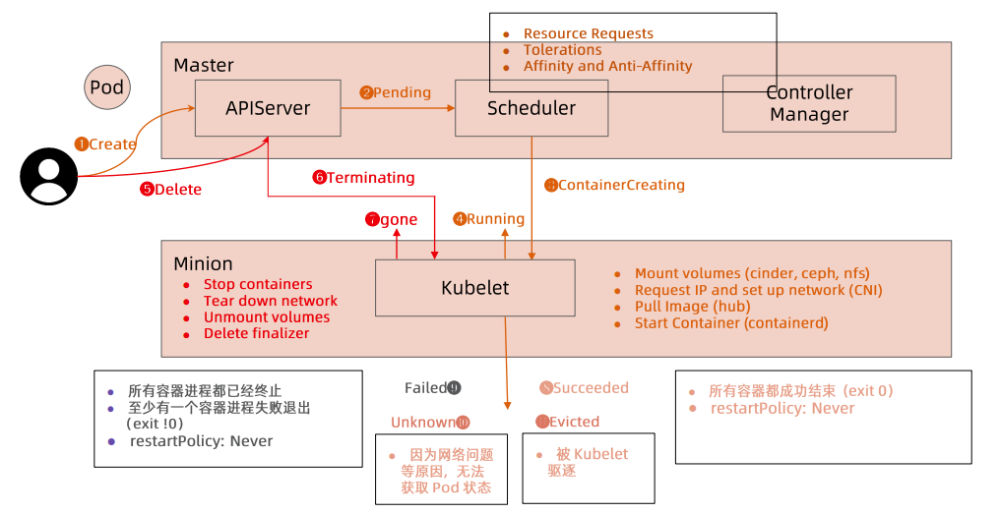

1. create：用户或者 controller 创建 Pod 后第一个状态
2. Pending：APIServer 会将请求写入 etcd，此时还未开始创建动作
   * 调度器 Scheduler  会监听到创建动作，根据调度策略调度到对应 Node 上
3. ContainerCreating：kubelet 会监听到自身 Node 上的调度，根据 Pod 定义的信息调取对应 CRI、CNI、CSI 接口实现 Pod 相关容器创建
4. Running：Pod 相关容器初始化并启动完成后，会处于此状态
5. Delete：用户或 controller 发起删除请求
6. Terminating：被用户删除，终止过程中
7. gone：结束消失
8. Succeeded：所有容器都结束运行，退出码为 0
9. Failed：创建失败、所有容器已经终止，至少有一个容器退出失败，退出码不为 0，并且 restart 策略为 Never
10. Unknown：未知状态，由于网络等原因无法获取 Pod 状态
11. Evicted：被驱逐


## Pod 状态机

上面图的简化：

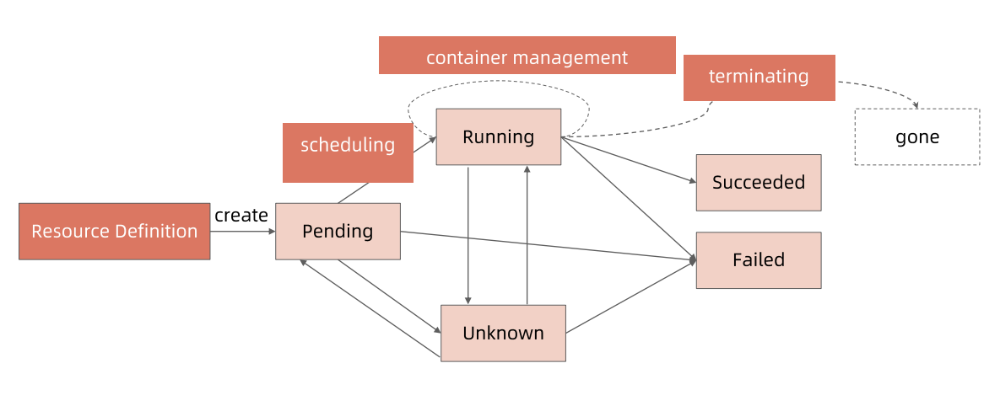

### PodPhase

PodPhase 是由 conditions 和 phase 计算出来的。  

查看 pod 状态信息  

`kubectl get pod POD_NAME -o yaml`，status 中表示 Pod 当前的状态

```yaml
status:
  conditions:
  - lastProbeTime: null
    lastTransitionTime: "2022-05-06T07:48:34Z"
    status: "True"
    type: Initialized
  - lastProbeTime: null
    lastTransitionTime: "2022-05-06T07:49:01Z"
    status: "True"
    type: Ready
  - lastProbeTime: null
    lastTransitionTime: "2022-05-06T07:49:01Z"
    status: "True"
    type: ContainersReady
  - lastProbeTime: null
    lastTransitionTime: "2022-05-06T07:48:34Z"
    status: "True"
    type: PodScheduled
  containerStatuses:
  - containerID: containerd://ef9a29dfb748371d38508e88fd7b0863aa926ac22e34e86c5797a287a362dba0
    image: docker.io/library/nginx:latest
    imageID: docker.io/library/nginx@sha256:859ab6768a6f26a79bc42b231664111317d095a4f04e4b6fe79ce37b3d199097
    lastState: {}
    name: nginx
    ready: true
    restartCount: 0
    started: true
    state:
      running:
        startedAt: "2022-05-06T07:49:00Z"
  hostIP: 10.0.12.8
  phase: Running			# Phase
  podIP: 10.244.1.11
  podIPs:
  - ip: 10.244.1.11
  qosClass: Burstable
  startTime: "2022-05-06T07:48:34Z"

```


#### Pod 状态计算细节

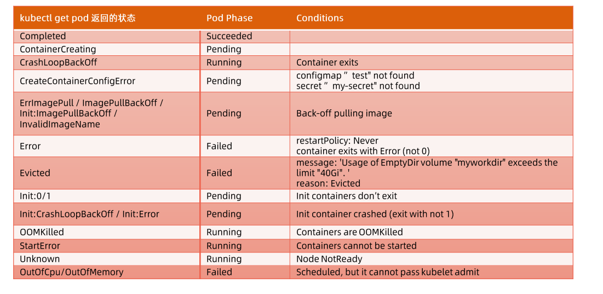


# Pod 质量

## 如何确保 Pod 高可用

* 避免容器进程被终止，避免 Pod 被驱逐
  * 设置合理的 resources.memory limits 防止容器进程被 OOMKill
  * 设置合理的 emptydir.sizeLimit 并确保数据写入不会超过 emptyDir 的限制，防止  Pod 被驱逐


## QoS & Quota

* Guaranteed

  * Pod 的每个容器都设置了资源 CPU 和内存需求

  * Limits 和 requests 的值完全一致

  * 示例

    ```yaml
    spec:
      containers:
        ...
        resources:
          limits:
            cpu: 700m
            memory: 200Mi
          requests:
            cpu: 700m
            memory: 200Mi
      ...
      qosClass: Guaranteed
    ```

* Burstable

  * 至少一个容器设置了 CPU 或内存 request

  * Pod 的 requests  和 limits 不一致

  * 示例

    ```yaml
    spec:
      containers:
        ...
        resources:
          limits:
            memory: 200Mi
          requests:
            memory: 100Mi
      ...
      qosClass: Burstable
    ```

* BestEffort

  * Pod 中的所有容器都未指定 CPU 或内存资源需求 requests

  * 示例

    ```yaml
    spec:
      containers:
        ...
        resources: {}
      ...
      qosClass: BestEffort
    ```

    

当计算节点检测到内存压力时，Kubernetes 会按照 BestEffort -> Burstable -> Guaranteed 的顺序依次驱逐 Pod。  

* 定义 Guaranteed 类型的资源需求来保护你的重要 Pod
* 认真考量 Pod 需要的真实需求并设置 limit 和 resource，这有利于将集群资源利用率控制在合理范围并减少 Pod 被驱逐的现象
* 尽量避免将生产 Pod 设置为 BestEffort，但测试环境中 BestEffort 较为适合
* Burstable 适用于大多数场景，平衡了资源锁定和突发请求


## Taint 和 Toleration

所有 Pod 都会被打上Toleration， node 为 not-ready 或 unreachable 时一定时间内会驱逐掉。  

* 有时候需要根据场景调整这些参数，以避免被驱逐
* 例如延长 tolerationSeconds 


## 健康检查探针

### 探针类型

#### livenessProbe

* 探活，当检查失败时，意味着该应用进程已经无法正常提供服务，kubelet 会终止该容器进程并按照 restartPolicy 决定是否重启

#### readinessProbe

* 就绪状态检查，当检查失败时，意味着应用进程正在运行，但因为某些原因不能提供服务，Pod 状态就会被标记为 NotReady

#### startupProbe

* 在初始化阶段（Ready之前）进行的健康检查，通常用来避免过于频繁的监测影响应用启动


### 探测方法

* ExecAction：在容器内部运行指定命令，当返回码为 0 时，探测结果为成功
* TCPSocketAction：由 kubelet 发起，通过 TCP 协议检查容器 IP 和端口，当端口可达时，探测结果为成功
* HTTPGetAction：由 kubelet 发起，对 Pod 的 IP 和指定端口以及路径进行 HTTPGet 操作，当返回码为 200-400 之间时，探测结果为成功


### 探针属性

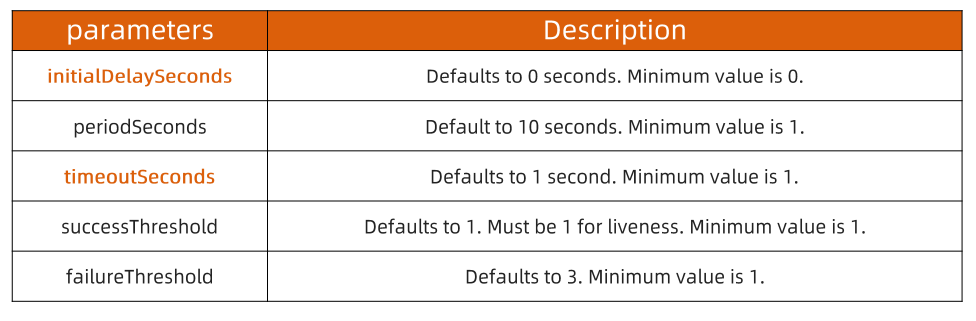

* initialDelaySeconds：延迟启动时间
* timeoutSeconds：超时时间
* failureThreshold：失败尝试阈值，默认3次


### ReadinessGates

在 Kubernetes 自带的 Pod Conditions 之外定义的就绪条件

* readinessGates condition 需要为 True 状态后，加上其它内置的 conditions ，Pod 才可以变为就绪状态
* 该状态应该由某个控制器修改


### Post-start 和 Pre-Stop Hook

* Post-start 用于指定在启动容器时做的一些操作，Post-start script 未完成时容器不会被标记为 running 状态

  * Post-start script 和 Entrypoint 是并行执行，无法保证先后顺序

* Pre-stop 用于 Pod 被终止时执行的动作，用于优雅退出

  * grace period 默认值：terminationGracePeriodSeconds=30

  * Pod 被终止时，kubernetes 会执行 pre-stop script ，如果该脚本一段时间没能结束容器，kubernetes 会发送 kill -SIGTERM 信号，之后再发送 kill -SIGKILL 信号

  * pre-stop 、-SIGTERM、-SIGKILL 的分解

    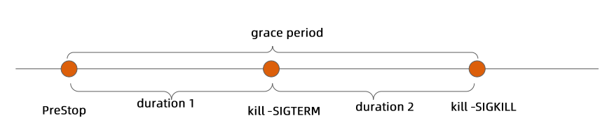

## Grace start 示例

### initial-delay

设置 initialDelaySeconds 后，指定时间以后才会开始 readiness 探活

```yaml
apiVersion: v1
kind: Pod
metadata:
  name: initial-delay
spec:
  containers:
    - name: initial-delay
      image: centos
      args:
        - /bin/sh
        - -c
        - touch /tmp/healthy; sleep 600
      readinessProbe:
        exec:
          command:
            - cat
            - /tmp/healthy
        initialDelaySeconds: 30		# 容器启动 30s 以后才开始探活
        periodSeconds: 5
```

观察启动过程

```sh
root@master01:~/probe# kubectl create -f initial-delay.yaml 
pod/initial-delay created
# Pod 启动后在 initialDelaySeconds 指定的 30s 时间过后才开始探活，探活成功再将状态修改为 Ready 
root@master01:~/probe# kubectl get pods -w -owide
NAME                                READY   STATUS              RESTARTS   AGE     IP            NODE     NOMINATED NODE   READINESS GATES
initial-delay                       0/1     ContainerCreating   0          4s      <none>        node02   <none>           <none>
initial-delay                       0/1     Running             0          8s      10.244.2.247   node02   <none>           <none>
initial-delay                       1/1     Running             0          40s     10.244.2.247   node02   <none>           <none>

```


### liveness

liveness 默认容器启动后状态是 ready 的

```yaml
apiVersion: v1
kind: Pod
metadata:
  name: liveness1
spec:
  containers:
    - name: liveness
      image: centos
      args:
        - /bin/sh
        - -c
        - touch /tmp/healthy; sleep 30; rm -rf /tmp/healthy; sleep 600
      livenessProbe:
        exec:
          command:
            - cat
            - /tmp/healthy
        initialDelaySeconds: 10		# 即使设置了该值，容器启动后 liveness 也会认为容器 ready
        periodSeconds: 5
```

观察启动过程，可以看到没有等待 initialDelaySeconds 设置的 10s ，Pod 状态就变为了 ready

```sh
root@master01:~/probe# kubectl create -f liveness.yaml 
pod/liveness1 created
root@master01:~/probe# kubectl get pods -owide -w
NAME        READY   STATUS              RESTARTS   AGE   IP       NODE     NOMINATED NODE   READINESS GATES
liveness1   0/1     ContainerCreating   0          4s    <none>   node01   <none>           <none>
liveness1   1/1     Running             0          8s    10.244.1.41   node01   <none>           <none>

```

继续观察 Pod 状态，/tmp/healthy 文件被删除后，liveness 会按照策略重启 Pod

```sh
# 由于运行一段时间后会删除用于探活的 /tmp/healthy 文件，所以 Pod 会不断被重启
# root@master01:~/probe# k get pod -owide -w
NAME        READY   STATUS    RESTARTS   AGE   IP            NODE     NOMINATED NODE   READINESS GATES
liveness1   1/1     Running   0          5s    10.244.1.44   node01   <none>           <none>
liveness1   1/1     Running   1 (7s ago)   82s   10.244.1.44   node01   <none>           <none>
liveness1   1/1     Running   2 (3s ago)   2m38s   10.244.1.44   node01   <none>           <none>

# describe 查看 pod 相关event
Containers:
  liveness:
   ....
   # 默认的策略，探测到一次 success 就认为存活，3次 failure 就认为不存活
    Liveness:     exec [cat /tmp/healthy] delay=10s timeout=1s period=5s #success=1 #failure=3
  ....
Conditions:
  Type              Status
  Initialized       True 
  Ready             True 
  ContainersReady   True 
  PodScheduled      True 
....
# 相关事件
Events:
  Type     Reason     Age                 From               Message
  ----     ------     ----                ----               -------
  Normal   Scheduled  2m38s               default-scheduler  Successfully assigned default/liveness1 to node01
  Normal   Pulled     2m35s               kubelet            Successfully pulled image "centos" in 2.743634061s
  Normal   Pulled     77s                 kubelet            Successfully pulled image "centos" in 5.957496971s
  Warning  Unhealthy  33s (x6 over 2m3s)  kubelet            Liveness probe failed: cat: /tmp/healthy: No such file or directory
  Normal   Killing    33s (x2 over 113s)  kubelet            Container liveness failed liveness probe, will be restarted
  Normal   Pulling    3s (x3 over 2m37s)  kubelet            Pulling image "centos"
  Normal   Created    0s (x3 over 2m35s)  kubelet            Created container liveness
  Normal   Started    0s (x3 over 2m35s)  kubelet            Started container liveness
  Normal   Pulled     0s                  kubelet            Successfully pulled image "centos" in 2.716028626s

```


### readiness

```yaml
apiVersion: v1
kind: Pod
metadata:
  name: http-probe
spec:
  containers:
    - name: http-probe
      image: nginx
      readinessProbe:
        httpGet:
          ### this probe will fail with 404 error code
          ### only httpcode between 200-400 is retreated as success
          path: /healthz
          port: 80
        initialDelaySeconds: 30
        periodSeconds: 5
        successThreshold: 2
```

查看 Pod 状态

```sh
root@master01:~/probe# kubectl get pods -owide -w
NAME         READY   STATUS              RESTARTS   AGE   IP       NODE     NOMINATED NODE   READINESS GATES
http-probe   0/1     ContainerCreating   0          5s    <none>   node01   <none>           <none>
http-probe   0/1     Running             0          20s   10.244.1.42   node01   <none>           <none>
# describe Pod 
Events:
  Type     Reason     Age                From               Message
  ----     ------     ----               ----               -------
  Normal   Scheduled  2m20s              default-scheduler  Successfully assigned default/http-probe to node01
  Normal   Pulling    2m19s              kubelet            Pulling image "nginx"
  Normal   Pulled     2m1s               kubelet            Successfully pulled image "nginx" in 18.057565792s
  Normal   Created    2m1s               kubelet            Created container http-probe
  Normal   Started    2m                 kubelet            Started container http-probe
  Warning  Unhealthy  4s (x19 over 89s)  kubelet            Readiness probe failed: HTTP probe failed with statuscode: 404
  
# 在容器中创建文件
root@master01:~/probe# k exec -it http-probe -- bash
root@http-probe:/# touch /usr/share/nginx/html/healthy
# 另一个窗口中 watch Pod 状态会变成 ready
root@master01:~/probe# kubectl get pods -owide -w
NAME         READY   STATUS              RESTARTS   AGE   IP       NODE     NOMINATED NODE   READINESS GATES
http-probe   0/1     ContainerCreating   0          5s    <none>   node01   <none>           <none>
http-probe   0/1     Running             0          20s   10.244.1.42   node01   <none>           <none>
http-probe   1/1     Running             0          5m26s   10.244.1.42   node01   <none>           <none>
```


### readiness-gate

```yaml
apiVersion: v1
kind: Pod
metadata:
  labels:
    app: readiness-gate
  name: readiness-gate
spec:
  readinessGates:
    - conditionType: "www.example.com/feature-1"
  containers:
    - name: readiness-gate
      image: nginx
---
apiVersion: v1
kind: Service
metadata:
  name: readiness-gate
spec:
  ports:
    - port: 80
      protocol: TCP
      targetPort: 80
  selector:
    app: readiness-gate

```

观察启动，如果定义了 readiness gate condition ，容器启动成功，该 condition 不满足，Pod 状态中的 READINESS GATES 会标记为 not-ready

```sh
root@master01:~/probe# kubectl create -f readiness-gate.yaml
pod/readiness-gate created
service/readiness-gate created
root@master01:~/probe# kubectl get pod -owide -w
NAME             READY   STATUS    RESTARTS   AGE   IP            NODE     NOMINATED NODE   READINESS GATES
readiness-gate   1/1     Running   0          12s   10.244.1.43   node01   <none>           0/1

```


### post-start

在 containers 中容器 lifecycle 内定义的 postStart，会在容器启动时执行

```yaml
apiVersion: v1
kind: Pod
metadata:
  name: poststart
spec:
  containers:
    - name: lifecycle-demo-container
      image: nginx
      lifecycle:
        postStart:
          exec:
            command: ["/bin/sh", "-c", "echo Hello from the postStart handler > /usr/share/message"]
```

启动 Pod 并进入查看 postStart 中定义的 echo 文件动作

```sh
root@master01:~/probe# kubectl create -f post-start.yaml
pod/poststart created
root@master01:~/probe# kubectl get pods -owide -w
NAME        READY   STATUS    RESTARTS   AGE   IP            NODE     NOMINATED NODE   READINESS GATES
poststart   1/1     Running   0          4s    10.244.1.45   node01   <none>           <none>
# 进入容器查看文件内容，postStart 中定义的内容已经写入
root@master01:~/probe# k exec -it poststart -- bash
root@poststart:/# cat /usr/share/message 
Hello from the postStart handler
```


## Grace stop 示例

### no-sigterm

如果容器是由 sh 一类工具启动的，则不会处理 sigterm 信号，也就无法优雅退出了

```yaml
apiVersion: v1
kind: Pod
metadata:
  name: no-sigterm
spec:
  terminationGracePeriodSeconds: 60
  containers:
    - name: no-sigterm
      image: centos
      command: ["/bin/sh"]
      args: ["-c", "while true; do echo hello; sleep 10;done"]
```


### prestop

在 containers 中容器的 lifecycle 中定义要终止容器时做的一些动作，例如释放链接，持久化数据等

```yaml
apiVersion: v1
kind: Pod
metadata:
  name: prestop
spec:
  containers:
    - name: lifecycle-demo-container
      image: nginx
      lifecycle:
        preStop:
          exec:
            command: [ "/bin/sh","-c","nginx -s quit; while killall -0 nginx; do sleep 1; done" ]
```


### Terminating Pod 经验

* bash/sh 会忽略 SIGTERM 信号量
* 如果希望快速终止应用进程
  * 在 preStop script 中主动退出进程
  * 在主容器进程中使用特定的初始化进程
* 优雅的初始化进程应该
  * 正确处理系统信号量，将信号量转发给子进程
  * 在主进程退出之前，需要先等待并确保子进程退出
  * 监控并清理孤儿子进程
* tini 工具：参考链接：https://github.com/krallin/tini


## Kubernetes 部署应用的挑战


### 资源规划

* 实例资源计算
  * CPU/GPU
  * Memory
* 超售需求
* 存储资源
  * 大小
  * 本地 or 网络
  * 读写性能
  * Disk IO
* 网络需求
  * QPS、带宽


### 存储挑战

多容器共享，最简单方案是 emptyDir。  需要注意

* 控制 size limit，限制应用无限扩张导致的主机磁盘不可用，甚至集群大规模故障
* 设置 size limit 后，kubelet 会定期对容器目录进行 du 操作，影响些许性能
* size limit 触发后，Pod 会被驱逐，日志、配置等信息会消失


### 应用配置加载

如何加载配置文件到 Pod 容器中：  

传入方式

* Env
* Volume Mount


数据来源

* ConfigMap
* Secret
* Downward API


### 高可用部署方式

实例数量  

更新策略

* maxSuge
* maxUnavailable

理解 PodTemplateHash 导致的应用易变性


# 服务发现

## 服务发布

* 需要把服务发布至集群内部或者外部，服务的不同类型：
  * ClusterIP（Headless）
  * NodePort
  * LoadBalancer
  * ExternalName
* 证书管理和七层负载均衡的需求
* 需要gRPC 负载均衡如何做？
* DNS需求
* 与上下游服务的关系


## 服务发布的挑战

### kube-dns

* DNS TTL 问题
  * 客户端缓存了服务端 IP，TTL 周期内服务端出现问题，客户端仍会去请求该服务端


### Service

* ClusterIP 只能对内
* kube-proxy 支持的 iptables/ipvs 规模有限
* IPVS 的性能和生产化问题
* kube-proxy 的 drift 问题
* 频繁的 Pod 变动（spec change，failover，crashloop）导致 LB 频繁变更
* 对外发布的 Service 需要与企业 ELB 集成
* 不支持 gRPC
* 不支持自定义 DNS 和高级路由功能


### Ingress

* Spec 的成熟度？


其它可选方案？


### 跨地域部署

* 需要多少实例？
* 如何控制失败域，部署在几个地区，AZ，集群？
* 如何进行精细的流量控制
* 如何做按照地域的顺序更新？
* 如何回滚？


## 微服务架构的挑战

服务发现

* 微服务架构是由一系列职责单一的细粒度服务构成的分布式网状结构，服务之间通过轻量机制进行通信，这时候必然引入一个服务注册发现问题
  * 服务提供方要注册通告服务地址
  * 服务的调用方要能发现目标服务
* 同时服务提供方一般以集群方式提供服务，也就引入了负载均衡和健康检查问题
* 如何让客户端就近访问


## 互联网架构发发展历程

* single webpage：早期单体架构，容易出现单点故障问题
* loadbalacer and HA：负载均衡，主备
* L4/L7 Loadbalancer：简单负载无法满足需求，7层转发需求又增加了 L7 LB
* Multiple L4：大规模数据，需要多台负载均衡、集群来分摊流量
* Multiple Datacenters：为了满足优化多地访问，多个数据中心


## 网络包格式

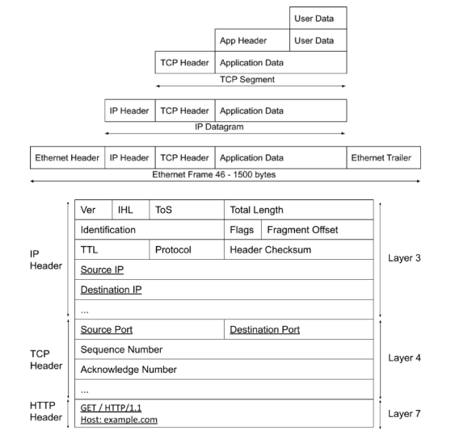

* 用户数据，例如 http，有 header 和 userdata 组成 application Data
* 在传输层（4层）会加上 TCP Header，包含了源端口、目标端口、协议等
* 在网络层（3层）会加上 IP Header，包含源 IP 地址、目标 IP 地址等
* 在链路层又会加上 Ethernet Header ，包含源 MAC 、目标 MAC 等信息

负载均衡是在这些数据包中检测对应特征进行分发到后端服务，例如  

* Layer 3 、Layer 4 中的源/目标 IP、源/目标端口、协议类型等
* Layer 7 中的 方法、路径、Header 信息中的特定值等


## LB 服务发现

### 集中式 LB 服务发现

* 在服务消费者和服务提供者之间有一个独立的 LB

* LB 上有所有服务的地址映射表，通常由运维配置注册

* 当服务消费方调用某个目标服务时，它向 LB 发起请求，由 LB 以某种策略（比如 Round-Robin）做负载均衡后将请求转发到目标服务

* LB 一般具备健康检查能力，能自动摘除不健康的服务实例

* 服务消费方通过 DNS 发现 LB，运维人员微服务配置一个 DNS 域名，这个域名指向 LB

  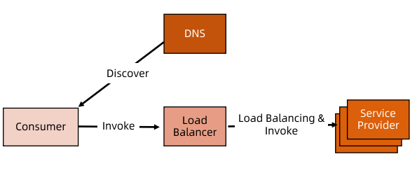

* 集中式 LB 方案实现简单，在 LB 上容易做集中式的访问控制，目前还是业界主流
* 主要问题是单点故障，所有服务调用都经过 LB，当服务数量和调用量大的时候，LB 容易成为瓶颈，且一旦 LB 发生故障对整个系统的影响是灾难的
* LB 在 consumer 和 producer 之间增加了 一跳（hop），有一定性能开销


### 进程内服务发现

* 进程内 LB 方案将 LB 的功能以库的形式集成到服务消费方进程里，该方案也被称为客户端负载均衡方案

* 服务注册表（Service Registry）配合支持服务自注册和自发现，服务提供方启动时，首先将服务地址注册到服务注册表（同时定期报心跳到服务注册表以表明服务的存活状态）

* 服务消费方要访问某个服务时，它通过内置的 LB 组件向服务注册表查询（同时缓存并定期刷新）目标服务地址列表，然后以某种负载均衡策略选择一个目标服务地址，最后向目标发起请求

* 这一方案对服务注册表的可用性（Availability）要求很高，一般采用能满足高可用分布式一致的组件（例如 zookeeper、consul、etcd 等）来实现

  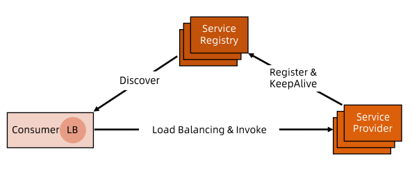

* 进程内 LB 是一种分布式模式，LB 和服务发现能力被分散到每一个服务消费者的进程内部，同时 consumer 和 producer 之间是直接调用
  * 没有额外开销，性能比较好
  * 以客户库（client library）的方式集成到服务调用方进程里，如果企业内有多种不哦她那个的语言栈，就要配合开发多种不同的客户端，有一定研发和维护成本
* 一旦客户端跟随服务调用方发布到生产环境种，后续如果要对客户库进行升级，需要调用方修改代码并重新发布，所以该方案升级推广阻力不小


### 独立 LB 进程服务发现

* 针对进程内 LB 模式不足提出的一种折中方案，原理和进程内 LB 方案基本类似

* 将 LB 和服务发现功能从进程内一出来，变成主机上的一个独立进程，主机上的一个或多个服务要访问目标服务时，他们都通过同一主机上的独立 LB 进程做服务发现和负载均衡

* LB 独立进程可以进一步与服务消费方进行解耦，以独立集群的形式提供高可用的负载均衡服务

* 这种模式可以称之为真正的 “软负载（Soft Load Blancing）”

  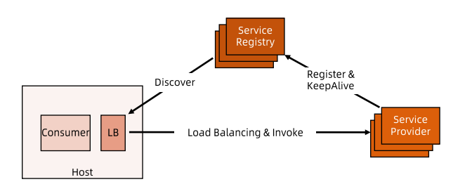

* 独立 LB 进程也是一种分布式方案，没有单点问题，一个 LB 进程挂掉之影响该主机上的服务调用方
* 服务调用方和 LB 之间时进程间调用，性能好
* 简化了服务调用方，不需要为不同语言开发客户库，LB 的升级不需要服务调用方改代码
* 不足是部署较复杂，环节多，出错调试排查问题不方便


## 负载均衡

* 系统扩展可以分为纵向（垂直）扩展和横向（水平）扩展
  * 纵向扩展，从单机角度通过增加硬件处理能力。例如 CPU、内存、磁盘能力，实现服务器处理能力的提升，但不能满足大型分布式系统（网站），大流量、高并发、海量数据的问题
  * 横向扩展，通过添加机器来满足大型网站服务的处理能力。一台机器不足则增加多台，共同承担访问压力，典型的集群和负载均衡架构。
* 负载均衡解决的问题
  * 解决并发压力，提高应用处理性能，增加吞吐量，加强网络处理能力
  * 提供故障转移，实现高可用
  * 通过添加或减少服务器数量，提供网站伸缩性，扩展性
  * 安全防护，负载均衡设备上可以做一些过滤，黑白名单处理


### DNS 负载均衡

最早的负载均衡技术，利用域名解析实现负载均衡，在 DNS 服务器，配置多个 A 记录，这些 A 记录对应的服务器构成集群。

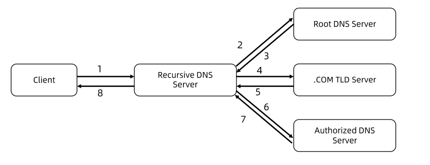

* 优点
  * 使用简单，负载直接交给 DNS 服务器处理
  * 提高性能，可以基于客户端地址，解析成距离用户最近的服务器地址，加快访问速度，CDN
* 缺点
  * 可用性差，DNS 是多级解析，新增/修改 DNS 后，解析时间较长，解析过程种，用户访问网站会失败
  * 扩展性低，DNS 负载均衡控制器在域名提供商处，无法做太多扩展
  * 维护性差，不能反应服务器当前运行状态，支持的算法少，不能区分服务器的差异（根据系统与服务的状态来判断负载）


### 负载均衡技术概览

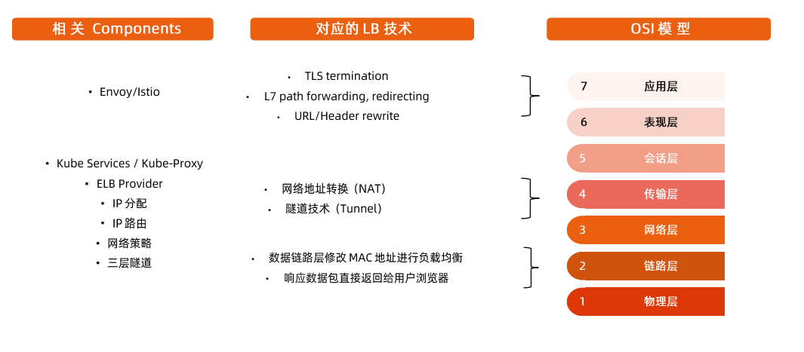

#### NAT

通常修改数据包的源地址（Source NAT）或目标地址（Destination NAT）来控制数据包转发行为。

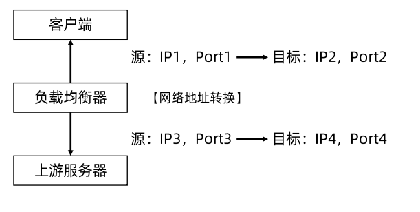

通过 Connection Tracking Table 维护映射关系，通过设定的策略，将 IP 包的地址进行替换。


#### 新建 TCP 连接

为了记录原始客户端 IP 地址，负载均衡功能不仅需要进行数据包的源/目标地址修改，同时要记录原始客户端 IP 地址，简单的 NAT 无法满足。  

因此诞生了 TCP/UDP Termination 方案，负载均衡会断掉请求，再重新建立请求到服务器。  

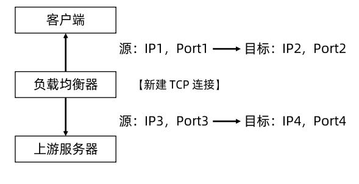


#### 链路层负载均衡

* 在数据链路层修改 MAC 地址进行负载均衡
* 数据分发时，不修改 IP 地址，只修改目标 MAC 地址
  * real server 集群所有机器虚拟 IP 和 LB 的 IP 要地址一致
  * 不修改数据包的源地址和目标地址
* 实际处理服务器 IP 和数据请求目的 IP 一致，不需要经过负载均衡服务器进行地址转换，可将 response 数据包直接返回给客户端
  * 避免负载均衡服务器网卡成为瓶颈
* 也叫直接路由模式（DR模式）

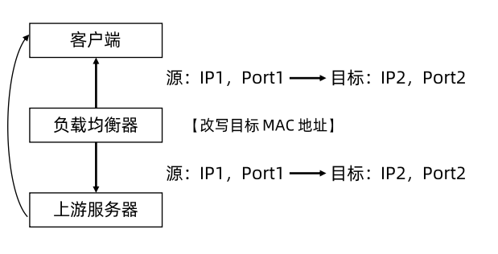


#### 隧道技术

* 常用的有 GRE、IP over IP

* 原理是保持原始数据包 IP 头不变，在 IP 头外层增加额外的 IP 包头后转发给上游服务器。
* 上有服务器接收 IP 数据包后，解开外层 IP 包头，剩下原始数据包
* 原始数据包的目标 IP 地址要配置在上游服务器上
* 上游服务器处理完数据请求后，响应包通过网关直接返回给客户端


# Service 对象

## 相关属性

* Service Selector
  * 通过 Service Selector 标签过滤打了 label 的 Pod 对象
* Ports
  * Ports 属性中定义了服务的端口、协议、目标端口等信息

示例：

```yaml
apiVersion: v1
kind: Service
metadata:
  name: httpserver-svc
spec:
  selector:
    app: httpserver
  ports:
    - port: 80
      targetPort: 80
      protocol: TCP

```


## Endpoint 对象

* 当 Service 的 selector 不为空时，Kubernetes Endpoint Controller 会侦听服务创建事件，创建与 Service 同名的 Endpoint 对象
* Selector 能够选取的所有 PodIP 都会被配置到 addresses 属性中
  * 如果此时 selector 所对应的 filter 查询不到对应的 Pod，则 address 列表为空
  
  * 默认配置下，如果对应的 Pod 为 not ready 状态，则对应 PodIP 只会出现在 notReadyAddresses 属性中，这意味着对应的 Pod 还没准备好提供服务，不能作为流量转发的目标
  
  * 如果设置了 PublishNotReadyAddress 为 true，则无论 Pod 是否就绪都会被加入到 readyAddress list
  
    ```yaml
    apiVersion: v1
    kind: Service
    metadata:
      name: nginx-publish-notready
    spec:
      publishNotReadyAddresses: true
      type: ClusterIP
      ports:
        - port: 80
          protocol: TCP
          name: http
      selector:
        app: nginx
    ```
  
    


### EndpointSlice 对象

新版本中用来替换 Endpoint 对象的

* 当某个 Service 对应的 backend Pod 较多时，Endpoint 对象就会因保存的地址信息过多而变得异常庞大
* Pod 状态的变更会引起 Endpoint 的变更，Endpoint 的变更会被推送至所有节点，从而导致持续占用大量网络带宽
* EndpointSlice 对象，用于对 Pod 较多的 Endpoint 进行切片，切片大小可以自定义


## 不定义 Selector 的 Service

如果用户创建了 Service 但不定义 Selector

* Endpoint Controller 不会为该 Service 自动创建 Endpoint
* 用户可以手动创建 Endpoint，并设置任意 IP 地址到 Address 属性
* 访问该服务的请求会被转发至该目标地址

通过该类型服务，可以为集群外的一组 Endpoint 创建服务

示例：  

Service

```yaml
apiVersion: v1
kind: Service
metadata:
  name: service-without-selector
spec:
  ports:
    - port: 80
      protocol: TCP
      name: http

```

Endpoint

```yaml
apiVersion: v1
kind: Endpoints
metadata:
  name: service-without-selector
subsets:
  - addresses:
      - ip: 220.181.38.148 # 设置需要转发到的IP地址
    ports:
      - name: http
        port: 80
        protocol: TCP
```


## Service、Endpoint、Pod 对应关系

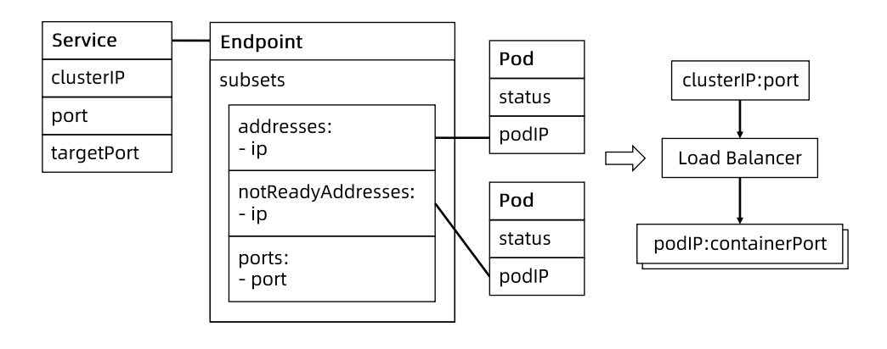


## Service 类型

* clusterIP

  * 默认类型，服务被发布到仅集群内部可见的虚拟 IP 地址上
  * API Server 启动时，需要通过 service-cluster-ip-range 参数配置虚拟 IP 地址段，API Server 中有用于分配 IP 地址和端口的组件，当该组件捕获 Service 对象并创建事件时，会从配置的 IP 地址段中取一个有效的 IP 地址，分配给该 Service 对象

* nodePort

  * 在 API Server 启动时，需要通过 node-port-range 参数配置 nodePort  的范围，同样的，API Server 组件会捕获 Service 对象并创建事件，从配置好的 nodePort 范围取一个有效端口，分配给该 Service
  * 每个节点的 kube-proxy 会尝试在服务分配的 nodePort 上建立侦听器接收请求，并转发给服务对应的后端 Pod 实例

* LoadBalancer

  * 企业数据中心一般会采购 LB 设备，作为外网进入数据中心统一流量入口
  * 针对不同基础架构云平台，Kubernetes Cloud Manager 提供支持不同供应想 API 的 Service Controller。
    * 如果需要在 Openstack 云平台上搭建 Kubernetes 集群，只需要提供一份 openstack.rc，Openstack Service Controller 即可通过调用 LBaaS API 完成负载均衡配置

* 其它

  * Headless Service

    * Headless 服务是用户将 clusterIP 显式定义为 None 的服务

    * 意味着 Kubernetes 不会为该服务分配统一入口，包括 clusterIP、nodePort等

      ```yaml
      apiVersion: v1
      kind: Service
      metadata:
        name: nginx-headless
      spec:
        ClusterIP: None
        ports:
          - port: 80
            protocol: TCP
            name: http
        selector:
          app: nginx
      ```

      

  * ExternalName Service

    * 为一个服务创建别名

      ```yaml
      apiVersion: v1
      kind: Service
      metadata:
        name: my-service
        namespace: prod
      spec:
        type: ExternalName
        externalName: tencent.com
      ```

      


## Service Topology

用于实现不同地域/可用区之间就近访问。  

* 网络调用延迟受到客户端和服务器之间所处位置的影响，两者是否在同一节点、同一机架、同一可用区、同一数据中心，都会影响参与数据传输的设备数量

* 分布式系统中，为保证系统的高可用，往往需要控制应用的错误域（Failure Domain），比如通过反亲和性配置，将一个应用的多个副本部署在不同机架，甚至不同的数据中心

* Kubernetes 提供通用标签来标记节点所处的物理位置

  ```
  topology.kubernetes.io/zone: us-west2-a
  failure-domain.beta.kubernetes.io/region: us-west
  failure-domain.beta.kubernetes.io/network-device: us-west05-ra053
  failure-domain.beta.kubernetes.io/rack: us_west02_02-314_19_12
  kubernetes.io/hostname: node-1
  ```

* Service 引入了 `topologyKeys`  属性，可以通过设置来控制流量

  * 当 topologyKeys 设置为 `["kubernetes.io/hostname"]`时，调用服务的客户端所在节点上如果有服务实例在运行，则该实例处理请求，否则调用失败
  * 当 topologyKeys 设置为 `["kubernetes.io/hostname","topology.kubernetes.io/zone","topology.kubernetes.io/region"]`时， 若同意节点有对应的服务实例，则请求会优先转发至该实例。否则，顺序查找当前 zone 及当前 region 是否有服务实例，并将请求按顺序转发 
  * 当 topologyKeys 设置为 `["topology.kubernetes.io/zone","*"]`时，请求会被优先转发至当前 zone 的服务实例，如果当前 zone 不存在服务实例，则请求会被转发至任意服务实例


示例：  

仅转发给当前节点的实例，如果没有则丢弃

```yaml
apiVersion: v1
kind: Service
metadata:
  name: nodelocal
spec:
  ports:
    - port: 80
      protocol: TCP
      name: http
  selector:
    app: nginx
  topologyKeys:
    - "kubernetes.io/hostname"
```

按照顺序，查找当前节点、zone、region，都没有符合实例时，最后再转发给其它任意实例

```yaml
apiVersion: v1
kind: Service
metadata:
  name: prefer-nodelocal
spec:
  ports:
    - port: 80
      protocol: TCP
      name: http
  selector:
    app: nginx
  topologyKeys:
    - "kubernetes.io/hostname"
    - "topology.kubernetes.io/zone"
    - "topology.kubernetes.io/region"
    - "*"
```


# kube-proxy 组件
每台机器都运行一个 kube-proxy 服务，它监听 API Server 中 service 和 endpoint 的变化情况，并通过 iptables 等来为服务配置负载均衡（仅支持 TCP 和 UDP）  
kube-proxy 可以直接运行在物理机上，也可以以 static pod 或者 DaemonSet 的方式运行。  
kube-proxy 当前支持以下几种实现：
* userspace：最早的负载均衡方案，监听一个端口，所有服务通过 iptables 转发到这个端口，然后在其内部负载到实际的 Pod
  * 效率低，有明显的性能瓶颈
* iptables：基于 iptables 实现 service 负载均衡，主要是服务多的时候产生太多的 iptables 规则，非增量式更新会引入一定的时延，大规模情况下有明显的性能瓶颈
* ipvs：v1.8 以后新增的 ipvs 模式，采用增量更新，可以保证 service 更新期间连接保持不断开
* winuserspace：同 userspace，但仅工作在 windows


## Netfilter框架

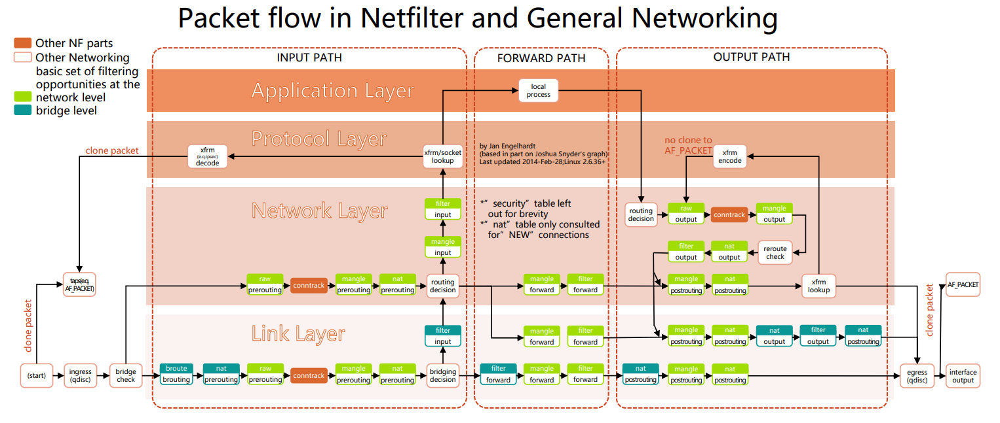


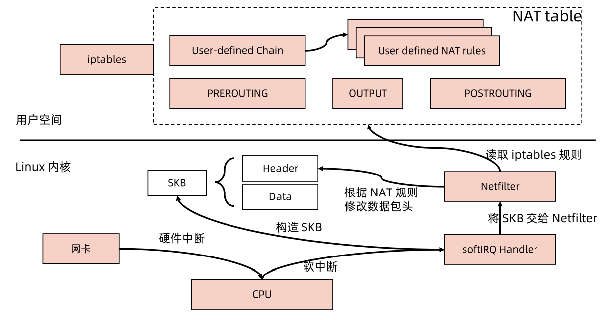


## iptables

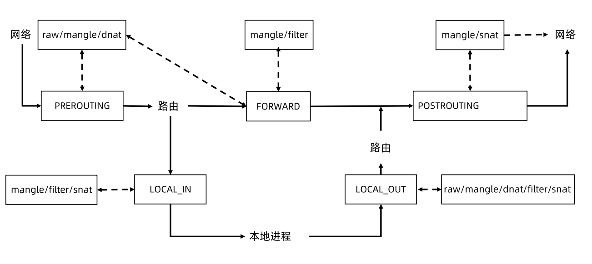

### iptables hook

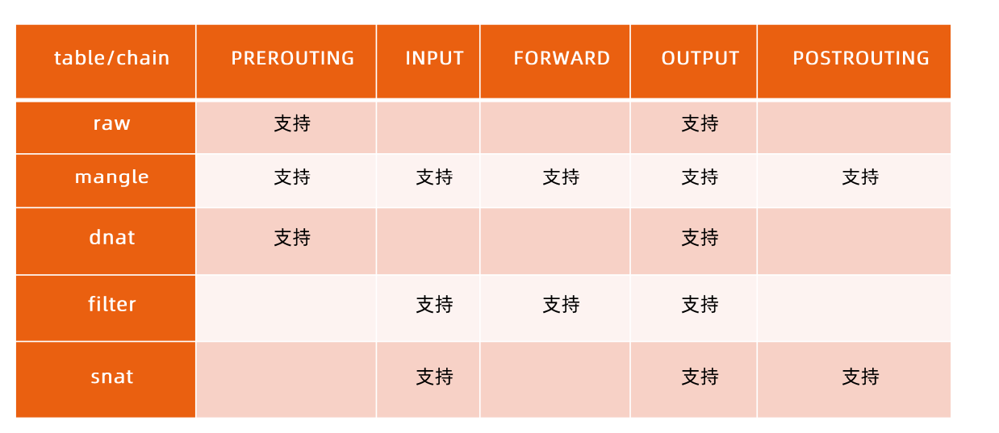


## kube-proxy 工作原理

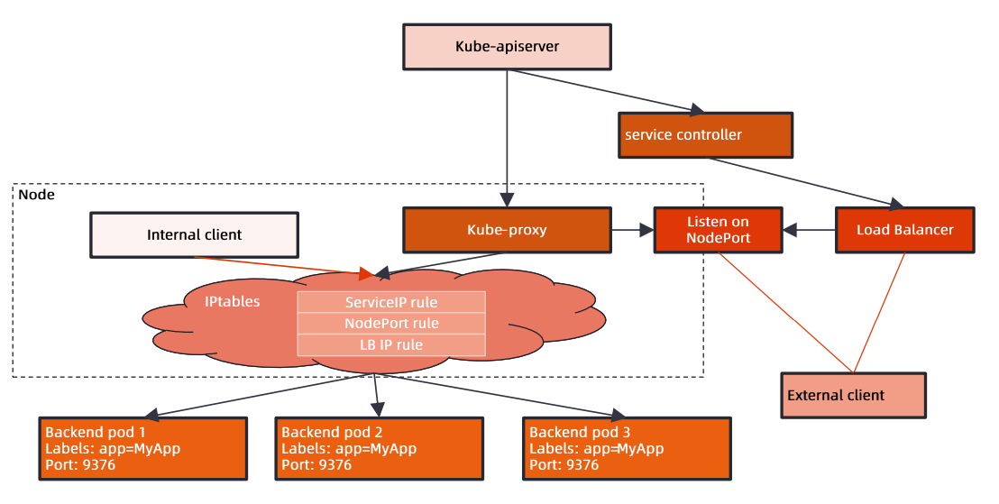

* watch api-server，监听到与节点或Pod相关的IP映射
* 调用iptables、ipvs等配置规则，实现功能


## Kubernetes iptables 原理

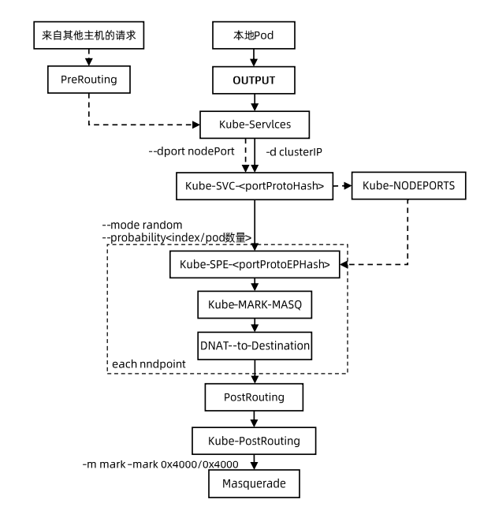

## IPVS

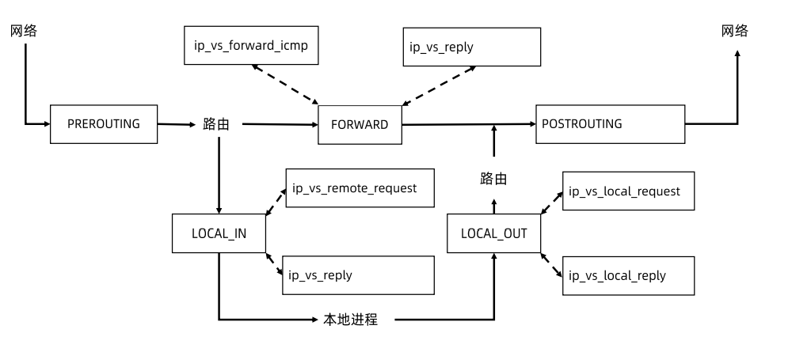

### IPVS hook & core func

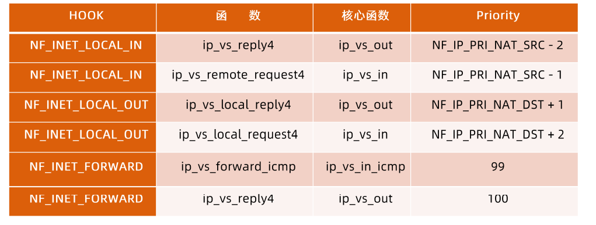


# DNS 原理和实践


## CoreDNS

CoreDNS 包含一个内存态 DNS，以及与其他 controller 类似的控制器。  

CoreDNS 的实现原理是，控制器监听 Service 和 Endpoint 的变化并配置 DNS，客户端 Pod 在进行域名解析时，从 CoreDNS 中查询服务对应的地址记录。


## 不同类型服务的 DNS 记录

* 普通 Service
* Headless Service
* ExternalName Service


## Kubernetes 中的 DNS 解析

* Kubernetes Pod 有一个与 DNS 策略相关的属性 DNSPolicy，默认值是 ClusterFirst

* Pod 启动后的 /etc/resolv.conf 会被改写，所有的地址解析优先发送至 CoreDNS

  * ```bash
    $ cat /etc/resolv.conf
    search ns1.svc.cluster.local svc.cluster.local cluster.local
    nameserver 192.168.0.100
    options ndots:3		//与第一条配合，域名的长度在几个以内会匹配search 中的后缀，以实现短域名访问服务
    ```

* 当 Pod 启动时，同一Namespace 的所有 Service 都会以环境变量的形式设置到容器内


## 自定义 DNSPolicy


# Ingress 对象

## 四层负载和七层负载


## Service 中的 Ingress 的对比


## Ingress 工作原理

* Ingress
  * Ingress 是一层代理
  * 负责根据 hostname 和 path 将流量转发到不同的服务上，使得一个负载均衡器用于多个后台应用
  * Kubernetes Ingress Spec 是转发规则的集合
* Ingress Controller
  * 确保实际状态（Actual）与期望状态（Desired）一直的 Control Loop
  * Ingress Controller 确保
  * 负载均衡配置
  * 边缘路由配置
  * DNS 配置


# 案例：通过 Ingress 和 Service 完成一个网络拓扑