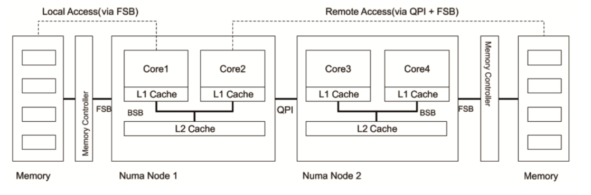
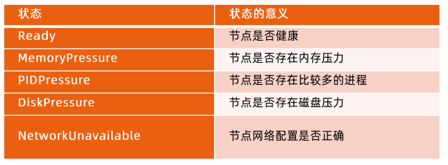
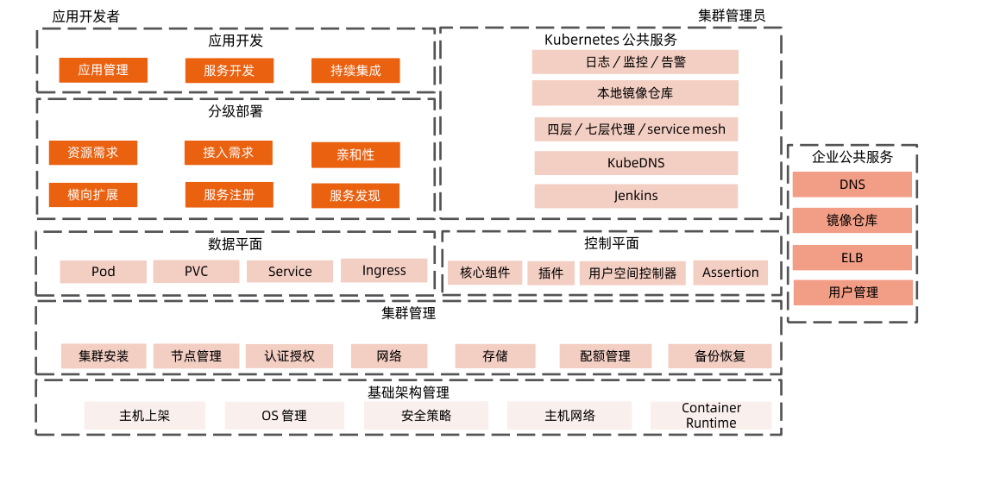
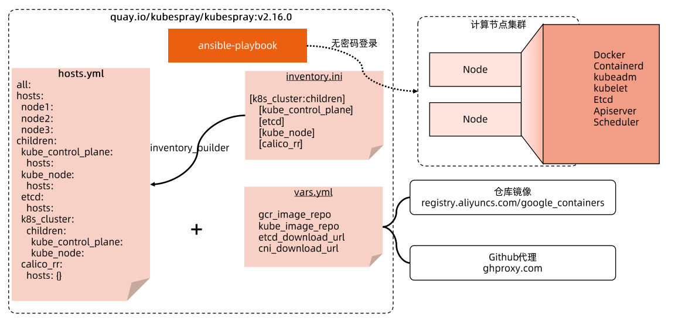

[toc]


# 计算节点及操作系统选择


# 节点资源管理

## NUMA Node

Non-Uniform Memory Access  是一种内存访问方式，为多核CPU计算机设计的内存架构。




现代计算机硬件中多个CPU、多个内存，不同的CPU和内存有直连和非直连的情况，非直连（Remote Access）情况下CPU需要通过QPI（Quick Path Interconnect）总线，再经过FSB总线去连接内存。

如果需要对系统做一些比较极致的性能优化，可以从此处入手研究。


## 状态上报

kubelet 周期性地向 API Server 进行汇报，并更新节点的相关健康和资源使用信息

* 节点基础信息，包括IP地址、操作系统、内核、运行时、kubelet、kube-proxy 版本信息
* 节点资源信息，包括CPU、内存、HugePage、临时存储、GPU等注册设备，以及这些资源可以分配给容器使用的部分
* 调度器在为 Pod 选择节点时会将机器的状态信息作为依据





### Lease 对象

在早期版本 kubelet 的状态上报直接更新 node 对象，而上报的信息包含状态信息和资源信息，因此需要传输的数据包较大，给 APIServer 和 etcd 造成的压力较大。  

后引入 Lease 对象用来保存健康信息，在默认 40s 的 nodeLeaseDurationSeconds 周期内，若 Lease 对象没有被更新，则对应节点可以被判定为不健康。


### 状态上报示例

```yaml
#Lease信息
root@master01:~# k get lease -n kube-node-lease -o yaml node01
apiVersion: coordination.k8s.io/v1
kind: Lease
metadata:
  creationTimestamp: "2022-03-03T04:12:27Z"
  name: node01
  namespace: kube-node-lease
  ownerReferences:
  - apiVersion: v1
    kind: Node
    name: node01
    uid: 435c2872-9dd5-4871-8095-a1ec6d3b9563
  resourceVersion: "25411"
  uid: dbdd9925-2189-4ef8-9910-5b92572bb156
spec:
  holderIdentity: node01
  leaseDurationSeconds: 40
  renewTime: "2022-03-03T09:05:20.883373Z"
root@master01:~# k get lease -n kube-node-lease -o yaml node02
apiVersion: coordination.k8s.io/v1
kind: Lease
metadata:
  creationTimestamp: "2022-03-03T04:12:27Z"
  name: node02
  namespace: kube-node-lease
  ownerReferences:
  - apiVersion: v1
    kind: Node
    name: node02
    uid: cb300662-5dd5-4ed1-af81-fa522b5c136f
  resourceVersion: "25412"
  uid: 308f280e-7c1f-435c-8b8c-bc54a2385f99
spec:
  holderIdentity: node02
  leaseDurationSeconds: 40
  renewTime: "2022-03-03T09:05:22.489530Z"
root@master01:~# 


```


## 资源预留

计算节点除了用户容器外，还存在很多支撑系统运行的基础服务，譬如 systemd、journald、sshd、dockerd、Containerd、kubelet 等。  

为了使服务进程能够正常运行，要确保它们在任何时候都可以获取足够的系统资源，所以我们要为这些系统进程预留资源。  

kubelet 可以通过众多启动参数为系统预留 CPU、内存、PID 等资源，比如 SystemReserved、KubeReserved 等。


### Capacity 和 Allocatable

容量资源（Capacity）是指kubelet 获取的计算节点当前的资源信息。

* CPU 是从 /proc/cpuinfo 文件中获取的节点 CPU核数；
* memory 是从 /proc/memoryinfo 中获取的节点内存大小；
* ephemeral-storage 是指节点根分区的大小。

资源可分配额（Allocatable）是用户 Pod 可用的资源，是资源容量减去分配给系统的资源的剩余部分。

* kube-reserved
* system-reserved
* eviction-threshold
* Allocatables


node中配置片段：

```yaml
...
allocatable:
    cpu: "2"
    ephemeral-storage: "76043298691"
    hugepages-1Gi: "0"
    hugepages-2Mi: "0"
    memory: 3927596Ki
    pods: "110"
capacity:
    cpu: "2"
    ephemeral-storage: 82512260Ki
    hugepages-1Gi: "0"
    hugepages-2Mi: "0"
    memory: 4029996Ki
    pods: "110"
...
```


### 节点磁盘管理

* 系统分区 nodefs
  * 工作目录和容器日志
* 容器运行时分区 imagefs
  * 用户镜像和容器可写层
  * 容器运行时分区是可选的，可以合并到系统分区中


### 驱逐管理

* kubelet 会在系统资源不够时终止一些容器进程，以空出系统资源，保证节点的稳定性
* 但由 kubelet 发起的驱逐只停止 Pod 的所有容器进程，并不会直接删除 Pod
  * Pod 的 status.phase 会被标记为 Failed
  * status.reason 会被设置为 Evicted
  * status.message 则会记录被驱逐的原因


### 资源可用额监控

* kubelet 依赖内嵌的开源软件 cAdvisor，周期性检查节点资源使用情况。
* CPU 是可压缩资源，根据不同进程分配时间配额和权重，CPU 可被多个进程竞相使用。
* 驱逐策略是基于磁盘和内存资源用量进行的，因为两者属于不可压缩的资源，当此类资源使用耗尽时将无法再申请。


| 检查类型           | 说明                                                         |
| ------------------ | ------------------------------------------------------------ |
| memory.available   | 节点当前的可用内存                                           |
| nodefs.available   | 节点根分区的可使用磁盘大小                                   |
| nodefs.inodesFree  | 节点根分区的可使用 inode                                     |
| imagefs.inodesFree | 节点运行时分区的可使用 inode                                 |
| imagefs.available  | 节点运行时分区的可使用磁盘大小<br />节点如果没有运行时分区，就不会有相应的资源监控 |


### 驱逐策略配置示例


#### 基于内存压力的驱逐


#### 基于磁盘压力的驱逐


## 容器和资源配置


### CPU Cgroup 配置


### OOM Killer 行为，配置示例


### 日志管理

节点上需要通过运行 logrotate 的定时任务对系统服务日志进行 rotate 清理，以防止系统服务日志占用大量的磁盘空间。

* logratate 的执行周期不能过长，以防止日志短时间内大量增长
* 同时配置日志的 rotate 条件，在日志不占用太多空间的情况下，保证有足够的日志可供查看
* Docker
  * 除了基于系统 logrotate管理日志，还可以依赖 Docker自带的日志管理功能来设置容器日志的数量和每个日志文件的大小
  * Docker 写入数据之前会对日志大小进行检查和 rotate 操作，确保日志文件不会超过配置的数量和大小
* Containerd
  * 日志的管理是通过 kubelet 定期（默认为 10s）执行 du 命令，来查看容器日志的数量和文件的大小的
  * 每个容器日志的大小和可以保留的文件个数，可以通过 kubelet 的配置参数 container-log-max-size 和 container-log-max-files 进行调整


### Docker 卷管理


### 网络资源

由网络插件通过 Linux Traffic Control 为 Pod 限制带宽  

可利用CNI 社区提供的 bandwidth 插件


### 进程数


# 节点异常检测


## node-problem-detector

* NPD 只负责获取异常时间，并修改 node condition ，不会对节点状态和调度产生影响。
* 需要自定义控制器，监听 NPD 汇报的 condition ，taint node，阻止 Pod 调度到故障节点
* 问题修复后，重启 NPD Pod 来清理错误事件


## 常用节点问题排查手段

### ssh 到内网节点

* 创建一个支持 ssh 的 Pod
* 并通过负载均衡器转发 ssh 请求


### 查看日志

* 针对使用 system 拉起的服务
  * journalctl
* 针对标准的容器日志
  * kubectl logs 
* 如果容器日志被 shell 转储到文件，则需通过 exec


## 基于 extended resource 扩展节点资源

### 扩展资源

扩展资源是 kubernetes.io 域名之外的标准资源名称。它们使得集群管理员能够颁布非 Kubernetes 内置资源，而用户可以使用他们。  

自定义扩展资源无法使用 kubernetes.io 作为资源域名。


#### 管理扩展资源

* 节点级扩展资源
  * 节点级扩展资源绑定到节点
* 设备插件管理的资源
  * 发布在各节点上由设备插件所管理的资源，如 GPU、智能网卡等


#### 为节点配置资源


#### 集群层面的扩展资源


# 构建和管理高可用集群

## Kubernetes 高可用层级




## 高可用的数据中心

* 多地部署。
* 每个数据中心需要划分成具有独立供电、制冷、网络设备的高可用区。
* 每个高可用区管理独立的硬件资产，包括机架、计算节点、存储、负载均衡器、防火墙等硬件设备


## Node 的生命周期管理

运营 Kubernetes 集群，不仅仅是集群搭建那么简单，运营需要对集群中所有节点的完整生命周期负责。

* 集群搭建
* 集群扩容/缩容
* 集群销毁（很少）
* 无论是集群搭建还是扩容，核心是 Node 的生命周期管理
  * Onboard
    * 物理资产上架
    * 操作系统安装
    * 网络配置
    * Kubernetes 组件安装
    * 创建 Node 对象
  * 故障处理
    * 临时故障？
    * 永久故障？
  * Offboard
    * 删除 Node 对象
    * 物理资产下架，送修/报废


## 主机管理

* 选定哪个版本的系统内核、哪个发行版、安装哪些工具集、主机网络如何规划等。
* 日常主机镜像升级更新也可能是造成服务不可用的因素之一。
  * 主机镜像更新可以通过 A/B 系统 OTA（Over The Air）升级方式进行
    * 分别使用 A、B 两个存储空间，共享一份用户数据。在升级过程中，OTA 更新即往其中一个存储空间写入升级包，同时保证了另一个系统可以正常运行，而不会打断用户。如果OTA 失败，那么设备回启动到 OTA 之前的磁盘分区，并且仍然可以使用。


## 生产化集群管理

* 如何设定单个集群规模
  * 社区声明单一集群可支持 5000 节点，在如此规模的集群中，大规模部署应用是有诸多挑战的。应该更多还是更少？如何权衡？
* 如何根据地域划分集群
  * 不同地域的计算节点划分到同一集群，根据应用反亲和性
  * 将同一地域的节点划分到同一集群
* 如何规划集群的网络
  * 企业办公环境、测试环境、预生产环境和生产环境应如何进行网络分离
  * 不同租户之间应如何进行网络隔离
* 如何自动化搭建集群
  * 如何自动化搭建和升级集群，包括自动化部署控制平面和数据平面的核心组件
  * 如何与企业的公共服务集成


## 企业公共服务


## 控制平面的高可用保证


## 高可用集群


# 高可用集群实践

## 安装方法比较

* 二进制，下载二进制文件，通过设置 systemd 来管理，灵活度强，但是比较复杂，需要关心每一个组件的配置，对系统服务的依赖性过多。适合用来学习研究集群组件。
* Kubeadm，控制面板组件的安装和配置被封装起来了。缺点是：操作系统层面的配置无法自动化，运行时安装配置等复杂步骤依然是必须的，CNI 插件等需要手工安装
* Kubespray，通过 Ansible-playbook 完成集群搭建，自动完成操作系统层面的配置，利用了 kubeadm 作为集群管理工具。但是 缺少基于声明式 API 的支持
* KOPS，基于声明式 API 的集群管理工具。基于社区标准的 Cluster API 进行集群管理，节点的操作系统安装等全部自动化。但是与云环境深度集成，灵活性差。


## Kubeadm 方式

参考社区文档或者 Github 云原生训练营101中文档。

https://github.com/xumingyu528/101/tree/master/k8s-install/k8s-by-kubeadm


## Kubespray 方式

基于 Ansible-playbook 实现  




参考链接：

https://github.com/xumingyu528/101/blob/master/module9/kubespray/kubespray.MD


https://cncamp.notion.site/Install-HA-cluster-using-kubespray-e398756229a649b8adc7338788df4672


