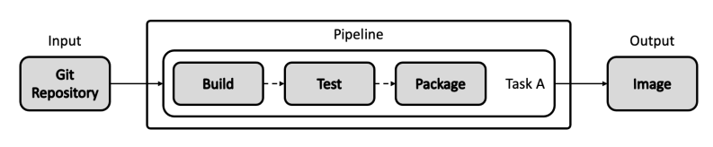

[toc]

# 镜像仓库

## 简介

镜像仓库（Docker Registry）负责存储、管理和分发镜像。  

镜像仓库管理多个 Repository，Repository 通过命名来区分。每个 Repository 包含一个或多个镜像，镜像通过镜像名称和标签（tag）来区分。  

客户端拉取镜像时，要指定三要素：

* 镜像仓库：要从哪个镜像仓库拉取镜像，通常通过 DNS 或 IP 地址来确定一个镜像仓库，如 hub.docker.com
* Repository：组织名，如 apache
* 镜像名称+标签：如 nginx:latest


**镜像仓库遵循 OCI 的 Distribution Spec**


### 数据和块文件

镜像由元数据和块文件两部分组成，镜像仓库的核心职能就是管理这两项数据。  

* 元数据
  * 用于描述一个镜像的核心信息，包含镜像的镜像仓库、repository、标签、校验码、文件层、镜像构建描述等信息。
  * 通过这些信息可以从抽象层面完整描述一个镜像：它是如何构建出来的、运行过什么构建命令、构建的每一个文件层的校验码、打的标签、镜像的校验码等
* 块文件（blob）
  * 块文件是组成镜像的联合文件层的实体，每一个块文件是一个文件层，内部包含对应文件层的变更。


### 公有和私有镜像仓库

公有镜像仓库优势

* 开放：任何开发者都可以上传，分享镜像到公有仓库中
* 便捷：开发者可以非常方便的搜索、拉取其它开发者镜像，避免重复构建
* 免运维：开发者只需要关注应用开发，不必关心镜像仓库的更新、升级、维护
* 成本低：企业或开发者不需要购买硬件、解决方案来搭建镜像仓库，也不需要团队维护


私有镜像仓库优势

* 隐私性：企业的代码和数据都是企业的私有财产，不允许随意共享到公共平台
* 敏感性：企业的镜像会包含一些敏感信息，例如密钥信息、令牌信息等
* 网络连通性：企业网络结构多种多样，并非所有环境都可以访问互联网
* 安全性：在企业环境中，若使用一些含有漏洞的依赖包，则会引入安全隐患


## Harbor

quar 是 CoreOS 以前开发的私有镜像仓库软件。  

目前主流的是 Harbor，VMware 开源的企业级镜像仓库，已经是 CNCF 的毕业项目。它拥有完整的仓库管理、镜像管理、基于角色的权限控制、镜像安全扫描集成、镜像签名等。  


* Harbor 核心服务：提供 Harbor 的核心管理服务 API，包括仓库管理、认证管理、授权管理、配置管理、项目管理、配额管理、签名管理、副本管理等
* Harbor Portal：Harbor 的 Web 界面
* Registry：负责接收客户端的 pull/push 请求，其核心为 Docker/Distribution
* Replication controller（副本控制器）：Harbor 可以以主从模式部署镜像仓库，副本控制器将镜像从主镜像服务分发到从镜像服务
* Log Collector（日志收集器）：收集各模块日志
* 垃圾回收控制器：回收日常操作中删除镜像记录后遗留在块存储中的孤立块文件


### Harbor 架构


### Harbor 安装

```sh
# helm 安装
root@master01:~# helm repo add harbor https://helm.goharbor.io
"harbor" has been added to your repositories
root@master01:~# helm fetch harbor/harbor --untar
# 创建 namespace
root@master01:~# kubectl create namespace harbor
namespace/harbor created
# 修改harbor 目录下 values.yaml 文件
vim harbor/values.yaml
...
expose:
  type: nodePort
tls:
  auto:
    commonName: 'core.harbor.domain'
...
persistence: false
...

# helm 安装 harbor
root@master01:~# helm install harbor ./harbor -n harbor
NAME: harbor
LAST DEPLOYED: Mon May 23 11:29:26 2022
NAMESPACE: harbor
STATUS: deployed
REVISION: 1
TEST SUITE: None
NOTES:
Please wait for several minutes for Harbor deployment to complete.
Then you should be able to visit the Harbor portal at https://core.harbor.domain
For more details, please visit https://github.com/goharbor/harbor

# 等待Pod 启动完成后，访问 nodeIP:30002，或者 https://nodeIP:30003
# 默认账号密码 admin/Harbor12345
# 下载证书 https://Harbor_ADDRESS:PORT/harbor/projects/1/repositories
# 创建目录，将刚下载证书导入 docker
mkdir /etc/docker/certs.d/core.harbor.domain
copy the ca.crt to this folder
systemctl restart docker

# 编辑/etc/hosts 文件，将域名解析到对应的服务器IP
# 登录 harbor
docker login -u admin -p Harbor12345 core.harbor.domain
# tag 并推送一个镜像进行测试
docker tag k8s.gcr.io/pause:3.2 core.harbor.domain/library/test:test
docker push core.harbor.domain/library/test:test
The push refers to repository [core.harbor.domain/library/test]
ba0dae6243cc: Pushed 
test: digest: sha256:4a1c4b21597c1b4415bdbecb28a3296c6b5e23ca4f9feeb599860a1dac6a0108 size: 526

# 进入 harbor registry Pod 容器可以查看镜像文件
root@master01:~# k exec -it harbor-registry-7f5fd844bb-89jxw  -n harbor bash
harbor [ / ]$ ls /storage/docker/registry/v2/
blobs  repositories


# 进入 harbor database 数据库 Pod 容器查看数据库中存储的内容，harbor 使用 postgresql
root@master01:~# kubectl exec -it harbor-database-0 -n harbor -- bash
Defaulted container "database" out of: database, data-migrator (init), data-permissions-ensurer (init)
postgres [ / ]$ psql -U postgres -d postgres -h 127.0.0.1 -p 5432
psql (13.6)
Type "help" for help.

postgres=# \c registry
You are now connected to database "registry" as user "postgres".
registry=# select * from harbor_user;
 user_id | username  | email |             password             |    realname    |    comment     | deleted | reset_uuid |               salt               | sysadmin_flag |   
    creation_time        |        update_time         | password_version 
---------+-----------+-------+----------------------------------+----------------+----------------+---------+------------+----------------------------------+---------------+---
-------------------------+----------------------------+------------------
       2 | anonymous |       |                                  | anonymous user | anonymous user | t       |            |                                  | f             | 20
22-05-23 03:38:17.854928 | 2022-05-23 03:38:18.582566 | sha1
       1 | admin     |       | 8a706dfe762b066b60158b0ef4b0e607 | system admin   | admin user     | f       |            | nsnxmnAszOKDkVmvtuljxfoBc0dK22pB | t             | 20
22-05-23 03:38:17.854928 | 2022-05-23 03:38:19.37734  | sha256
(2 rows)

registry=# \dt
                    List of relations
 Schema |            Name             | Type  |  Owner   
--------+-----------------------------+-------+----------
 public | access                      | table | postgres
 public | alembic_version             | table | postgres
 public | artifact                    | table | postgres
 public | artifact_accessory          | table | postgres
 public | artifact_blob               | table | postgres

```


**Harbor Demo Server**

[https//demo.goharbor.io/harbor/projects](https//demo.goharbor.io/harbor/projects)

* 2天清理一次数据
* 不能 push 超过 100Mb 的镜像
* 不能使用管理功能


### Harbor 高可用架构


  


### Harbor 用户管理


### 垃圾回收 Garbage Collection

删除镜像时，Blob 文件不会删除，由垃圾回收期定期删除。  

可以通过面板中的垃圾回收手动触发。


### 本地镜像加速 Dragonfly

Dragonfly 是一款基于 P2P 的智能镜像和文件分发工具。  

旨在提高文件传输的效率和速率，最大限度地利用网络带宽，尤其在分发大量数据时。  

* 应用分发
* 缓存分发
* 日志分发
* 镜像分发


#### 优势

* 基于P2P的文件分发
* 非侵入式
* 被动CDN
* ...

缺点

* 镜像存储会占用磁盘资源和计算资源


#### 镜像下载流程


cluster manager 负责对接 registry 并协调处理客户端请求，每个主机上运行一个 dfget proxy，拉取镜像时会询问 cluster manager，如果没有则去 registry 中拉取，下载到本地。如果后续其它节点有同样的请求，可以将从已有资源的客户端节点中拉取，并且可以从多个节点并行拉取，效率比较高。


每个镜像文件会被分成多块，可以从不同节点上拉取已存在的文件块，提高效率。


# 镜像安全

## 构建

* 构件指令问题
  * 避免敏感信息构建在镜像中，例如密钥、token等，配置和代码分离
* 应用依赖问题
  * 避免不必要的依赖
  * 确保依赖无安全风险，长期不更新的基础镜像可能有风险，例如基于 openssl1.0的只支持 tls1.0
* 文件问题
  * 构件镜像时，除应用本身外，还会添加应用需要的配置文件、模板，添加这些文件时，可能会无意间加入包含敏感信息或者不符合安全策略的文件到镜像中
  * 镜像中文件存在问题时，需要找到引入该文件的构建指令去修复，不要通过追加删除指令来修复

## 镜像扫描（Vulnerability Scanning）

通过扫描工具或者扫描服务对镜像进行扫描，来确定镜像是否安全。  

* 分析构建指令、应用、文件、依赖包
* 查询 CVE 库、安全策略
* 检测镜像是否安全，是否符合安全标准


## 镜像策略准入控制

准入控制是在部署 Pod、更新 Pod 时，对 Pod 中的镜像进行安全验证以放行或拦截 Pod 操作

* 放行：Pod 中所有镜像都安全，允许此次操作，Pod 成功被创建或更新
* 拦截：Pod 中的镜像未扫描，或已扫描但存在安全漏洞，或不符合安全策略，Pod 无法被创建或更新


在 kubernetes API Server 中准入的 Validating 阶段有一个 ImagePolicyAdmit 的 Plugin，支持 webhook，结合镜像扫描服务就可以在 Pod 发布更新时进行扫描


## 扫描镜像

1. 镜像扫描服务从镜像仓库拉取镜像
2. 解析镜像的元数据
3. 解压镜像的每一个文件层
4. 提取每一层所包含的依赖包、可运行程序、文件列表、文件内容进行扫描
5. 将扫描结果与 CVE 字典、安全策略字典进行匹配，以确认最终镜像是否安全


## 扫描镜像服务

镜像扫描服务软件对比


Clair 


* 用户交互相关
  * HTTP Interface 用于接收用户请求
  * Notifier 用于通知扫描结果
  * Notification Storage 用于存储通知信息
* 核心组件
  * libIndex：
  * Libvuln：
  * Updaters：更新组件
  * Vulnerability Storage：漏洞相关数据
  * Layer Content Storage：分层数据


# 基于 Kubernetes 的 DevOps


# 自动化流水线
## 基于GitHub Action

### 优势

* 低成本
  * GitHub 目前为项目免费提供构建流水线，可以满足日常构建需求
* 免运维
  * 无需自己构建流水线
* 易构建
  * 点击按钮
  * 提供了一系列内建 action，社区也有大量可复用的 action
* 易集成
  * 无需配置 webhook


### 演示

* 在Github 项目中的 Actions 中创建新的 workflow

* 可以使用 Github 根据语言生成的模板
* 在 yml 中使用 触发器、镜像、 steps 指定 Actions 完成


## 基于 Jenkins

### 能力概览


1. 与 SCM 系统交互，通过 webhook 等形式接收代码提交等更新的通知，拉取代码再通过工具进行编译打包
2. 单元测试
3. 代码质量检测
4. 部署到测试环境
5. 集成测试
6. 打包归档二进制包存储到对应位置
7. 构建 release 版本安装包
8. 部署到预生产环境
9. 用户验收测试
10. 部署到生产环境


### Kubernetes CI&CD 完整流程


* 开发人员提交源代码 PR，经过编译、单元测试、端到端测试、Code Review 等阶段，通过以后 Merge 代码到对应分支
* 使用对应分支进行编译二进制文件，进行端到端测试、更新测试，发布至集成测试环境、预生产环境，测试通过后发布到生产环境


持续集成容器化是基于容器技术，主要解决了传统模式下各环境不一致问题

* 保证 CI 构建环境和 开发构建环境的统一
* 适用容器作为标准构建环境，代码块作为 Volume 挂载到构建容器
* 需要注意 DIND（Docker in Docker） 问题


### 基于 Kubernetes 的 CI


jenkins 分为 Master 和 Slave 节点，Master 负责接收 webhook 事件，开始构建任务指令，从 Kubernetes 调起 Slave Pod，Slave Pod 会连接到 Master 中读取具体任务作业和配置信息，开始构建操作。


### Docker in Docker 问题

方法1 ：docker in docker  

* 早期尝试
  * https://github.com/jpetazzo/dind
* 官方支持
  * https://hub.docker.com/_/docker/
  * `docker run --privileged -d docker:dind`
* 可能引入的问题
  * [Using Docker-in-Docker for your CI or testing environment? Think twice. (jpetazzo.github.io)](https://jpetazzo.github.io/2015/09/03/do-not-use-docker-in-docker-for-ci/)


方法2：mount host docker.socket  

`docker run -v /var/run/docker.sock:/var/run/docker.sock ...`  

将主机中的 docker.socket 挂载到容器中  

* 存在安全性问题


方法3：Kaniko

* [GitHub - GoogleContainerTools/kaniko: Build Container Images In Kubernetes](https://github.com/GoogleContainerTools/kaniko)

Google 为容器构建推出的工具


### 实践

#### 构建 Pipeline

1. Image 准备：基于 Jenkins 官方 Image 安装自定义插件
   * https://github.com/jenkinsci/kubernetes-plugin
     * 默认安装 kuberentes plugin
   * https://github.com/jenkinsci/docker-jnlp-slave
     * 如果需要做 docker build，则需要自定义 Dockerfile，安装 docker binary，并且把 host 的 docker.socket 挂载进 container
2. Jenkins 配置的保存
   * 需要创建 PVC，以便保证在 jenkins master pod 出错时，新的 kubernetes Pod 可以 mount 同样的工作目录，保证配置不丢失
   * 可以通过 jenkins scm plugin 把 jenkins 配置保存到 Github
3. 创建 Kubernetes spec


#### 安装

创建 sa role rolebinding 等

```yaml
---
apiVersion: v1
kind: ServiceAccount
metadata:
  name: jenkins

---
kind: Role
apiVersion: rbac.authorization.k8s.io/v1
metadata:
  name: jenkins
rules:
- apiGroups: [""]
  resources: ["pods"]
  verbs: ["create","delete","get","list","patch","update","watch"]
- apiGroups: [""]
  resources: ["pods/exec"]
  verbs: ["create","delete","get","list","patch","update","watch"]
- apiGroups: [""]
  resources: ["pods/log"]
  verbs: ["get","list","watch"]
- apiGroups: [""]
  resources: ["events"]
  verbs: ["watch"]
- apiGroups: [""]
  resources: ["secrets"]
  verbs: ["get"]

---
apiVersion: rbac.authorization.k8s.io/v1
kind: RoleBinding
metadata:
  name: jenkins
roleRef:
  apiGroup: rbac.authorization.k8s.io
  kind: Role
  name: jenkins
subjects:
- kind: ServiceAccount
  name: jenkins
```

创建 jenkins 资源，注意挂载的目录权限，镜像默认使用 uid 和 group id 为1000 的用户 jenkins 启动进程，要在主机上创建对应用户

```yaml
apiVersion: apps/v1
kind: StatefulSet
metadata:
  name: jenkins
spec:
  selector:
    matchLabels:
      name: jenkins
  serviceName: jenkins
  replicas: 1
  template:
    metadata:
      name: jenkins
      labels:
        name: jenkins
    spec:
      terminationGracePeriodSeconds: 10
      serviceAccountName: jenkins
      volumes:
        - name: jenkins-storage
          persistentVolumeClaim:
            claimName: pvc-jenkins
      containers:
        - name: jenkins
          image: jenkins/jenkins:lts-alpine
          ports:
            - containerPort: 8080
            - containerPort: 50000
          volumeMounts:
            - mountPath: "/var/jenkins_home"
              name: jenkins-storage

---
apiVersion: v1
kind: PersistentVolume
metadata:
  name: pv-jenkins
  labels:
    type: local
spec:
  storageClassName: manual
  capacity:
    storage: 1Gi
  accessModes:
    - ReadWriteMany
  hostPath:
    path: "/mnt/data/jenkins_data"
---
apiVersion: v1
kind: PersistentVolumeClaim
metadata:
  name: pvc-jenkins
spec:
  storageClassName: manual
  accessModes:
    - ReadWriteMany
  resources:
    requests:
      storage: 1Gi
---
apiVersion: v1
kind: Service
metadata:
  name: jenkins
spec:
  selector:
    name: jenkins
  ports:
    - name: http
      port: 80
      targetPort: 8080
      protocol: TCP
    - name: agent
      port: 50000
      protocol: TCP
  type: NodePort

```


创建完成后等待 Pod 启动

```sh
# 查看 svc 可以看到 NodePort 信息
root@master01:~/jenkins# k get svc 
NAME             TYPE        CLUSTER-IP       EXTERNAL-IP   PORT(S)                        AGE
jenkins          NodePort    10.105.131.135   <none>        80:39312/TCP,50000:17666/TCP   2m6s

# 查看 Pod 日志，可以看到登录的 password 
root@master01:~/jenkins# k logs jenkins-0
Running from: /usr/share/jenkins/jenkins.war
....
Jenkins initial setup is required. An admin user has been created and a password generated.
Please use the following password to proceed to installation:

9ab3f05aa8a14727a024bb73852763e9

This may also be found at: /var/jenkins_home/secrets/initialAdminPassword
....
root@master01:~/jenkins# 

```


### 配置 jenkins

访问 服务器IP:NodePort ，输入日志中的密码字符串登录  

* 可以跳过插件安装  

* 在 Manage Jenkins 菜单的 System Configuration --> Manage Nodes and Clouds 中可以配置 Kubernetes 信息
* 点击左侧 Confiure Clouds ，添加 Clouds 组件
  * 第一次需要安装插件，在插件安装中搜索 kubernetes 进行安装

* 配置 Cloud Provider
* 创建任务进行测试


## 基于声明式 API ：Tekton

**Jenkins 的不足**  

* 基于脚本的 Job 配置复用率不足
  * Jenkins 等工具的流水线作业通常基于大量不可复用的脚本语言
* 代码调试困难
  * 流水线作业的配置需要更好的适应云原生场景的需求


Tekton 是从 Knative 中分离出来的 build 组件。  


### 特性

* 自定义
  * 对象是高度自定义的，可扩展性极强。平台工程师可以预定义可重用模块以详细的模块目录提供，开发人员可以在其它项目中直接引用
* 可重用
  * 对象的可重用性强，组件定义一次，组织内其他人在任何流水线都可重用
* 可扩展
  * Tekton Catalog 是一个社区驱动的 Tekton 组件的存储仓库，用户可以从社区获取成熟的组件，基于这些组件进行构件复杂流水线
* 标准化
  * 作为 Kubernetes 集群的扩展安装和运行，使用公认的 Kubernetes 资源模型，作业以 Kubernetes 容器形态执行
* 规模化支持
  * 只需增加 Kubernetes 节点，即可增加作业处理能力


### 核心组件

Pipeline：对象定义了一个流水线作业，一个 Pipeline 对象由一个或数个 Task 对象组成。  

Task：一个可独立运行的任务，例如获取代码，编译，或者推送镜像等等。当流水线被运行时，Kubernetes 会为每个 Task 创建一个 Pod。一个 Task 由多个 Step 组成，每个 Step 体现为这个 Pod 中的一个容器。  


* 任务可以是并行或者串行。
* 例如上图中 TaskB 和 TaskC 是 runAfterA，表示依赖于 TaskA 任务，需要 TaskA 执行完成后才开始，两个任务 B、C 之间可以并行执行
* TaskD 是 from B and C，表示需要 TaskB 和 TaskC 都执行完成，才能开始执行


### 输入输出

Pipeline 和 Task 对象可以接收 git reposity，pull request 等资源作为输入，可以将 Image，Kubernetes Cluster，Storage，CloudEvent 等对象作为输出。  




### 事件触发的自动化流水线


* 基于 Git 管理系统的 webhook 触发任务构建，如上图最右侧位置
* webhook 被触发后 push 一个 event 到 listener-svc，listener-svc 会转发请求到 listener-pod 处理
* EventListener 会拦截请求匹配到预先定义的 TriggerTemplate，创建 PipelineRun
* Pipeline 有多个 Task
  * ClusterTask 可以被所有 namespace 共用
  * Task 属于某 namespace 下
  * Task 会根据定义的 Step 执行
* Step 中定义的具体任务，例如 compile、build、deploy 等


**EventListener**

事件监听器，该对象核心属性是 interceptors 拦截器，该拦截器可监听多种类型的事件，比如监听来自 GitLab 的 Push 事件。  

当该 EventListener 对象被创建以后，Tekton 控制器会为该 EventListener 创建 Kubernetes Pod 和 Service，并启动一个 HTTP 服务以监听 Push 事件。  

当用户在 GitLab 项目中设置 webhook 并填写该 EventListener 的服务地址以后，任何人针对被管理项目发起的 Push 操作，都会被 EventListener 捕获。   


```yaml
# EvenetListener 示例
apiVersion: triggers.tekton.dev/v1alpha1 
kind: EventListener 
metadata: 
  name: gitlab-listener
spec: 
  serviceAccountName: cncamp-gitlab-sa
  triggers: 
  - name: gitlab-push-events-trigger 
    interceptors: 
    - ref: 
        name: gitlab 
      params: 
      - name: secretRef
        value: 
          secretName: cncamp-gitlab-secret 
          secretKey: secretToken 
      - name: eventTypes 
        value: 
          - Push Hook
    bindings: 
    - ref: gitlab-binding 
    template: 
      ref: gitlab-triggertemplate
```


```yaml
# TriggerTemplate 示例
apiVersion: triggers.tekton.dev/v1alpha1 
kind: TriggerTemplate 
metadata: 
  name: gitlab-triggertemplate 
spec:
  params:
  - name: gitrevision
  - name: gitrepositoryurl
  resourcetemplates:
    - kind: PipelineRun
      apiVersion: tekton.dev/v1beta1
      metadata:
        generateName: gitlab-pipeline-run-
      spec: 
        serviceAccountName: cncamp-gitlab-sa
        pipelineSpec:
          tasks:
          - name: checkout
            taskRef:
              name: gitlab-checkout
            resources:
              inputs:
              - name: source
                resource: source
          resources:
          - name: source
            type: git
        resources:
        - name: source
          resourceSpec:
            type: git
            params:
            - name: revision
              value: $(tt.params.gitrevision)
            - name: url
              value: $(tt.params.gitrepositoryurl)
```


在 Github、Gitlab 项目中可以添加 webhook，有新的 push 事件时可以推送事件到指定的 Eventlistener 地址


### 安装

安装tekton，基于 task 和 pipeline 构件容器执行任务


## 持续交付 Argo CD

Argo CD 是用于 Kubernetes 的声明性 GitOps 连续交付工具。  

* 应用程序定义，配置和环境应为声明性的，并受版本控制。
* 应用程序部署和生命周期管理应该是自动化的，可审核的且易理解的


### 架构

* Argo CD 被实现为 Kubernetes 控制器，该控制器连续监视正在运行的应用程序，并将当前的活动状态与所需的目标状态（在Git 存储库中指定）进行比较
* 其活动状态偏离目标状态的已部署应用程序被标记为 OutOfSync
* Argo CD 报告并可视化差异，同时提供了自动或手动将实时状态同步回所需目标状态的功能
* 在 Git 存储库中堆所需目标状态所做的任何修改都可以自动应用并反映在指定的目标环境中


### 安装


### Argo CD 适用场景

* 低成本的 GitOps 利器
* 多集群管理
  * 不同目的的集群：测试、集成、预生产、生产
  * 多生产集群管理


# 日志收集分析


## Loki


# 监控系统


## Prometheus


