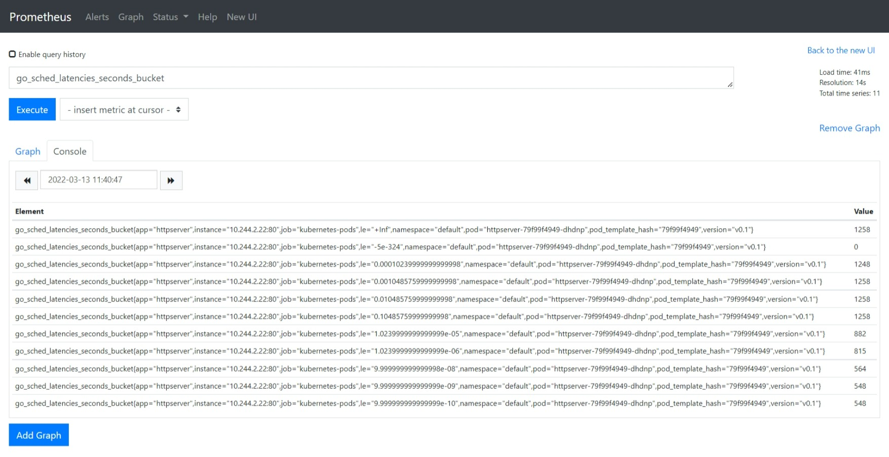
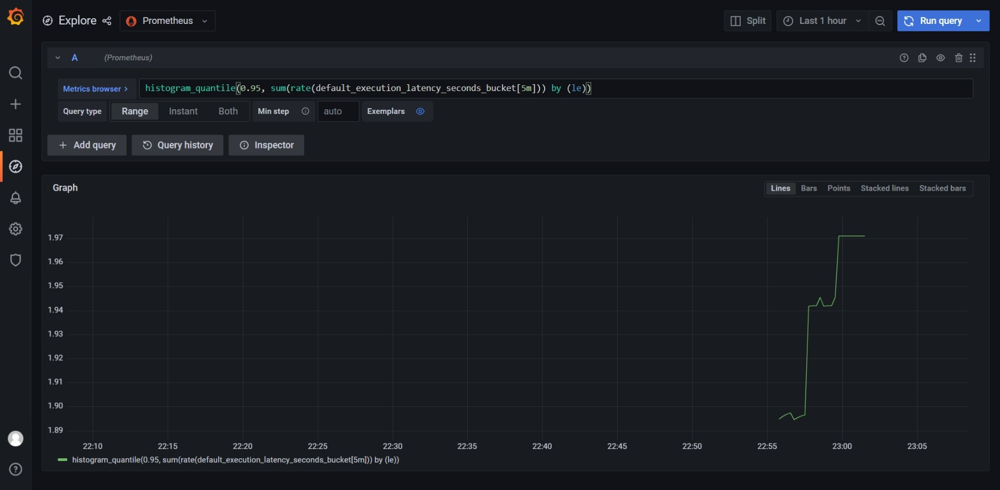

# 作业要求

1. 为 HTTPServer 添加 0-2 秒的随机延时；
2. 为 HTTPServer 项目添加延时 Metric；
3. 将 HTTPServer 部署至测试集群，并完成 Prometheus 配置；
4. 从 Promethus 界面中查询延时指标数据；
5. （可选）创建一个 Grafana Dashboard 展现延时分配情况。


# 实现
## 1. 随机延时
```go
#在处理响应的方法里增加随机sleep 0-2 S 
randSecond := rand.Intn(2000)

#控制台打印随机ms
println(randSecond)
time.Sleep(time.Millisecond * time.Duration(randSecond))


#访问/时候，控制台输出一下随机延时ms（client info为之前作业添加的client header）
1318
client info { IP: [::1]:64427, HTTP_CODE: 200 }
425
client info { IP: [::1]:64427, HTTP_CODE: 200 }
540
client info { IP: [::1]:64427, HTTP_CODE: 200 }
456
client info { IP: [::1]:64427, HTTP_CODE: 200 }
1300

```


## 2. 延时Metric
```go
#导入 prometheus的promhttp
import ("github.com/prometheus/client_golang/prometheus/promhttp")

#增加/metrics，转交给promhttp处理
http.Handle("/metrics", promhttp.Handler())


# 在处理的handle中，调用metrics的NewTimer方法，并用defer 使得在方法结束时触发ObserveTotal方法
timer := metrics.NewTimer()
defer timer.ObserveTotal()
```

metrics引用了孟老师的 github.com/cncamp/httpserver/metrics
```go
func Register() {
	err := prometheus.Register(functionLatency)
	if err != nil {
		fmt.Println(err)
	}
}

const (
	MetricsNamespace = "httpserver"
)

// NewExecutionTimer provides a timer for Updater's RunOnce execution
func NewTimer() *ExecutionTimer {
	return NewExecutionTimer(functionLatency)
}

var (
	functionLatency = CreateExecutionTimeMetric(MetricsNamespace,
		"Time spent.")
)

// NewExecutionTimer provides a timer for admission latency; call ObserveXXX() on it to measure
func NewExecutionTimer(histo *prometheus.HistogramVec) *ExecutionTimer {
	now := time.Now()
	return &ExecutionTimer{
		histo: histo,
		start: now,
		last:  now,
	}
}

// ObserveTotal measures the execution time from the creation of the ExecutionTimer
func (t *ExecutionTimer) ObserveTotal() {
	(*t.histo).WithLabelValues("total").Observe(time.Now().Sub(t.start).Seconds())
}

// CreateExecutionTimeMetric prepares a new histogram labeled with execution step
func CreateExecutionTimeMetric(namespace string, help string) *prometheus.HistogramVec {
	return prometheus.NewHistogramVec(
		prometheus.HistogramOpts{
			Namespace: namespace,
			Name:      "execution_latency_seconds",
			Help:      help,
			Buckets:   prometheus.ExponentialBuckets(0.001, 2, 15),
		}, []string{"step"},
	)
}

// ExecutionTimer measures execution time of a computation, split into major steps
// usual usage pattern is: timer := NewExecutionTimer(...) ; compute ; timer.ObserveStep() ; ... ; timer.ObserveTotal()
type ExecutionTimer struct {
	histo *prometheus.HistogramVec
	start time.Time
	last  time.Time
}
```


访问/metrics返回的内容
```bash
# HELP default_execution_latency_seconds Time spent.
# TYPE default_execution_latency_seconds histogram
default_execution_latency_seconds_bucket{step="total",le="0.001"} 0
default_execution_latency_seconds_bucket{step="total",le="0.002"} 0
default_execution_latency_seconds_bucket{step="total",le="0.004"} 0
default_execution_latency_seconds_bucket{step="total",le="0.008"} 0
default_execution_latency_seconds_bucket{step="total",le="0.016"} 0
default_execution_latency_seconds_bucket{step="total",le="0.032"} 0
default_execution_latency_seconds_bucket{step="total",le="0.064"} 0
default_execution_latency_seconds_bucket{step="total",le="0.128"} 1
default_execution_latency_seconds_bucket{step="total",le="0.256"} 1
default_execution_latency_seconds_bucket{step="total",le="0.512"} 1
default_execution_latency_seconds_bucket{step="total",le="1.024"} 1
default_execution_latency_seconds_bucket{step="total",le="2.048"} 1
default_execution_latency_seconds_bucket{step="total",le="4.096"} 1
default_execution_latency_seconds_bucket{step="total",le="8.192"} 1
default_execution_latency_seconds_bucket{step="total",le="16.384"} 1
default_execution_latency_seconds_bucket{step="total",le="+Inf"} 1
default_execution_latency_seconds_sum{step="total"} 0.081407054
default_execution_latency_seconds_count{step="total"} 1
# HELP go_gc_cycles_automatic_gc_cycles_total Count of completed GC cycles generated by the Go runtime.
# TYPE go_gc_cycles_automatic_gc_cycles_total counter
...
...
...
# TYPE promhttp_metric_handler_requests_in_flight gauge
promhttp_metric_handler_requests_in_flight 1
# HELP promhttp_metric_handler_requests_total Total number of scrapes by HTTP status code.
# TYPE promhttp_metric_handler_requests_total counter
promhttp_metric_handler_requests_total{code="200"} 28
promhttp_metric_handler_requests_total{code="500"} 0
promhttp_metric_handler_requests_total{code="503"} 0
```


## 3. 部署至集群，配置Prometheus监控
打包推送带有metrics的镜像
```bash
#制作镜像打包httpserver，镜像tag中增加-metrics标记
docker build -t xumingyu/httpserver-metrics:v0.1 .

#将镜像推送至 docker 官方镜像仓库
docker push xumingyu/httpserver-metrics:v0.1
```

手动单独部署Prometheus，需要在配置文件中增加targets
```yml
scrape_configs:
  # The job name is added as a label `job=<job_name>` to any timeseries scraped from this config.
  - job_name: "prometheus"

    # metrics_path defaults to '/metrics'
    # scheme defaults to 'http'.

    static_configs:
      - targets: ["localhost:9090"]
# 增加httpserver的metrics探测
  - job_name: "httpserver-metrics"
    static_configs:
      -  targets: ["10.0.12.2:30854"]

```


通过helm 部署的loki中带有Prometheus、Grafana等，比较方便
```bash
# 参考了101中的部署文档，通过helm安装loki
# 在线安装
helm repo add grafana https://grafana.github.io/helm-charts
helm upgrade --install loki grafana/loki-stack --set grafana.enabled=true,prometheus.enabled=true,prometheus.alertmanager.persistentVolume.enabled=false,prometheus.server.persistentVolume.enabled=false


# 本地安装
# 拉取并解压loki-stack
helm pull grafana/loki-stack
tar -xvf loki-stack-*.tgz
cd loki-stack

# 替换api版本v1beta1为v1
grep -rl "rbac.authorization.k8s.io/v1beta1" . | xargs sed -i 's/rbac.authorization.k8s.io\/v1beta1/rbac.authorization.k8s.io\/v1/g'

helm upgrade --install loki ./loki-stack --set grafana.enabled=true,prometheus.enabled=true,prometheus.alertmanager.persistentVolume.enabled=false,prometheus.server.persistentVolume.enabled=false

# 安装完成后修改grafana和Prometheus的deployment，从ClusterIP改为NodePort方式，这样可以通过端口直接访问它们

# grafana的密码获取，其中有个admin-password，用base64解码
kubectl get secret loki-grafana -oyaml
```


service和pod信息
```bash
root@master01:~# k get svc
NAME                            TYPE        CLUSTER-IP       EXTERNAL-IP   PORT(S)                        AGE
httpserver-svc                  NodePort    10.97.25.189     <none>        80:30854/TCP                   10d
jenkins                         NodePort    10.108.177.177   <none>        80:31685/TCP,50000:30457/TCP   6d5h
kubernetes                      ClusterIP   10.96.0.1        <none>        443/TCP                        10d
loki                            ClusterIP   10.109.171.39    <none>        3100/TCP                       5h47m
loki-grafana                    NodePort    10.101.39.169    <none>        80:32190/TCP                   5h47m
loki-headless                   ClusterIP   None             <none>        3100/TCP                       5h47m
loki-kube-state-metrics         ClusterIP   10.108.218.62    <none>        8080/TCP                       5h47m
loki-prometheus-alertmanager    ClusterIP   10.99.78.104     <none>        80/TCP                         5h47m
loki-prometheus-node-exporter   ClusterIP   None             <none>        9100/TCP                       5h47m
loki-prometheus-pushgateway     ClusterIP   10.101.62.225    <none>        9091/TCP                       5h47m
loki-prometheus-server          NodePort    10.110.3.221     <none>        80:32011/TCP                   5h47m


root@master01:~# k get pods -o wide
NAME                                           READY   STATUS    RESTARTS      AGE     IP            NODE       NOMINATED NODE   READINESS GATES
httpserver-65cbb484d-bdbz7                     1/1     Running   0             29m     10.244.2.25   node02     <none>           <none>
jenkins-0                                      1/1     Running   1 (24h ago)   6d5h    10.244.2.8    node02     <none>           <none>
loki-0                                         1/1     Running   0             5h48m   10.244.2.18   node02     <none>           <none>
loki-grafana-7b5496b8dd-8szpg                  2/2     Running   0             5h45m   10.244.2.21   node02     <none>           <none>
loki-kube-state-metrics-869bbbf6d8-xjrqb       1/1     Running   0             3h55m   10.244.2.23   node02     <none>           <none>
loki-prometheus-alertmanager-984c996b-nx89c    2/2     Running   0             5h48m   10.244.2.16   node02     <none>           <none>
loki-prometheus-node-exporter-8hzn6            1/1     Running   0             5h48m   10.0.12.8     node01     <none>           <none>
loki-prometheus-node-exporter-chsx6            1/1     Running   0             5h48m   10.0.12.12    node02     <none>           <none>
loki-prometheus-pushgateway-5c845f48b5-24wcj   1/1     Running   0             5h48m   10.244.2.14   node02     <none>           <none>
loki-prometheus-server-5b6dc4b94f-pqlg9        2/2     Running   0             3h42m   10.244.2.24   node02     <none>           <none>
loki-promtail-ch27d                            1/1     Running   0             5h48m   10.244.2.20   node02     <none>           <none>
loki-promtail-hk4rj                            1/1     Running   0             5h48m   10.244.1.6    node01     <none>           <none>
loki-promtail-ntrk9                            1/1     Running   0             5h48m   10.244.0.2    master01   <none>           <none>
testpod                                        1/1     Running   1 (24h ago)   9d      10.244.1.5    node01     <none>           <none>
root@master01:~# 

```


## 4. 在Prometheus中查看Metrics
在Prometheus中查看访问httpserver的延时数据，根据histogram_quantile绘制数据



## 5. Grafana查看prometheus数据
通过loki部署的grafana，在grafana选择Prometheus，可以直接查看到对应的数据
