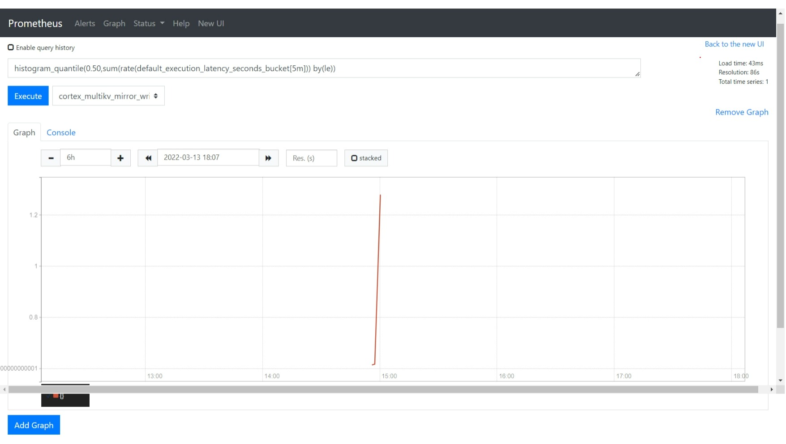

# 作业要求

1. 为 HTTPServer 添加 0-2 秒的随机延时；
2. 为 HTTPServer 项目添加延时 Metric；
3. 将 HTTPServer 部署至测试集群，并完成 Prometheus 配置；
4. 从 Promethus 界面中查询延时指标数据；
5. （可选）创建一个 Grafana Dashboard 展现延时分配情况。


# 实现
## 1. 随机延时
```go
#在处理响应的方法里增加随机sleep 0-2 S 
randSecond := rand.Intn(2000)
#控制台打印随机ms
println(randSecond)
time.Sleep(time.Millisecond * time.Duration(randSecond))


#访问/时候，控制台输出一下随机延时ms（client info为之前作业添加的client header）
1318
client info { IP: [::1]:64427, HTTP_CODE: 200 }
425
client info { IP: [::1]:64427, HTTP_CODE: 200 }
540
client info { IP: [::1]:64427, HTTP_CODE: 200 }
456
client info { IP: [::1]:64427, HTTP_CODE: 200 }
1300

```


## 2. 延时Metric
```go
#导入 prometheus的promhttp
import ("github.com/prometheus/client_golang/prometheus/promhttp")

#增加/metrics，转交给promhttp处理
http.Handle("/metrics", promhttp.Handler())


# 在处理的handle中，调用metrics的NewTimer方法，并用defer 使得在方法结束时出发ObserveTotal方法
timer := metrics.NewTimer()
defer timer.ObserveTotal()
```

metrics引用了孟老师的 github.com/cncamp/httpserver/metrics
```go
func Register() {
	err := prometheus.Register(functionLatency)
	if err != nil {
		fmt.Println(err)
	}
}

const (
	MetricsNamespace = "httpserver"
)

// NewExecutionTimer provides a timer for Updater's RunOnce execution
func NewTimer() *ExecutionTimer {
	return NewExecutionTimer(functionLatency)
}

var (
	functionLatency = CreateExecutionTimeMetric(MetricsNamespace,
		"Time spent.")
)

// NewExecutionTimer provides a timer for admission latency; call ObserveXXX() on it to measure
func NewExecutionTimer(histo *prometheus.HistogramVec) *ExecutionTimer {
	now := time.Now()
	return &ExecutionTimer{
		histo: histo,
		start: now,
		last:  now,
	}
}

// ObserveTotal measures the execution time from the creation of the ExecutionTimer
func (t *ExecutionTimer) ObserveTotal() {
	(*t.histo).WithLabelValues("total").Observe(time.Now().Sub(t.start).Seconds())
}

// CreateExecutionTimeMetric prepares a new histogram labeled with execution step
func CreateExecutionTimeMetric(namespace string, help string) *prometheus.HistogramVec {
	return prometheus.NewHistogramVec(
		prometheus.HistogramOpts{
			Namespace: namespace,
			Name:      "execution_latency_seconds",
			Help:      help,
			Buckets:   prometheus.ExponentialBuckets(0.001, 2, 15),
		}, []string{"step"},
	)
}

// ExecutionTimer measures execution time of a computation, split into major steps
// usual usage pattern is: timer := NewExecutionTimer(...) ; compute ; timer.ObserveStep() ; ... ; timer.ObserveTotal()
type ExecutionTimer struct {
	histo *prometheus.HistogramVec
	start time.Time
	last  time.Time
}
```


访问/metrics返回的内容
```bash
# HELP go_gc_cycles_automatic_gc_cycles_total Count of completed GC cycles generated by the Go runtime.
# TYPE go_gc_cycles_automatic_gc_cycles_total counter
go_gc_cycles_automatic_gc_cycles_total 6
# HELP go_gc_cycles_forced_gc_cycles_total Count of completed GC cycles forced by the application.
# TYPE go_gc_cycles_forced_gc_cycles_total counter
go_gc_cycles_forced_gc_cycles_total 0
# HELP go_gc_cycles_total_gc_cycles_total Count of all completed GC cycles.
# TYPE go_gc_cycles_total_gc_cycles_total counter
go_gc_cycles_total_gc_cycles_total 6
# HELP go_gc_duration_seconds A summary of the pause duration of garbage collection cycles.
# TYPE go_gc_duration_seconds summary
go_gc_duration_seconds{quantile="0"} 0
go_gc_duration_seconds{quantile="0.25"} 0
go_gc_duration_seconds{quantile="0.5"} 0
go_gc_duration_seconds{quantile="0.75"} 0
...
...
...
# TYPE promhttp_metric_handler_requests_in_flight gauge
promhttp_metric_handler_requests_in_flight 1
# HELP promhttp_metric_handler_requests_total Total number of scrapes by HTTP status code.
# TYPE promhttp_metric_handler_requests_total counter
promhttp_metric_handler_requests_total{code="200"} 28
promhttp_metric_handler_requests_total{code="500"} 0
promhttp_metric_handler_requests_total{code="503"} 0


```


## 3. 部署至集群，配置Prometheus监控
打包推送带有metrics的镜像
```bash
#制作镜像打包httpserver，镜像tag中增加-metrics标记
docker build -t xumingyu/httpserver-metrics:v0.1 .

#将镜像推送至 docker 官方镜像仓库
docker push xumingyu/httpserver-metrics:v0.1
```

部署Prometheus，在配置文件中增加targets
```yml
scrape_configs:
  # The job name is added as a label `job=<job_name>` to any timeseries scraped from this config.
  - job_name: "prometheus"

    # metrics_path defaults to '/metrics'
    # scheme defaults to 'http'.

    static_configs:
      - targets: ["localhost:9090"]
# 增加httpserver的metrics探测
  - job_name: "httpserver-metrics"
    static_configs:
      -  targets: ["10.0.12.2:30854"]

```


通过helm 部署的loki中带有Prometheus、Grafana等


## 4. 在Prometheus中查看Metrics
在Prometheus中查看访问httpserver的延时数据



## 5. Grafana查看prometheus数据
